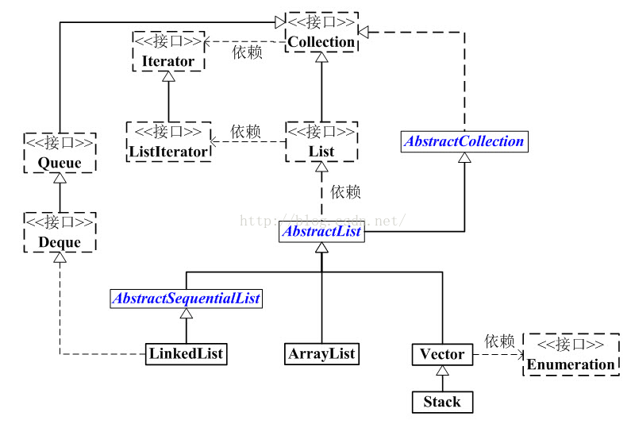

## 简述

Java集合类历史悠久，历经多次变化，存在以下遗留类：`HashTable`、`Vector`、`Stack`、`Enumeration`（已由`Iterator`取代）。

由于历史遗留问题，`Properties`类实际上是用`HashTable`来存储，从Java9开始，`Properties`文件支持指定文件编码了。

>可以反复调用`Properties.load()`来加载配置文件，并把已经存在的Key的Value给覆盖掉。

### 遍历

遍历集合的时候推荐使用`Iterator`，这样统一、无需知道集合内部结构、遍历速度较快。

1. 编写`Iterator`时常用一个**内部类**来实现该接口。
2. 设计模式中的[迭代器模式](http://leanlee.top/notes/10、Linux、Maven、Git、设计模式/4.3 行为型设计模式#iterator迭代器)。

#### 遍历与删除[[1]](https://juejin.cn/post/6844904038442467336)🌙

##### ArrayList

| 方法                                             | 结果 | 详情           |
| ------------------------------------------------ | ---- | -------------- |
| 普通`for`循环正序删除                            | ❌    | 会漏掉元素判断 |
| 普通`for`循环倒序删除                            | ✔    | 正确删除       |
| `for-each`循环删除                               | ❌    | 抛出异常       |
| `Iterator`遍历，使用`ArrayList.remove()`删除元素 | ❌    | 抛出异常       |
| `Iterator`遍历，使用`Iterator.remove()`删除元素  | ✔    | 正确删除       |

##### HashMap

| 方法                                                         | 结果 | 详情     |
| ------------------------------------------------------------ | ---- | -------- |
| `for-each`遍历`HashMap.entrySet()`，使用`HashMap.remove()`删除 | ❌    | 抛出异常 |
| `for-each`遍历`HashMap.keySet()`，使用`HashMap.remove()`删除 | ❌    | 抛出异常 |
| `Iterator`遍历，使用`Iterator.remove()`删除元素              | ✔    | 正确删除 |

#### fail-fast

快速失败是Java集合的一种错误检测机制，当线程不安全的集合发生并发写入时，可能会触发该机制，抛出`ConcurrentModificationException`。


## Collections

`Collections`类提供了一系列实用方法：

1. 创建空集合。
   1. `List.of()`（Java9）也能方便地创建空集合、创建单元素集合，返回的是**定长**数组。
2. 创建单元素集合。
3. 创建不可变集合。
4. 排序、洗牌操作。


## Collection

如[下图](https://blog.csdn.net/eson_15/article/details/51145788)所示，`Collection`是除`Map`外，所有集合类（`List`、`Set`）的根接口。




## List

`List`最常用的两个实现类是`ArrayList`和`LinkedList`。

### ArrayList

跟`HashMap`一样，`ArrayList`基于动态数组，所以在创建时最好指定一个恰当的容量：⭐

- 容量过大，会占用过多的内存，如果<span style=background:#c9ccff>堆</span>中碎片过多，还有分配失败的风险。
- 如果过小，则会有频繁的扩容、数据的拷贝、**GC**等问题。

> `ArrayList.subList()`返回的是`SubList`，一个视图，[没有进行拷贝](https://www.hollischuang.com/archives/3775)。

#### 与数组

有多种方法支持<u>数组</u>转换为`ArrayList`：

1. ```java
   Arrays.asList();
   ```

2. ```java
   Arrays.stream();
   ```

3. ```java
   List.of(1, 3, 7); // JavaK9
   ```

`ArrayList`转<u>数组</u>可通过调用`List.toArray(new String[0])`方法完成。

### LinkedList

基于链表。

> 基于`LinkedList`、`HashMap`[实现LRUMap](https://blog.51cto.com/u_14849432/3063788#h4)。

### 比较⭐

对于随机访问（`get`、`set`），`ArrayList`要优于`LinkedList`，因为`ArrayList`的元素内存地址连续、通过下标访问，而`LinkedList`要移动指针（遍历）。

> “内存地址连续”[还有更深层的含义](https://blog.51cto.com/u_14849432/3063788)：CPU有多级缓存，每个缓存由<u>缓存行</u>（Cache Line）组成；CPU从主存拉取数据时，会把相邻的数据一起存入一个<u>缓存行</u>，加速便利。
>
> `LinkedList`对随机访问进行了优化，根据`index < size / 2`是否成立来决定是从头部遍历，还是尾部遍历。

对于增删操作（`add`、`remove`），一般来说`LinkedList`要比`ArrayList`快。

> 如果是往尾部增删，则两者性能相仿。
>
> 如果是往随机位置增删，`ArrayList`要执行`System.arraycopy()`来移动数据，下标越小，`ArrayList`需要移动的数据越多；而`LinkedList`需要遍历来定位，下标越靠近中间位置，遍历过程越长。
>
> 并且数据量大时，`LinkedList`存在内存碎片化问题，对<u>缓存行</u>的利用情况没有`ArrayList`好，需要进行较多的缓存行填充操作，[开销更大](https://blog.csdn.net/eson_15/article/details/51145788#7.2/8.5)。

### CopyOnWriteArrayList⭐

`CopyOnWriteArrayList`是线程安全的`List`，写操作在一个<span style=background:#c2e2ff>复制</span>的数组上进行，在写入时<span style=background:#c2e2ff>加锁</span>，在读取时<span style=background:#c9ccff>不加锁</span>。

1. 因为进行了读写的分离，所以允许写的同时进行读。
2. 这样的设计增加了内存的占用，并造成了数据的不一致，所以<span style=background:#c9ccff>不适合</span>实时性高的场景。


## Map

见[8.1 Map](http://leanlee.top/notes/01、Java/8.1 Map)。


## Set

`HashSet`实际上是用`HashMap`来实现的。


## Queue

`Queue`的接口的方法都有两套，一套是抛出异常，一套是返回真假。

不要放入`null`值，因为队列为空时，也会返回`null`。

`Queue`有[多种](https://docs.oracle.com/en/java/javase/15/docs/api/java.base/java/util/Queue.html)实现类。

### 非阻塞式

- AbstractQueue、Array**Deque**、ConcurrentLinked**Deque**、ConcurrentLinkedQueue、**LinkedList**、PriorityQueue

> 向`PriorityQueue`传入的元素需实现`Comparable`接口，或者传入`Comparator`对象。

### 阻塞式[[2]](https://www.cnblogs.com/duanxz/p/3400003.html)[[3]](https://blog.csdn.net/Holmofy/article/details/81610481)

<table>
   <thead>
      <tr>
         <th style="width:190px;">类型</th><th style="width:130px;">实现</th><th style="width:auto;">特点</th>
      </tr>
   </thead>
   <tbody>
      <tr>
         <td>ArrayBlockingQueue</td><td>用数组实现的有界队列</td><td>出队、入队使用同一个锁对象，可能是因为已经够轻巧了，采用分离锁会增加复杂度，得不偿失。<br/>默认采用非公平锁（也支持公平锁）。</td>
      </tr>
      <tr>
         <td>DelayQueue</td><td>无界队列</td><td>队列中的节点<span style=background:#c2e2ff>到期</span>后才能被取出，用的少； 阻塞出队，不阻塞入队。</td>
      </tr>
      <tr>
         <td>LinkedBlockingQueue</td><td>用链表实现的无界队列</td><td>相当于无界，但是其最大容量为<span style=background:#c2e2ff>Integer.MAX_VALUE</span>。<br/>采用分离锁。<br/>出队、入队时，<span style="font-weight: bold;">ABQ</span>不会产生额外的对象，但<span style="font-weight: bold;">LBQ</span>需要将对象封装成节点，需要考虑对<span style="font-weight: bold;">GC</span>的影响。</td>
      </tr>
      <tr>
         <td>LinkedBlocking<span style="font-weight: bold;">Deque</span></td><td>用链表实现的双向队列</td><td>头尾均可增删任务，能减少锁的竞争。</td>
      </tr>
      <tr>
         <td>LinkedTransferQueue</td><td>用链表实现的无界队列</td><td>多了<span style=background:#c2e2ff>transfer()</span>和<span style=background:#c2e2ff>tryTransfer()</span>，当消费者线程阻塞时，可直接将数据传递给消费者，无需放入队列。</td></tr>
      <tr>
         <td>PriorityBlockingQueue</td><td>无界队列</td><td>支持按优先级排序，默认按自然序进行排序，也可通过实现<span style=background:#c2e2ff>compareTo()</span>来指定排序规则。<br/>会阻塞出队，不会阻塞入队，所以需要预防<code>OutOfMemoryError</code>。</td>
      </tr>
      <tr>
         <td>SynchronousQueue</td><td>不是一个真正的队列</td><td>没有容量、线程安全：只是对数据的使用权进行交接，或者说传递；每个<code>put</code>操作都必须等待<code>take</code>操作。<br/>支持<span style=background:#c9ccff>公平锁</span>和<span style=background:#c9ccff>非公平锁</span>：公平模式下采用FIFO来阻塞多余的生产者、消费者，非公平模式（默认）下采用LIFO来管理多余的生产者、消费者。</td>
      </tr>
   </tbody>
</table>

[下图](https://www.cnblogs.com/duanxz/p/3400003.html)为阻塞队列：


## Deque

`Deque`，Double Ended Queue，双端队列，扩展自`Queue`接口。

- `Deque`虽然扩展自`Queue`，但使用`Deque`时推荐使用`offerFirst()`、`peekLast()`等方法。

`Deque`实现类有`ArrayDeque`、`LinkedList`。

- `LinkedList`既实现了`List`接口，也实现了`Deque`（`Deque`又扩展自`Queue`接口）。

| [方法说明](https://www.liaoxuefeng.com/wiki/1252599548343744/1265122668445536) | Queue                  | Deque                           |
| :----------------------------------------------------------- | :--------------------- | ------------------------------- |
| 添加元素到队尾                                               | add(E e) / offer(E e)  | addLast(E e) / offerLast(E e)   |
| 取队首元素并删除                                             | E remove() / E poll()  | E removeFirst() / E pollFirst() |
| 取队首元素但不删除                                           | E element() / E peek() | E getFirst() / E peekFirst()    |
| 添加元素到队首                                               | 无                     | addFirst(E e) / offerFirst(E e) |
| 取队尾元素并删除                                             | 无                     | E removeLast() / E pollLast()   |
| 取队尾元素但不删除                                           | 无                     | E getLast() / E peekLast()      |


## Stack

`Stack`类继承自`Vector`，属于历史遗留类，不推荐使用。

> `Vector`包含大量同步方法，效率低，所以不推荐。

可以用`Deque`代替`Stack`。

进制转换、中缀表达式、后缀表达式计算都可以用`Stack`来实现。

> queue：offer、poll、peek。
>
> stack：  push、pop、peek。


## 函数式编程[[4]](https://www.liaoxuefeng.com/wiki/1252599548343744/1322403061825570)

### Lambda

### Stream

**Stream API**用于简化批量操作。

**Stream API**有两个核心抽象：

- Stream，流：表示有限或无限的<u>元素序列</u>。
- Pipeline，管道：表示对<u>元素序列</u>的多级计算，这些计算大部分是惰性的。

<u>元素序列</u>可以来自集合、数组、文件、正则表达式模式匹配器、伪随机数生成器和其他的**Stream**。

<u>元素序列</u>既可以是对象引用，也可以是基本类型。

> 仅支持`int`、`long`、`double`三种基本类型。

**Stream API**提供的常用操作有：

- 转换操作：`map()`、`filter()`、`sorted()`、`distinct()`
- 合并操作：`concat()`、`flatMap()`
- 并行处理：`parallel()`
- 聚合操作：`reduce()`、`collect()`、`count()`、`max()`、`min()`、`sum()`、`average()`
- 其他操作：`allMatch()`、`anyMatch()`、`forEach()`

