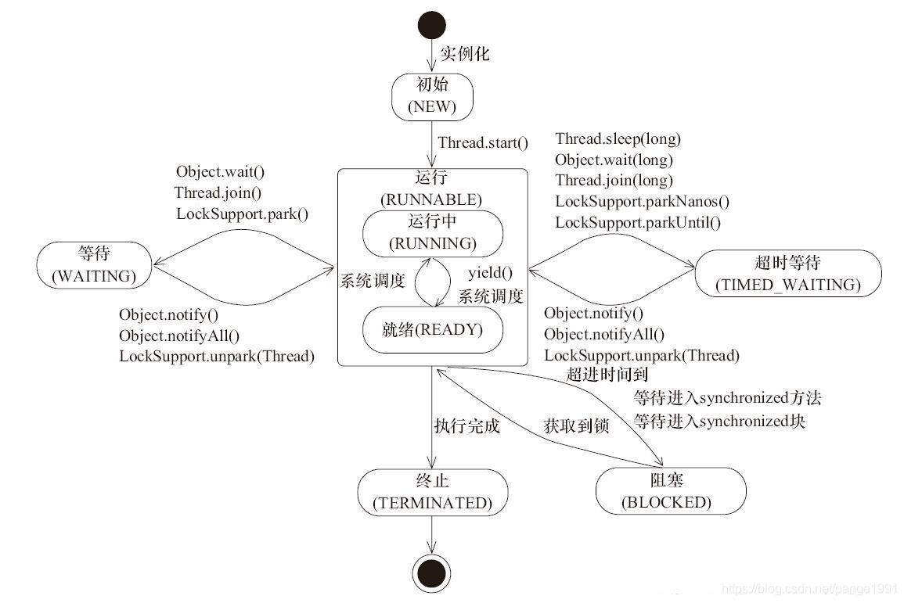

## 线程的状态

[Java线程有6种状态](https://blog.csdn.net/pange1991/article/details/53860651)：

1. **New**，创建后尚未启动。

2. **Runnable**，正在运行，具体是否运行需要看**OS**的资源调度。

   1. **Running**，运行中，CPU正在运行该线程。
   2. **Ready**，就绪，CPU暂未运行该线程。

3. **Blocked**，阻塞。
   1. 请求获取monitor lock从而进入**synchronized**代码块或方法，但是monitor lock已经被其它线程占用，所以处于阻塞状态。

4. **Waiting**，等待其它线程的通知或中断。
   1. **Blocked**是被动的，**Waiting**是主动的。

8. **Timed** **Waiting**，正在计时等待。

9. **Terminated**，已终止。

其中**Runnable**、**Blocked**、**Waiting**、**Timed** **Waiting**状态都算是<span style=background:#c2e2ff>运行</span>状态，启动后的线程会在这**4**个状态间<span style=background:#c2e2ff>切换</span>。


## 状态的转换



   

<span style=background:#ff8000>注意</span>：上图存在错误，**Waiting**、**Timed Waiting**均不会转换为**Runnable**，而是转换为**Blocked**，之后由**Blocked**转换为**Runnable**。

如上图所示，调用`yield()`、`sleep()`、`wait/wait(long)`、`notify/notifyAll()`、`join/join(long)`等方法可以转换线程状态：

1. `Thread.yield()`
   
   1. 当前线程放弃获取的CPU时间，但<span style=background:#c9ccff>不会</span>释放锁。
   
   2. 该方法只是对<span style=background:#e6e6e6>线程调度</span>的一个<span style=background:#e6e6e6>建议</span>，目的是让<span style=background:#e6e6e6>相同优先级</span>的线程轮流执行，该方法只是<span style=background:#e6e6e6>建议</span>，<span style=background:#e6e6e6>不保证</span>一定会轮流执行。
   
2. `Thread.sleep(long)`

   1. 使线程<span style=background:#f8d2ff>睡眠</span>。
   2. <span style=background:#c9ccff>会</span>让出CPU资源，但<span style=background:#c9ccff>不会</span>释放锁。

3. `Object.wait()/wait(long)`

   1. 线程<span style=background:#ffb8b8>挂起</span>（阻塞），即，进入**Waiting**/**Timed Waiting**状态。

   2. <span style=background:#c9ccff>会</span>让出CPU资源，同时<span style=background:#c9ccff>会</span>释放锁（不然其它线程没法进入<span style=background:#19d02a>临界区</span>，也无法被其它线程唤醒）。

   ```java
   public final void wait() throws InterruptedException{
       this.wait(0L); 
   }
   ```

   > 技巧：`Object.wait()`常搭配`while`循环使用，而非`if`判断，因为唤醒后线程往往需要确认线程是否拥有需要的资源，如果没有则重新调用`Object.wait()`进入等待。

4. `Object.notify()/notifyAll()`

   1. 线程调用`wait()/wait(long)`进入等待后，可调用`notify()`来唤醒该线程。
   2. `notify()`一次只能唤醒一个线程，如果有多个线程需要唤醒，我们可以调用`notifyAll()`将其全部唤醒。

5. `Thread.join()/join(long)`

   1. 在当前线程中调用目标线程的`join()/join(long)`，<u><span style=background:#19d02a>当前线程</span><span style=background:#c9ccff>不会</span><span style=background:#19d02a>释放锁</span></u>，但会<span style=background:#ffb8b8>挂起</span>，即，进入**Waiting**/**Timed Waiting**状态。

   2. 如下面的伪代码所示，`join()`基于`wait()`。

         1. 所以当前线程会先进入<span style=background:#ffb8b8>同步队列</span>中竞争<span style=background:#258df6>目标线程的对象锁</span>，然后释放该锁，进入目标线程的对象锁的<span style=background:#f8d2ff>等待队列</span>，等待被唤醒。
         2. 目标线程运行结束后或运行时间到后会唤醒当前线程，即状态变为**Blocked**，被唤醒的线程会重新进入<span style=background:#ffb8b8>同步队列</span>中的其它线程一起竞争锁，只是一般不会有竞争，当前线程会顺利地进入**Runnable**。
         3. <span style=background:#ff8000>注意</span>：“<u><span style=background:#19d02a>当前线程</span><span style=background:#c9ccff>不会</span><span style=background:#19d02a>释放锁</span></u>”中的锁，与“<span style=background:#258df6>目标线程的对象锁</span>”不是同一把锁，不要混淆。

         ```java
         synchronized void join(long mills){
             !mills ? wait(0L) : wait(mills);
         }
         ```

[该回答](https://www.zhihu.com/question/27654579/answer/254496076)中引用了正确的[状态转换图](https://www.uml-diagrams.org/java-thread-uml-state-machine-diagram-example.html)：    