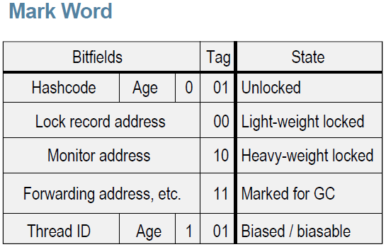

### <span style=background:#ff8000>说明</span>

这篇笔记对 [中文文案排版指北](https://github.com/sparanoid/chinese-copywriting-guidelines/blob/master/README.zh-CN.md) 中的排版要求进行了实验。

按照「指北」排版后的文章确实要美观一些，但我还是选择暂时不使用「指北」。

我想在只想专注笔记内容，而非笔记样式，选择Markdown进行写作也是为此，而写作时考虑这些排版要求对我来说是一种负担。

让笔记变得花花绿绿也是一种负担，但不用颜色标记的文章不叫笔记，叫普通文章。

### synchronized

Java使用 **synchronized** 关键字来标识**临界区**，使用时需指定一个对象<span style=background:#c2e2ff>作为锁</span>：
1. 同步代码块
   1. **synchronized** 修饰代码块时，需要指定一个对象<span style=background:#c2e2ff>作为锁</span>。
2. 同步方法
   1. **synchronized **修饰方法时，无需指定对象，因为此时会自动将 **this**，即，将对象本身<span style=background:#c2e2ff>作为锁</span>。
   2. 如果 **synchronized** 修饰的是**静态方法**，则会自动将类对应的 Class 实例<span style=background:#c2e2ff>作为锁</span>，这会导致同一个类的多个对象、多个方法并发执行时都会阻塞等待。
```java
void method(){synchronized(object){……}} // 同步代码块
synchronized void method(){……}          // 同步方法
```
显然，**synchronized **判断是否为同一把锁的依据为<span style=background:#c2e2ff>作为锁</span>的对象是否为同一个。

<span style=background:#e6e6e6>中文多使用“判断”一词，英文多使用“check”一词，直译过来就是“检查”。在计算机中的绝大部分语境中，“判断”、“检查”没有区别，按照个人习惯使用就好。</span>


### Monitor

[Monitor](https://segmentfault.com/a/1190000016417017)，直译为监视器，也称作管程。

直接使用 **Semaphore**、**Mutex **等原语即复杂，又容易出错（死锁），所以Java等编程语言在 **Semaphore**、**Mutex** 等原语的基础上提出了 **Monitor**。
**Monitor** 类包含以下几个重要属性：

1. <span style=background:#ffb8b8>同步队列</span>
   1. 保存被阻塞的线程。
2. 一个 MutexLock
   1. 对互斥量（Mutex）的封装。
3. 条件变量及相关操作 wait()、signal()。
   1. 调用 wait()可<span style=background:#c2e2ff>阻塞</span>当前线程，并让出 **Monitor**。
   2. 调用 signal()可<span style=background:#c2e2ff>唤醒</span>被阻塞的线程。

Java对象的内存模型包括3部分：1.对象头、2.实例数据、3.对齐填充。
其中，对象头也称作 <span style=background:#d4fe7f>Mark Word</span> ，用来保存锁标识（bit fields，类型标识；tag bits，<span style=background:#c9ccff>状态标识</span>），不同格式的 <span style=background:#d4fe7f>Mark Word</span> 对应不同的锁状态：

<table cellspacing="0" cellpadding="0">
   <thead>
      <tr><th style="width:80px;">A</th><th style="width:60px;">B</th><th style="width:42px;">C</th><th style="width:40px;">D</th><th style="width:67px;">E</th><th style="width:143px;">F</th><th style="width:110px;">G</th></tr>
   </thead>
   <tbody>
      <tr style="height: 20px"><td colspan="5">type</td><td colspan="2">state</td></tr>
      <tr style="height: 20px"><td colspan="4">bitfields</td><td>tag bits</td><td>en</td><td>zh</td></tr>
      <tr style="height: 20px"><td colspan="2">hash code</td><td>age</td><td>0</td><td dir="ltr">01</td><td>unlocked</td><td>无锁状态</td></tr>
      <tr style="height: 20px"><td>thread id</td><td>epoch</td><td>age</td><td>1</td><td dir="ltr">01</td><td>biased/biasable</td><td>偏向状态</td></tr>
      <tr style="height: 20px"><td colspan="4">lock record address</td><td>00</td><td>light-weight locked</td><td>轻量级锁定状态</td></tr>
      <tr style="height: 20px"><td colspan="4">heavy-weight monitor address</td><td>10</td><td>inflated</td><td>膨胀状态</td></tr>
      <tr style="height: 20px"><td colspan="4">forwarding address, etc.</td><td>11</td><td>marked for GC</td><td>垃圾回收</td></tr>
   </tbody>
</table>

HashCode与ThreadID共享。


### Monitor 与 synchronized

**synchronized** 正是基于“**锁对象**”（<span style=background:#c2e2ff>作为锁</span>的对象）的 **Monitor** 实例实现的同步：

1. Java中的每个对象都可以关联一个 **Moniter** 实例，当线程执行到**临界区**时，会在自己的栈桢中开辟空间保存**锁对象**的 <span style=background:#d4fe7f>Mark Word</span> 的副本<span style=background:#ffee7c>（这一步是我猜的）</span>，而 <span style=background:#d4fe7f>Mark Word</span> 的内容会替换为 **Monitor ** 的内存地址，**锁对象**也就与 **Monitor** 关联上了。
   1. 线程开辟的这块空间叫做**锁记录**（Lock Record）。
   2. “内存地址”和“指针”是同一回事儿。
2. 同一时刻只允许一个线程使用 **Monitor**，从而实现了多线程对**临界区**的互斥访问。

基本类型、Null不是对象，无法关联 **Monitor** 实例，这也是它俩为啥不能配合 **synchronized** 使用的原因。

~~<span style=background:#e6e6e6>线程在无法执行的时候需要让出 **Monitor**，以便其它线程有机会使用。JVM 没有明确规定如何实现 **Monitor** 与对象的关联。</span>~~


### [Monitor 与同步代码块](https://blog.hufeifei.cn/2017/06/15/Java/Java多线程复习与巩固（四）--synchronized的JVM实现/#3-jvm-gui-fan-zhong-de-monitor)

同步代码块在编译后，会变成由 <span style=background:#ffb8b8>monitorenter</span> 指令和 <span style=background:#f8d2ff>monitorexit</span> 指令前后包围的字节码：
1. <span style=background:#ffb8b8>monitorenter</span> 指令用来尝试占有**锁对象**的 **Monitor**，如[JVM 规范](https://docs.oracle.com/javase/specs/jvms/se8/html/jvms-6.html#jvms-6.5.monitorenter)所述，线程执行 <span style=background:#ffb8b8>monitorenter</span>：
   1. 如果**锁对象**的 **Monitor** 的“entry count“为 0，该线程会~~<span style=background:#e6e6e6>进入该 **Monitor** 并</span>~~将“entry count”设为 1，~~<span style=background:#e6e6e6>完成上锁</span>~~并占有该 **Monitor**。<span style=background:#ffee7c>（entry count 指的是哪个属性？源码里没这个属性。）</span>
   2. 如果线程已经占有了该 **Monitor**，则线程会~~<span style=background:#e6e6e6>再次进入 **Monitor** 并</span>~~将“entry count”加1（可重入）。<span style=background:#ffee7c>（进入又是什么意思？）</span>
   3. 如果 **Monitor** 已经被其它线程占有，则线程会被阻塞并放入**同步队列**，等待“entry count”归0后，重新尝试占有 **Monitor**。
2. <span style=background:#f8d2ff>monitorexit</span> 指令用来释放**锁对象**的 **Monitor**。
   1. 执行<span style=background:#f8d2ff>monitorexit</span> 的线程必是**Monitor **的所有者。
   2. 每执行一次<span style=background:#f8d2ff>monitorexit</span> ，**Monitor **的“entry count”就会减 1。
   3. 当“entry count”减为0时，该线程~~<span style=background:#e6e6e6>也就完成了 **Monitor** 的释放，</span>~~不再占有该 **Monitor**，~~<span style=background:#e6e6e6>同步队列中的</span>~~其它线程会竞争~~<span style=background:#e6e6e6>获取**锁对象**的</span>~~ **Monitor**。


### Monitor与同步方法

同步方法与普通方法几乎没有区别，只是多了一个 ACC_SYNCHRONIZED 标志位，以标明该方式需要同步访问。

调用同步方法时会进入**Monitor**，方法返回时会退出 **Monitor**，这一过程由 JVM 隐式地执行。


### 重量级锁

**synchronized** 之所以被称为**重量级锁**是因为：

1. **synchronized **依赖 **Monitor** 类，而 **Moniter** 基于**OS**的 **MutexLock**（互斥锁）指令，执行该指令时会锁住总线。
2. <span style=background:#c9ccff>阻塞/唤醒</span>会涉及多个线程的切换，即，需要从用户态转为核心态，开销大。
为了减少开销，jdk6 对 **synchronized** [进行了很多优化](https://www.jianshu.com/p/1e8d54cb2bf1)：
1. 引入了锁消除、锁粗化、自适应的自旋等设计。
2. 随竞争的加剧，锁还会进行单向的升级（膨胀）：偏向锁 **->** 轻量级锁 **->** 重量级锁，而非只基于 **Monitor** 作为重量级锁发挥作用。


### 锁消除

有些**临界区**始终处于单线程环境中，不存在多线程的竞争，这时应取消**临界区**（消除同步锁），以减少开销。

开发人员可以根据逻辑将自己代码中没有意义的同步锁消除掉，但无法消除 JDK 或第三方 JAR 中的同步锁，如 StringBuffer、Vector、HashTable 等类。

但 JVM 会对代码进行**逃逸分析**将没有意义的同步锁消除掉。（那开发人员是否可以放松警惕，随意加锁？）


### 锁粗化

**临界区**的范围应尽可能地小，以减少加锁状态的持续时间，从而减少线程的等待时间。但有些代码中会有针对**同一锁对象**的连续的**临界区**，从而引起频繁的加锁/解锁操作，反而增加开销。JVM 会识别这种情景，并合并这些**临界区**，以减少加锁/解锁操作。


### 自旋

有些**临界区**很小，时间维度上的小，即，加锁后很快就会解锁，<span style=background:#ffee7c>且线程间的竞争不激烈</span>，这时不值得采用<span style=background:#c9ccff>阻塞/唤醒</span>的方式，可以使用**自旋**的方式。

**自旋**要求线程有以下行为：

1. 当一个线程尝试获取锁时，发现该锁已经被其它线程占用，这时该线程应对锁的状态进行<span style=background:#c2e2ff>循环检测</span>（基于 **CAS**），直到检测到锁被释放，然后线程获取锁。
2. 其中，<span style=background:#c2e2ff>循环检测</span>的次数应该有一定限度，不应无限等待，当循环超过指定的次数仍然没能获取锁时，线程应取消**自旋**，进入<span style=background:#c9ccff>阻塞</span>状态。
3. **自旋**于 JDK4 引入，<span style=background:#c2e2ff>循环检测</span>的次数默认为 10。

循环次数固定的**自旋**难免有些僵硬，所以 JDK6 对**自旋**进行了优化，引入了自适应**自旋：**
1. <span style=background:#c2e2ff>循环检测</span>的次数不再固定，而是根据持有同一把锁的线程的前一次**自旋**的循环次数及结果来决定。
2. 如果前一次的**自旋**成功，那么这一次的**自旋**也很有可能会成功，所以应增加循环的次数。
3. 如果**自旋**失败，那么应减少循环的次数；当循环的次数减少到 0 时，应取消**自旋**，改为<span style=background:#c9ccff>阻塞/唤醒</span>的方式。


### 偏向锁

有研究发现，在大多数情况下，锁不仅不存在多线程竞争，而且总是由**同一**线程多次获得。

所以 JDK6 后，**synchronized** 默认类型为**偏向锁**，其运行过程为：

1. 线程执行到**临界区**，判断**锁对象**的 <span style=background:#d4fe7f>Mark Word</span> 是否为<span style=background:#ffb8b8>可偏向状态</span>。
   1. 如果线程是**首次**执行到**临界区**，则会在自己的栈桢中开辟空间，以保存 <span style=background:#d4fe7f>Mark Word</span> 的副本。开辟的这块空间叫做**锁记录**（Lock Record）。
2. 若 <span style=background:#d4fe7f>Mark Word </span>的<span style=background:#c9ccff>状态标识</span>为 **01**，且<span style=background:#c2e2ff>是否偏向</span>为 **0**，说明为“无锁状态”，则进行一次 **CAS** 操作，尝试将 <span style=background:#d4fe7f>Mark Word</span> 替换为<span style=background:#ffb8b8>可偏向状态</span>（包括设置“是否偏向”为 1，设置 **ThreadID **等）：
   1. 如果成功，则加锁完成。
   2. 如果失败，说明存在竞争，会<span style=background:#f8d2ff>撤销</span>**偏向锁**。
3. 若 <span style=background:#d4fe7f>Mark Word</span> 的<span style=background:#c9ccff>状态标识</span>为 **01**，且<span style=background:#c2e2ff>是否偏向</span>为 **1**，说明为<span style=background:#ffb8b8>可偏向状态</span>，然后会判断 **ThreadID** 是否与自己的相等：
   1. 如果相等，说明已经设置偏向锁，且偏向自己，则直接返回。
   2. 如果不相等，说明偏向锁指向的是其它线程，则该线程会进行一次<span style=background:#ffee7c>（应该是一次，而非多次）</span> **CAS** 操作，尝试将 **ThreadID** 设为自己的：
      1. 如果成功，则加锁完成。
      2. 如果失败，说明存在竞争，会<span style=background:#f8d2ff>撤销</span>**偏向锁**。
4. 若 <span style=background:#d4fe7f>Mark Word</span> 的<span style=background:#c9ccff>状态标识</span>为 **00** 时，说明锁已经由**偏向锁**升级为**轻量级锁**，进入**轻量级锁**的竞争模式。
5. 若 <span style=background:#d4fe7f>Mark Word</span> 的<span style=background:#c9ccff>状态标识</span>为 **10** 时，说明锁已经由**轻量级锁**升为**重量级锁**，进入**重量级锁**的竞争模式。

**偏向锁**仅需进行一次 **CAS**，以后执行到**临界区**时，不需要再进行 **CAS**，只需判断 <span style=background:#d4fe7f>Mark Word</span> 是否为<span style=background:#ffb8b8>可偏向状态</span>，以及 **ThreadID**。

如果存在竞争，会<span style=background:#f8d2ff>撤销</span>**偏向锁**：

1. 暂停持锁线程。
2. 判断**锁对象**是否处于锁定状态<span style=background:#ffee7c>（怎么判断？）</span>：
   1. 如果否，则将锁恢复至无锁状态，线程竞争重新获取锁。
   2. 如果是，则：
      1. 将 <span style=background:#d4fe7f>Mark Word</span> 设为“轻量级锁定状态”：将<span style=background:#c9ccff>状态标识</span>设为 **00**，并将持锁线程的 **Lock Record** 的**地址**写入 <span style=background:#d4fe7f>Mark Word</span>。
      2. 将 <span style=background:#d4fe7f>Mark Word</span> 的**地址**<span style=background:#c2e2ff>也</span>存入到 **Lock Record** 中（ <span style=background:#d4fe7f>Mark Word</span> 的副本之前已经存入到 **Lock Record** 中了）。
      3. 锁也就升级为了**轻量级锁**，进入**轻量级锁**的竞争模式。
3. 将持锁线程恢复。

<span style=background:#fdc200>注意</span>：暂停/恢复持锁线程的过程没有发生锁的转移。


### 轻量级锁

**轻量级锁**也是基于 **CAS** 来释放的：

1. 持锁线程进行一次 **CAS** ，尝试将 <span style=background:#d4fe7f>Mark Word</span> 的内容替换（还原）为自己之前保存在 **Lock Record** 中的 <span style=background:#d4fe7f>Mark Word</span> **副本**。
2. 如果替换成功，<u>锁会恢复到最初的无锁状态</u>，即，成功释放锁。
3. 如果替换失败，说明竞争加剧，已经由**轻量级锁**升级为**重量级锁**，之后会进入**重量级锁**的竞争模式：释放锁的同时，唤醒阻塞的线程。

由**偏向锁**升级而来的**轻量级锁**的运行过程为：
1. 线程执行到**临界区**，发现 <span style=background:#d4fe7f>Mark Word</span> 为“轻量级锁定状态”，即，<span style=background:#c9ccff>状态标识</span>为 **00**。
2. 线程会判断 <span style=background:#d4fe7f>Mark Word</span> 中保存的 **Lock Record** 的**地址**是否是自己的 **Lock Record** 的**地址**：
   1. 如果是，则说明已经获取了**轻量级锁**，可以运行临界区中的代码。
      1. 这里没有考虑重入的情景。如果考虑重入，也就是递归锁住一个对象的情况，**Lock Record** 会被初始化为 0，而非 <span style=background:#d4fe7f>Mark Word</span>。
   2. 如果否，则说明锁已被其它线程占有，该线程会**自旋**，即，循环执行 **CAS**，尝试将<u>无锁状态的 <span style=background:#d4fe7f>Mark Word</span> 的内容</u>替换为“轻量级锁定状态”，且其中的 **Lock Record** 的**地址**为自己的 **Lock Record**：
      1. 如果持锁线程释放锁，即，<u>锁恢复到最初的无锁状态</u>，那么**CAS**会成功，该线程也就得到了**轻量级锁**，线程会将 <span style=background:#d4fe7f>Mark Word</span> 的**地址**<span style=background:#c2e2ff>也</span>存入到 **Lock Record** 中。
      2. 如果直到**自旋**结束，持锁线程仍未释放锁，即，该线程仍未获得锁，该线程就会将**轻量级锁**升级为**重量级锁**：将<span style=background:#c9ccff>状态标识</span>设为 **10**，将 <span style=background:#d4fe7f>Mark Word</span> 的内容替换为 **Monitor** 的地址。

除了**偏向锁**升级得到**轻量级锁**，我们还可以直接关闭JVM的**偏向锁**设置，将**轻量级锁**作为 **synchronized** 的默认类型，这时当线程运行到**临界区**，会判断 <span style=background:#d4fe7f>Mark Word</span> 的内容：
1. 如果为“轻量级锁定状态”，则线程按照上文所述的过程运行。
2. 如果为“膨胀状态”，           则线程进入**重量级锁**的竞争模式（好像两句废话）。
3. 如果为“无锁状态”，           则线程将 <span style=background:#d4fe7f>Mark Word</span> 的副本保存到 **Lock Record** 中，然后进行一次 **CAS**，尝试将<u>无锁状态的 <span style=background:#d4fe7f>Mark Word</span> 的内容</u>替换为“轻量级锁定状态”，且其中的 **Lock Record **的**地址**为自己的**Lock Record**：
   1. 如果成功，该线程也就得到了**轻量级锁**，线程会将<span style=background:#c9ccff>状态标识</span>为 **00**，并将 <span style=background:#d4fe7f>Mark Word</span> 的**地址**<span style=background:#c2e2ff>也</span>存入到 **Lock Record** 中。
   2. 如果失败，说明锁已被其它线程占有，该线程会**自旋**，之后的过程无需赘述。


### 偏向锁、轻量级锁、重量级锁的比较

1. **偏向锁**
   1. 仅需在设置 **ThreadID** 时执行一次 **CAS**，之后进入**临界区**时不需进行 **CAS**，仅需在内存中判断 ThreadID 是否相等，开销小。
   2. 并且即便**偏向锁**因升级为**轻量级锁**而需要<span style=background:#f8d2ff>撤销</span>时会带来的开销，但也小于节省下来的 **CAS** 开销。
   3. 持有**偏向锁**的线程不会主动解锁，且一有竞争会立刻升级为**轻量级锁**，只适合一个线程执行临界区的场景。
2. **轻量级锁**
   1. 加锁/解锁操作需要执行多次 **CAS**，执行 **CAS**时会锁住总线，且**自旋**会消耗 CPU，开销略大。
   2. 适合多线程交替执行同步代码块，即，有竞争但不激烈的场景。
3. **重量级锁**
   1. 缺点不再赘述，就是太重，但竞争激烈的场景只能用它。


### 源码分析

[死磕Synchronized底层实现–重量级锁](https://www.javazhiyin.com/24370.html)

[Java Synchronized 重量级锁原理深入剖析上(互斥篇)](https://www.jianshu.com/p/8a8d2b42ddca) 


### 补充



上图来自[Lock Lock Lock: Enter!](https://jpbempel.github.io/2013/03/25/lock-lock-lock-enter.html)


上图来自[Synchronization](https://wiki.openjdk.java.net/display/HotSpot/Synchronization)
