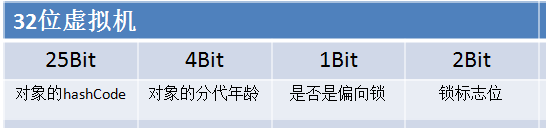

## synchronized⭐

```java
void method(){synchronized(object){……}} // 同步代码块
synchronized void method(){……}          // 同步方法
```

Java使用`synchronized`关键字来标识<span style=background:#19d02a>临界区</span>，使用时需指定一个对象<span style=background:#c2e2ff>作为锁</span>：

1. ##### 同步代码块
   1. `synchronized`修饰代码块时，需要指定一个对象<span style=background:#c2e2ff>作为锁</span>。

2. ##### 同步方法

   1. `synchronized`修饰方法时，无需指定对象，因为此时会自动将`this`，即，将对象本身<span style=background:#c2e2ff>作为锁</span>。
   2. 如果`synchronized`修饰的是**静态方法**，则会自动将类对应的`Class`实例<span style=background:#c2e2ff>作为锁</span>，这会导致同一个类的多个对象、多个方法并发执行时都会阻塞等待。

显然，`synchronized`判断是否为同一把锁的依据为<span style=background:#c2e2ff>作为锁</span>的对象是否为同一个。

<span style=background:#e6e6e6;color:#b3b3b3>中文多使用“判断”一词，英文多使用“check”一词，直译过来就是“检查”。在计算机中的绝大部分语境中，“判断”、“检查”没有区别，按照个人习惯使用就好。</span>


## Monitor

Monitor，直译为监视器，也称作管程。

直接使用**Semaphore**、**Mutex**等原语即复杂，又容易出错（死锁），所以Java等编程语言在**Semaphore**、**Mutex**等原语的基础上提出了**Monitor**。

**Monitor**类实际上是由C++的**MonitorObject**类实现的，它包含以下几个重要属性：

1. <span style=background:#ffb8b8>同步队列</span>
   1. 变量名为`_EntryList`，保存被阻塞的线程。

      > 阻塞的线程需要放到队列中，这个队列需要被多线程共享，而**LockRecord**是线程私有的，不能存放共享变，但**Monitor**可用来共享，并存放队列。
      >
      > 其实**LockRecord**不光是私有的，而且每个线程都有，假设用**LockRecord**来存储阻塞队列，那阻塞队列需要被来回交接，这显然不合适。

      > 此外还有<span style=background:#f8d2ff>等待队列</span>，\_WaitSet。<span style=background:#ffee7c>那\_cxq是干甚的？</span>。
2. 一个Mutex Lock
   1. 对互斥量（Mutex）的封装。
3. 条件变量及相关操作`wait()`、`signal()`。
   1. 调用`wait()`可<span style=background:#c2e2ff>阻塞</span>当前线程，并让出**Monitor**。
   2. 调用`signal()`可<span style=background:#c2e2ff>唤醒</span>被阻塞的线程。


## Mark Word⭐

[Java对象的内存模型](https://www.cnblogs.com/duanxz/p/4967042.html)包括3部分：1.**对象头**、2.实例数据、3.对齐填充。

其中，**对象头**包括：<span style=background:#d4fe7f>Mark Word</span>、类型指针。

<span style=background:#d4fe7f>Mark Word</span>用来保存锁标识（bit fields，类型标识；tag bits，<span style=background:#c9ccff>状态标识</span>）。

<span style=background:#d4fe7f>Mark Word</span>的数据结构不固定，不同的结构对应不同的锁状态：

<table cellspacing="0" cellpadding="0">
   <thead>
      <tr style="height:1px"><th style="width:143px;padding:0"></th><th style="width:110px;padding:0"></th><th style="width:80px;padding:0"></th><th style="width:60px;padding:0"></th><th style="width:42px;padding:0"></th><th style="width:40px;padding:0"></th><th style="width:67px;padding:0"></th></tr>
      <tr style="height: 20px"><th colspan="2">state</th><th colspan="5">type</th></tr>
      <tr style="height: 20px"><th>zh</th><th>en</th><th colspan="4">bitfields</th><th>tag bits</th></tr>
   </thead>
   <tbody>
      <tr style="height: 20px"><td>无锁状态</td><td>unlocked</td><td colspan="2">hash code</td><td>age</td><td>0</td><td dir="ltr">01</td></tr>
      <tr style="height: 20px"><td>偏向状态</td><td>biased/biasable</td><td>thread id</td><td>epoch</td><td>age</td><td>1</td><td dir="ltr">01</td></tr>
      <tr style="height: 20px"><td>轻量级锁定状态</td><td>light-weight locked</td><td colspan="4">lock record address</td><td>00</td></tr>
      <tr style="height: 20px"><td>膨胀状态</td><td>inflated</td><td colspan="4">heavy-weight monitor address</td><td>10</td></tr>
      <tr style="height: 20px"><td>垃圾回收</td><td>marked for GC</td><td colspan="4">forwarding address, etc.</td><td>11</td></tr>
   </tbody>
</table>
> `hash code`与`thread id`共享。
>
> 人们习惯将锁的不同状态直接称呼为相应的锁，如，偏向状态称呼为偏向锁，虽然这样称呼不恰当，但无伤大雅。
>
> 32位的JVM中，<span style=background:#d4fe7f>Mark Word</span>自然为`4Byte`（32位）；64位的JVM中，<span style=background:#d4fe7f>Mark Word</span>自然为`8Byte`（64位）。


## Monitor与synchronized

`synchronized`正是基于“**锁对象**”（<span style=background:#c2e2ff>作为锁</span>的对象）的**Monitor**实例实现的同步：

1. Java中的每个对象都可以关联一个**Moniter**实例，当线程执行到<span style=background:#19d02a>临界区</span>时，会在自己的<u>栈桢</u>中开辟空间保存**锁对象**的<span style=background:#d4fe7f>Mark Word</span>的副本<span style=background:#ffee7c>（这一步是我猜的）</span>，而<span style=background:#d4fe7f>Mark Word</span>的内容会替换为**Monitor**的内存地址，**锁对象**也就与**Monitor**关联上了。
3. 同一时刻只允许一个线程使用**Monitor**，从而实现了多线程对<span style=background:#19d02a>临界区</span>的互斥访问。

> “内存地址”和“指针”是同一回事儿。
>
> 基本类型、`null`不是对象，无法关联**Monitor**实例，这也是它俩为啥不能配合`synchronized`使用的原因。

<span style=background:#e6e6e6;color:#b3b3b3>线程在无法执行的时候需要让出**Monitor**，以便其它线程有机会使用。JVM没有明确规定如何实现**Monitor**与对象的关联。</span>


## Monitor与同步代码块[[1]](https://blog.hufeifei.cn/2017/06/15/Java/Java多线程复习与巩固（四）--synchronized的JVM实现/#3-jvm-gui-fan-zhong-de-monitor)

同步代码块在编译后，会变成由<span style=background:#ffb8b8>monitorenter</span>指令和<span style=background:#f8d2ff>monitorexit</span>指令前后包围的字节码。

### monitorenter

<span style=background:#ffb8b8>monitorenter</span>指令用来尝试占有**锁对象**的**Monitor**，如[JVM规范](https://docs.oracle.com/javase/specs/jvms/se8/html/jvms-6.html#jvms-6.5.monitorenter)所述，线程执行<span style=background:#ffb8b8>monitorenter</span>：

1. 如果**锁对象**的**Monitor**的`entry count`为`0`，该线程会~~<span style=background:#e6e6e6;color:#b3b3b3>进入该**Monitor**并</span>~~将`entry count`设为`1`，~~<span style=background:#e6e6e6>完成上锁</span>~~并占有该**Monitor**。<span style=background:#ffee7c>（`entry count`指的是哪个属性？源码里没这个属性。）</span>
2. 如果线程已经占有了该**Monitor**，则线程会~~<span style=background:#e6e6e6>再次进入**Monitor**并</span>~~将`entry count`加`1`（可重入）。
3. 如果**Monitor**已经被其它线程占有，则线程会被阻塞并放入**同步队列**，等待`entry count`归`0`后，重新尝试占有**Monitor**。

> 这里的“进入”、“退出”是一种抽象概念，可以理解为“进入、退出<span style=background:#19d02a>临界区</span>”。可以参照下图理解，图片出现自[Java 中的 Monitor 机制](https://segmentfault.com/a/1190000016417017)，但最终来源未知。


### monitorexit

<span style=background:#f8d2ff>monitorexit</span>指令用来释放**锁对象**的**Monitor**。

执行<span style=background:#f8d2ff>monitorexit</span>的线程必是**Monitor**的所有者。

每执行一次<span style=background:#f8d2ff>monitorexit</span>，**Monitor**的`entry count`就会减`1`。

当`entry count`减为`0`时，该线程~~<span style=background:#e6e6e6>也就完成了**Monitor**的释放，</span>~~不再占有该**Monitor**，~~<span style=background:#e6e6e6>同步队列中的</span>~~其它线程会竞争~~<span style=background:#e6e6e6>获取**锁对象**的</span>~~**Monitor**。

[字节码中多出的那个](https://www.cnblogs.com/duanxz/p/4745871.html)<span style=background:#f8d2ff>monitorexit</span>指令，在异常结束时会被执行，以释放**Monitor**。


## Monitor与同步方法

同步方法与普通方法几乎没有区别，只是多了一个`ACC_SYNCHRONIZED`标志位，以标明该方式需要同步访问。

调用同步方法时会进入**Monitor**，方法返回时会退出**Monitor**，这一过程由JVM隐式地执行。


## 锁优化

`synchronized`很重，因为：⭐

1. `synchronized`依赖**Monitor**类，而**Moniter**基于**OS**的**MutexLock**（互斥锁）指令，执行该指令时会锁住总线。
2. <span style=background:#c9ccff>阻塞/唤醒</span>会涉及多个线程的切换，即需要从用户态转为核心态，开销大。

对此，Java6对`synchronized`[进行了很多优化](https://www.jianshu.com/p/1e8d54cb2bf1)，引入了锁消除、锁粗化、自适应的自旋等设计，并引入了4种锁状态。

### 锁消除

有些<span style=background:#19d02a>临界区</span>始终处于单线程环境中，不存在多线程的竞争，这时应取消<span style=background:#19d02a>临界区</span>（消除同步锁），以减少开销。

开发者可以将自己代码中没有意义的同步锁主动消除掉，但无法消除JDK或第三方JAR中的同步锁，如`StringBuffer`、`Vector`、`HashTable`等类，所以，JVM会对代码进行**逃逸分析**，将没有意义的同步锁消除掉。

> 那开发人员是否可以放松警惕，随意加锁？

### 锁粗化

<u><span style=background:#19d02a>临界区</span>的范围应尽可能地小</u>，以减少加锁状态的持续时间，从而减少线程的等待时间。

但有些代码中会有针对**同一锁对象**的连续的<span style=background:#19d02a>临界区</span>，从而引起频繁的加锁/解锁操作，反而增加开销。

JVM会识别这种情景，并合并这些<span style=background:#19d02a>临界区</span>，以减少加锁/解锁操作。

### 自旋

有些<span style=background:#19d02a>临界区</span>很小，时间维度上的小，即加锁后很快就会解锁，<span style=background:#fdc200>且</span>线程间的竞争不激烈，这时不值得采用<span style=background:#c9ccff>阻塞/唤醒</span>的方式，可以使用**自旋**的方式。

**自旋**要求线程有以下行为：

1. 当一个线程尝试获取锁时，发现该锁已经被其它线程占用，这时该线程应对锁的状态进行基于**CAS**的<span style=background:#c2e2ff>循环检测</span>，直到检测到锁被释放，然后线程获取锁。
2. 其中，<span style=background:#c2e2ff>循环检测</span>的次数应该有一定限度，不应无限等待，当循环超过指定的次数仍然没能获取锁时，线程应取消**自旋**，进入<span style=background:#c9ccff>阻塞</span>状态。
3. **自旋**于Java4引入，<span style=background:#c2e2ff>循环检测</span>的次数默认为10。

循环次数固定的**自旋**难免有些僵硬，所以Java6对**自旋**进行了优化，引入了自适应**自旋：**
1. <span style=background:#c2e2ff>循环检测</span>的次数不再固定，而是根据持有同一把锁的线程的前一次**自旋**的循环次数及结果来决定。
2. 如果前一次的**自旋**成功，那么这一次的**自旋**也很有可能会成功，所以应增加循环的次数。
3. 如果**自旋**失败，那么应减少循环的次数；当循环的次数减少到0时，应取消**自旋**，改为<span style=background:#c9ccff>阻塞/唤醒</span>的方式。

<span style=background:#ff8000>注意</span>：**自旋**与<span style=background:#c9ccff>阻塞</span>是相互补充的关系，而非取代。


## 五种状态

Java6将`synchronized`之前的状态称为`重量级锁`，并引入了4种新的状态。

随竞争的加剧，`synchronized`的**状态**会进行如下面代码所示的单向的升级（膨胀），而非只基于**Monitor**作为**重量级锁**发挥作用。

```js
`偏向锁` -> `轻量级锁` -> `重量级锁`
```

> ”偏向锁“、”轻量级锁“、”重量级锁“是`synchronized`的三种状态，这三种状态的更准确的称呼为：”偏向状态“、”轻量级锁定状态“、”膨胀状态/重量级锁定状态“。

如[下图](https://wiki.openjdk.java.net/display/HotSpot/Synchronization)所示，`synchronized`除了上述三种状态，还有两种状态：<u>未锁定、未偏向但可偏向状态</u>和<u>未锁定且不可偏向状态</u>（也就是常说的“无锁状态”）。

JVM默认开启**偏向锁**，当然也可以根据需要，通过配置`-XX:-UseBiasedLocking`来禁止**偏向锁**：

1. 如果开启**偏向锁**，**锁对象**的<span style=background:#d4fe7f>Mark Word</span>会被初始化为<u>未锁定、未偏向但可偏向状态</u>。
   1. 如图所示，该状态的<span style=background:#d4fe7f>Mark Word</span>的内容与之后进入”偏向状态“的<span style=background:#d4fe7f>Mark Word</span>的内容基本一致，只是`thread id`为`0`。
2. 如果禁止**偏向锁**，**锁对象**的<span style=background:#d4fe7f>Mark Word</span>会被初始化为“无锁状态”。

综上，这五种状态的完整变化过程为：

```js
`无锁但可偏向` -> `偏向锁` -> `无锁` -> `轻量级锁` -> `重量级锁`
```


### 偏向锁

有研究指出，在大多数情况下，锁不仅不存在多线程竞争，而且总是由<u>同一</u>线程多次获得，所以`synchronized`才引入了**偏向锁**。

当线程执行到<span style=background:#19d02a>临界区</span>时，首先会尝试将**锁对象**设置为偏向锁<span style=background:#d4fe7f>Mark Word</span>的<span style=background:#c9ccff>状态标识</span>：

3. 若<span style=background:#d4fe7f>Mark Word</span>的<span style=background:#c9ccff>状态标识</span>为`01`，且<span style=background:#c2e2ff>是否偏向</span>为`1`，说明为**偏向锁**，然后线程会判断`thread id`：
   1. 如果`thread id`为`0`，说明**锁对象**是全新的、未曾被获取过的，则线程会进行**CAS**，将<span style=background:#d4fe7f>Mark Word</span>的`thread id`设置为自己的。
      1. 如果**CAS**失败，说明**锁对象**已经被其它线程抢先设置为**偏向锁**，即，存在竞争，线程会<span style=background:#f8d2ff>撤销</span>**偏向锁**，进入**轻量级锁**的竞争模式。
   2. 如果`thread id`不为`0`，但与线程自己的相等，说明已经设置**偏向锁**，且偏向自己，则直接返回。
   3. 如果`thread id`不为`0`，且不等于线程自己的，也说明存在竞争，线程会<span style=background:#f8d2ff>撤销</span>**偏向锁**，进入**轻量级锁**的竞争模式。
2. 否则，进入**轻量级锁**的竞争模式。


如果线程是**首次**执行到<span style=background:#19d02a>临界区</span>，则会在自己的**栈桢**中开辟空间，以保存<span style=background:#d4fe7f>Mark Word</span>的副本。开辟的这块空间叫做**锁记录**（Lock Record）。

**偏向锁**仅需进行一次**CAS**，以后执行到<span style=background:#19d02a>临界区</span>时，不需要再进行**CAS**，只需判断**锁对象**的类型是否为**偏向锁**，以及`thread id`。

**偏向锁**没有释放一说。

### 撤销过程

1. 暂停持锁线程。
2. 判断**锁对象**是否处于锁定状态<span style=background:#ffee7c>（怎么判断？可能是通过是否在临界区来进行判断）</span>：
   1. 如果否，则：
      1. 将<span style=background:#d4fe7f>Mark Word</span>的<span style=background:#c2e2ff>是否偏向</span>为`0`，即，将锁设置为“无锁状态”，线程通过竞争来获取锁。
   2. 如果是，则：
      1. 将**锁对象**的类型设为**轻量级锁**：将<span style=background:#c9ccff>状态标识</span>设为`00`，并将持锁线程的**LockRecord**的**地址**写入<span style=background:#d4fe7f>Mark Word</span>。
      2. 将<span style=background:#d4fe7f>Mark Word</span>的**地址**<span style=background:#c2e2ff>也</span>存入到**LockRecord**中（<span style=background:#d4fe7f>Mark Word</span>的副本之前已经存入到**LockRecord**中了）。
      3. 锁也就升级为了**轻量级锁**，进入**轻量级锁**的竞争模式。
3. 恢复持锁线程。

<span style=background:#ff8000>注意</span>：暂停/恢复持锁线程的过程没有发生锁的转移。

### 轻量级锁

当进入**轻量级锁**的竞争模式时，线程执行到<span style=background:#19d02a>临界区</span>，会判断**锁对象**的类型是否为“无锁状态”，即，是否满足<span style=background:#d4fe7f>Mark Word</span>的<span style=background:#c9ccff>状态标识</span>为`01`，且<span style=background:#c2e2ff>是否偏向</span>为`0`：

1. 如果是，则线程将<span style=background:#d4fe7f>Mark Word</span>的副本保存到**LockRecord**中，然后进行一次**CAS**，尝试将<u>无锁状态的**锁对象**</u>设置为**轻量级锁**，即，尝试将<span style=background:#d4fe7f>Mark Word</span>的<span style=background:#c9ccff>状态标识</span>设为`00`、**LockRecord**的地址设为线程为自己的：
   1. 如果成功，该线程也就得到了**轻量级锁**，线程会将<span style=background:#d4fe7f>Mark Word</span>的**地址**<span style=background:#c2e2ff>也</span>存入到**LockRecord**中。
   2. 如果失败，说明存在竞争，进入**重量级锁**的竞争模式。
2. 否则，判断<span style=background:#d4fe7f>Mark Word</span>中保存的**LockRecord**的**地址**是否是自己的：
   1. 如果是，则说明已经获取了**轻量级锁**，可以运行<span style=background:#19d02a>临界区</span>中的代码，即，进行重入。重入，也就是递归锁住一个对象的情况，**LockRecord**会被初始化为`0`，而非<span style=background:#d4fe7f>Mark Word</span>。
   2. 否则，进入**重量级锁**的竞争模式。

退出<span style=background:#19d02a>临界区</span>后，持锁线程会主动释放**轻量级锁**，即，进行一次**CAS**，尝试将<span style=background:#d4fe7f>Mark Word</span>的内容替换（还原）为自己之前保存在**LockRecord**中的<span style=background:#d4fe7f>Mark Word</span>**副本**。

1. 如果替换成功，<u>锁会恢复到最初的无锁状态</u>，即成功释放锁。
2. 如果替换失败，也就是<span style=background:#c9ccff>状态标识</span>被其他线程设为`10`，说明竞争加剧，已经由**轻量级锁**升级为**重量级锁**，之后会进入**重量级锁**的竞争模式。
   1. 此时也会释放锁，但其实释放的是**重量级锁**，所以唤醒阻塞的线程。


## 偏向锁、轻量级锁、重量级锁的比较

### 偏向锁

仅需在设置**ThreadID**时执行一次**CAS**，之后进入<span style=background:#19d02a>临界区</span>时不需进行**CAS**，仅需在内存中判断ThreadID是否相等，开销小。

并且即便**偏向锁**因升级为**轻量级锁**而需要<span style=background:#f8d2ff>撤销</span>时会带来的开销，但也小于节省下来的**CAS**开销。

持有**偏向锁**的线程不会主动解锁，且一有竞争会立刻升级为**轻量级锁**，只适合一个线程执行<span style=background:#19d02a>临界区</span>的场景。

### 轻量级锁

每次加锁/解锁操作都需要执行**CAS**，执行**CAS**时会锁住总线，且**自旋**会消耗CPU，开销略大。

适合多线程交替进入<span style=background:#19d02a>临界区</span>，即有竞争但不激烈的场景。

### 重量级锁

缺点不再赘述，就是太重，但竞争激烈的场景只能用它。


## 源码分析

[死磕Synchronized底层实现–重量级锁](https://www.javazhiyin.com/24370.html)

[Synchronized源码分析](https://www.jianshu.com/p/8a8d2b42ddca)

1. 原标题名：《Java Synchronized 重量级锁原理深入剖析上(互斥篇)》
2. 该作者写的并发系列文章都结合了大量源码、流程图，很详细，但源码太多会导致篇幅过长，让人抓不住重点，也不便记忆。


## 几张图片

下图为不同状态的<span style=background:#d4fe7f>Mark Word</span>，来自[Lock Lock Lock: Enter!](https://jpbempel.github.io/2013/03/25/lock-lock-lock-enter.html)


下面两张图为32位JVM的<span style=background:#d4fe7f>Mark Word</span>，来自[java对象在内存中的结构（HotSpot虚拟机）](https://www.cnblogs.com/duanxz/p/4967042.html)



下图为64位JVM的<span style=background:#d4fe7f>Mark Word</span>，来自[Java Synchronized 偏向锁/轻量级锁/重量级锁的演变过程](https://www.jianshu.com/p/22b5a0a78a9b)


