## JUC与AQS

**JUC**（`java.util.concurrent.*`）提供了很多并发工具类，它们都是基于**AQS**实现的，比起直接使用`Object.wait()/wait(long)`、`Object.notify()/notifyAll()`要方便得多。

`ThreadPoolExecutor.Worker`也是利用**AQS**同步状态，实现对独占线程变量的设置（`tryAcquire()`、`tryRelease()`）。

 [下图](https://www.infoq.cn/news/java-memory-model-5)为**JUC**框架的层级结构：




## 3种常见的并发控制工具[[1]](http://blog.sina.com.cn/s/blog_7d1968e20102xewm.html)⭐

### CountDownLatch

子任务完成后通知主任务。

每完成一个子任务就调用`CountDownLatch.countDown()`（`Sync.tryReleaseShared()`），将<span style=background:#c2e2ff>未完成的子任务数</span>（`count`）减一，当`count`归零后，主线程会从`CountDownLatch.await()`（`Sync.tryAcquireShared()`）中醒来。

- <span style=background:#c2e2ff>未完成的子任务数</span>需要<span style=background:#c9ccff>预设</span>。

> 可应用于并发处理一张excel里的多个sheet。

### CyclicBarrier

子任务完成后通知主任务。

可循环使用的（Cyclic）内存屏障（Barrier）。

- 当子任务到达一个屏障，即，`CountDownLatch.await()`处，也称同步点）时会被阻塞，直到所有的子任务都到达屏障时，阻塞才会接触。
- <span style=background:#c2e2ff>子任务数</span>同样需要<span style=background:#c9ccff>预设</span>。

可以设置当所有子任务都到达屏障时，要执行的动作。

### Semaphore

可用于共享资源数量的控制，比如数据库连接数、限流。

- <span style=background:#c2e2ff>资源数量</span>同样需要<span style=background:#c9ccff>预设</span>。
- `Semaphore.acquire()`，减少计数，`Sync.tryAcquireShared()`。
- `Semaphore.release()`，增加计数，`Sync.tryReleaseShared()`。


## 并发读写锁

### ReadWriteLock

`ReadWriteLock`是一种悲观锁，允许在没有写入时，多个线程并发读；但在读时不允许写入。

`ReadWriteLock`适合读多写少的场景。

在创建`ReadWriteLock`后，需要先获取读锁或写锁，然后才能加锁，如，`ReadWriteLock.readLock().lock()`。

其实现类`ReentrantReadWriteLock`，使用`AQS.state`的高16位保存<u>写锁</u>持有的次数，低16位保存<u>读锁</u>的持有次数。

不允许锁的升级，允许降级。

### StampedLock

`StampedLock`是一种乐观锁，于Java8引入，也用于并发读写，它与`ReadWriteLock`的最大不同在于<u>支持读时写入</u>。

<u>支持读时写入</u>意味着读取的数据可能不一致，所以`StampedLock`需要额外检测数据是否一致，若不一致则将乐观读升级为悲观读。

`StampedLock`的写锁不可重入，读锁可重入。

```java
// StampedLock的使用说明：
long stamp = stampedLock.tryOptimisticRead(); // 加乐观锁
…… // 读取
if(!stampedLock.validate(stamp)){ // 检测数据是否一致
    stamp = stampedLock.readLock(); // 升级为悲观锁
    try{
        …… // 重新读取
    }finally{
        stamped.unlockRead(stamp); // 解锁
    }
}
…… // 业务代码
```


## Atomic

`java.util.concurrent.atomic.*`，原子操作封装类，通过<span style=background:#d4fe7f>volatile+CAS+自旋</span>来实现线程安全访问。

`AtomicInteger`主要有3个属性：

1. `volatile int value`：实际的值。
2. `static final Unsafe unsafe`：获取并操作内存的数据。
3. `static final long valueOffset`：
   1. `value`属性相对于`AtomicInteger`的首地址的偏移量，之后的自增自减是直接对内存进行操作的，所以需要内存偏移量。
   2. 对于一个确定的运行环境，其`valueOffset`是固定不变的，但这不代表着可以写死。因为对于不同的开发环境，比如32位JVM和64位JVM，它俩的`valueOffset`就不同，所以采用了这种编码的形式，而没有直接写死。

### 高度竞争

Java8提供`LongAdder`、`LongAccumulator`来应对多线程高度竞争的场景。

`LongAdder`的数值等于属性`volatile long base`和属性`lolatile Cell[] cells`的和。

- 当不存在并发访问时，通过直接对`base`进行**CAS**的方式来更新。
- 当存在并发访问时，会定位到某个`cells[i]`，并修改其值。

`Cell[]`的设计减少了原子变量的竞争、乐观锁的重试次数；[但代码复杂，执行时间长](https://segmentfault.com/a/1190000023761290)，所以在低竞争时，性能反而不如`AtomicInteger`；并且`LongAdder`的[实时准确性也不如](https://juejin.cn/post/6844903891310477325)`AtomicInteger`。

> 这种设计思想也可以用来优化SQL。

`LongAdder`仅支持累加，而`LongAccumulator`提供乘除等更丰富的运算。


## 锁的分类[[1]](https://tech.meituan.com/2018/11/15/java-lock.html)

### 乐观锁和悲观锁

<span style=background:#c2e2ff>乐观锁</span>，认为读的过程中大概率不会有写，基于**CAS**。

<span style=background:#c2e2ff>悲观锁</span>，认为读的过程中有写，写入需要等待读取完成。

### 公平锁和非公平锁

公平与否的标准在于是否允许<span style=background:#c2e2ff>插队</span>。

插队能提高效率（吞吐量）。

### 可重入锁和不可重入锁

可重入的意思是允许同一持锁者<span style=background:#c2e2ff>重复加锁</span>，不会产生死锁。

我们所遇到的锁<span style=background:#c2e2ff>绝大部分</span>都是可重入的。

### 共享锁和排他锁

**读**过程可以是**共享**的，也可以**排他**的，但**写**过程只能是**排他**的。

并发**读**的过程很难感知到数据的更新，所以**共享锁**往往只允许并发**读**，不允许**写**。

**独占锁**，也称**排他锁**。独占可以是完全的，即，只允许持锁者**读写**，也可以是不完全的，即，只允许持锁者**写**，但允许其他人**读**。

> MySQL中的独占锁是完全独占的。

共享锁，又称**S锁**（Shared）；排他锁，又称**X锁**（Exclusive）。

### 偏向锁、轻量级锁、重量级锁

略。


## 死锁

死锁可从4个方面预防。

#### 破坏互斥条件

#### 破坏占用和等待条件

使用同一个锁对象。

#### 破坏不可抢占条件

即中断阻塞，所以`Lock`可破坏，`synchronized`无法破坏。

支持超时。

非阻塞地获取锁，获取锁失败时直接返回，不进入阻塞状态。

#### 破坏循环等待条件

当多个线程持有不同的锁，并试图获取对方已持有的锁时，就会无限等待，即死锁。

有序加锁：多线程按照<u>统一的顺序</u>获取锁，能防止死锁。

