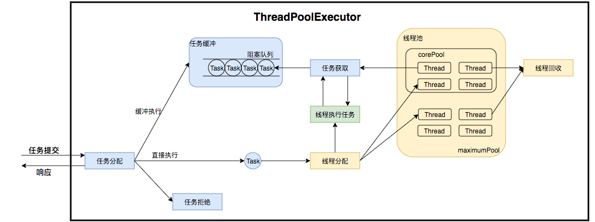

## 线程池

线程的创建、销毁、调度都要有开销，过多的线程会带来过多的开销、占用过多的资源，其资源的分配也往往不均，所以我们采用[线程池](https://tech.meituan.com/2020/04/02/java-pooling-pratice-in-meituan.html)来维护一组线程，以达到减少开销、管理资源的效果。


## 内置线程池

### FixedThreadPool

线程数固定。

### CachedThreadPool

线程数不固定，且只有非核心线程，即，所有线程空闲`60秒`后被回收。

而想要创建指定动态范围的线程池，可这样写：`new ThreadPoolExecutor(min, max, 60L, TimeUint.SECONDS, new SynchronousQueue())`。

### SingleThreadExecutor

按任务提交顺序串行执行。

### ScheduledThreadPool

定期、间隔执行多个任务。

```java
scheduledThreadPool.schedule(new Task("one-time"), 1, TimeUnit.SECONDS); // 一秒后执行一次性任务。
```

```java
scheduledThreadPool.scheduleAtFixedRate(new Task("fixed-time"), 2, 3, TimeUnit.SECONDS) // 2秒后开始执行，每3秒执行一次。某次执行时间超过任务周期时，后续执行会延迟开始，但不会并发执行。
```

```java
scheduledThreadPool.scheduleWithFixedDelay(new Task("fixed-delay"), 2, 3, TimeUnit.SECONDS) // 2秒后开始执行，每隔3秒执行一次。
```


## 实现

以上4种内置线程池都是借助<span style=background:#c2e2ff>ThreadPoolExecutor **extends** ( AbstractExecutorService **implements** ( ExecutorService **extends** Executor ) )</span>实现。

### Executor

该接口类提供`execute()`实现了任务提交和任务执行的解耦。
- 这样能良好的缓冲任务，复用线程。

我们只需将任务的运行逻辑（`Runnable`对象）提交到执行器，之后由执行器负责调度线程、执行任务。

- 生产者消费者模型在这里也有体现：任务管理相当于生产，线程管理相当于消费。

### ExecutorService

提供执行任务的能力，可以为一个或一批异步任务生成`Future`。

提供线程池的管控，如停止线程池的运行。

- 线程池使用后，需调用`shutdown()`关闭。

### AbstractExecutorService

将执行任务的流程串联起来，这样其实现类只需关注任务的执行。

### ThreadPoolExecutor

实现最复杂的运行部分，包括：
- 维护自身生命周期。
- 管理线程和任务，使两者良好地结合从而并行执行任务。


## 生命周期

线程池需要维护自身的生命周期：

1. 线程池使用一个`AtomicInteger`变量来维护2个状态：

   1. `runState`，高3位保存运行状态。
   2. `workerCount`，低29位保存有效线程数。

3. 在线程池中，经常需要同时判断上面这两个状态，而用一个变量存储两个状态，能避免为了维护这两个状态的一致性，而锁定资源的情况。

3. 如下图所示，线程池有5种运行状态：

   1. **Running**，能接受新任务，也能处理阻塞队列中的旧任务。
   2. **Shutdown**，不再接受新任务，处理完阻塞队列中的旧任务后停止。
   3. **Stop**，不接受新任务，也不处理阻塞队列中的旧任务，并中断正在处理任务的线程。
   4. **Tidying**，所有任务都已终止，`workerCount`为0。
   5. **Terminated**，终止。


## 线程池的运行过程⭐

线程池的运行过程主要分为：

1. 任务管理。
2. 线程管理。

其大概过程为：

1. 任务提交后，线程池进行任务调度：根据**线程池的运行状态**、**运行线程数**、**运行策略**决定，是拒绝该任务，还是直接申请线程执行该任务，还是将该任务缓冲到队列中等待执行。
2. 线程池中的线程会不断地从队列中获取任务，当所有任务执行完成后线程就会被回收。




## ForkJoinPool[[1]](https://blog.hufeifei.cn/2018/09/Java/ForkJoinPool/)

`ForkJoinPool`与`ThreadPoolExecutor`一样，都继承自`AbstractExecutorService`。

`ForkJoinPool`线程池采用分治法、工作窃算法。

- 分治法：`ForkJoinPool`将任务拆解成多个子任务<span style=background:#c2e2ff>并行</span>执行，但不会为每个子任务创建单独的线程，线程数量取决于CPU核数，每个线程都有一个`Deque`用于存储任务。
- 工作窃算法：线程的`Deque`如果为空，会随机调用其他线程的`Deque.poll()`，将任务“窃取”到自己的`Deque`中。

> Fork/Join与Map/Reduce叫法不同，但思想一致。
>

Fork/Join常用于并行排序、并行查找，往往搭配数组或列表来使用。
