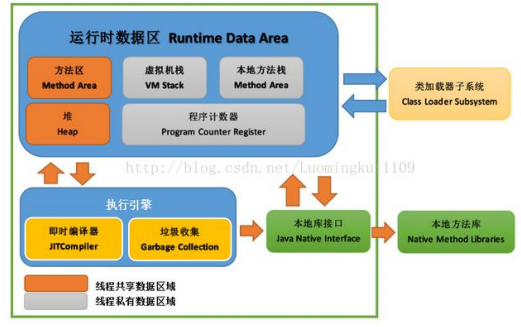

本章主要参考自[CS-Notes](https://www.cyc2018.xyz/)。

如下图所示，JVM主要包括<u>运行时数据区</u>、<u>类加载器</u>、<u>执行引擎</u>、<u>本地接口</u>等。

### 与运行时

Java9开始，对JDK进行了模块化拆分，允许仅将必要的类进行打包。

甚至支持借助圣杯（Graal）将工程连同JVM一并打包为可执行的二进制JAR，无需加载`*.class`，即，没有<u>类加载器</u>、也没有相关`*.class`。

这一做法的背后是对虚拟机的概念进行了淡化，对运行时（Runtime）这一概念的强化。

