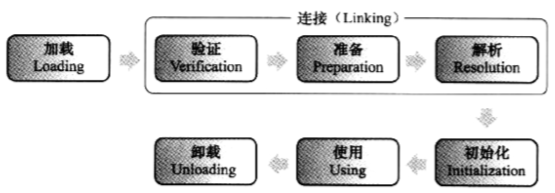

### 虚拟机的内存结构

虚拟机的运行时数据区域，也就是其内存结构，分为：堆、栈、方法区和程序计数器。

1. **堆**

   1. 用于存放对象，分为新生代（**Young** Generation）和老年代（**Old** Generation）。
   2. **堆**不需要连续内存。

2. **栈**

   1. 变量和引用都存放于**栈**中，而对象存放于**堆**中。
   2. 分为**虚拟机栈**和**本地方法栈**，用于方法的执行。
   3. **虚拟机栈**是线程私有的，生命周期与线程相同，该数据结构描述的是Java方法执行时的内存模型。
      1. 当执行一个方法时，会在虚拟机栈中创建一个**栈帧**，用于存放方法中的**局部变量**、**操作数栈**、**常量池引用**、**方法出口**等。
      2. 方法们的执行过程，就是栈帧在栈中出栈入栈的过程。
      3. 方法调用过程，符号引用转换为直接引用[的过程叫做](https://mp.weixin.qq.com/s?__biz=MzI0NjUxNTY5Nw==&mid=2247484671&idx=1&sn=b33d3a54250b217d0945c69a4e3d3212&chksm=e9bf5661dec8df777af465067f81e4ac57cb3aec2ca5a50c5b22a695d23ce99d8a8150c407b6&scene=21#wechat_redirect)**动态链接**。
   4. **本地方法栈**是调用本地方法的地方。
      1. 在HotSpot中，该栈与虚拟机栈合并，统一实现。
   5. 请求栈深度超过最大值时，会抛出**StackOverflowError**，栈进行动态扩展时无法申请到足够内存，会抛出**OutOfMemoryError**。

3. **方法区**

   1. 存放共享数据，或者说编译器编译后的代码，包括**元信息**、**常量**、**静态变量**。
   2. 在Java8之前，HotSpot使用永久代（**Permanent** Generation）实现**方法区**，而**Permanent**又在**堆**上，但这不符合JVM规范。但也有人说，方法区是一个JVM规范，**Permanent**和**元空间**都是其一种实现方式。
   3. 所以在Java8中，Hotspot[取消了Permanent](https://blog.csdn.net/weixin_35204634/article/details/113451805)，将方法区中的

      1. **元信息**、**常量**放入**元空间**。元空间位于本地内存中，而非JVM内存，故不受JVM参数的限制。
      2. **静态变量**放入**堆**。
   4. **方法区**不需要连续内存。

4. **程序计数器**

   1. 每个线程都有一个**程序计数器**，用于保存当前执行的**字节码**的行号（地址）。
   2. 分支、循环、异常处理、线程恢复都依赖**程序计数器**。
   3. 本地方法的**程序计数器**为空。

5. **直接内存**
   1. Java4引入的NIO类可以通过**DirectByteBuffer**对象来获取经本地方法分配的堆外内存，以避免堆内存和堆外内存的来回拷贝。

### 字面量与常量

1. **字面量**

   1. 在计算机科学中，字面量（Literal）是表示源代码中固定值的一种表示法（notation）。
   2. 几乎所有的编程语言都对原子值（如整数、浮点数和字符串）进行了字面量表示。

   3. 1. 非对象、懒加载、不重复。

2. **常量**

   1. 在C/C++中，常量是经**const**修饰的变量或者宏定义。
   2. 在Java中，常量不只是经**final**修饰的变量，还包括**字面量**和**符号引用**（类的全限定名、属性名称、方法名称、修饰符等）。
   3. Java编译器在编译时，会用一部分字节分类存储这些常量，这些字节就是**静态常量池**。

   

### 常量池

常量池分为：

1. **静态常量池，**位于class文件中，故也称类文件常量池。
2. **运行时常量池**，位于方法区。

在类的加载过程中：

1. **Loading**阶段，会将class文件中的**静态常量池**转换为方法区中的**运行时常量池**。
2. **Resolution**阶段，会将运行时常量池中的**符号引用**替换为**直接引用**。

首先，不是所有的数字字面值都会保存在常量池中，常见的数字字面值都直接内嵌到指令中，如整数字面量的-32768~23767，当然，这部分数字字面值如果经**final**修饰，就会保存到常量池中。

另外，Java会将包装类对象缓存起来对象池中。对象池与JVM无关，由相应的静态内部类实现，其初始化在包装类第一次被使用时就已完成。

但是，字符串的包装类不同，它的对象会缓存到常量池中，属于JVM。

内嵌到指令也好、缓存包装类对象也好，都是为了提升性能。

### 字符串池

String的不可变是通过**final**关键字和良好的封装来实现的。

new String("ABC")会创建两个对象，一个驻留字符串池，一个分配在堆中。

确切地说，字符串池没有直接保存字符串，而是保存了对字符串的**引用**，其保存过程是通过调用public **native** String String.intern()在运行时进行的。

1. intern()实际上会调用C++实现的**StringTable**的intern()。

2. C++的**StringTable**与Java的**HashMap**相仿，但是默认大小1009、不能自动扩容，采用拉链法。

   1. 拉链法就是数组+单向链表，“大小固定”指的是数组的容量大小固定，但链表（bucket）能无限延长。

Hotspot中，字符串池的位置：

1. 在Java7以前，字符串池位于**方法区**。
2. 在Java7中，字符串池被分离到**堆**中。

受此变化的影响，String.intern()在Java7前后实现有所[不同](https://blog.csdn.net/Xu_JL1997/article/details/89150026)，如果字符串池中不存在，调用String.intern()后：

1. Java7以前，会将字符串对象复制到字符串池中。
2. Java7中，会将字符串的引用保存到字符串池中。