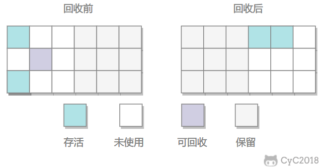

## 垃圾收集

Garage Collection，GC，发生在**堆**、**方法区**。而**栈**、**程序计数器**属于线程私有，随线程销毁而销毁。

### 存活标准

判断对象是否存活的标准是对象是否被引用，可分为：

1. ##### 引用计数法
   
   1. 为对象添加引用计数器，有引用时加1，引用失效时减1。
   2. 无法解决循环引用问题。
   
2. ##### 可达性分析法
   
   1. 以**GC Roots**为起点进行搜索，不可达的对象代表未被引用。
   2. **GC Roots**包括：
      1. **虚拟机栈**、**本地方法栈**中引用的对象。
      2. **方法区**中**常量**、**静态变量**引用的对象。

### 卸载

**方法区**主要是对**常量池**的回收和对类的卸载。类卸载需要满足3个条件，并且满足了也不一定会被卸载：

1. 类的所有实例已被回收。
2. 类的加载器已经被回收。
3. 类的Class对象不再被引用。

## 引用类型[[1]](https://zhuanlan.zhihu.com/p/70699720)

### 强引用

被**强引用**的对象不会被回收。

引用通过`new`关键字创建出的对象都是**强引用**（`FinalReference`）。

### 软引用

被**软引用**的对象在内存不足时才会被回收。

引用通过`SoftReference`类创建出的对象都是**软引用**。

### 弱引用

被**弱引用**的对象一定会被回收，即只能存活于下次垃圾回收发生前。

引用通过`WeakReference`类创建出的对象都是**强引用**。

### 虚引用

被**虚引用**的对象的回收与否与是否被**虚引用**无关，为对象设置**虚引用**仅仅是为了对象被回收时能收到系统通知。

引用通过`PhantomReference`类创建出的对象都是**虚引用**。

## 垃圾收集的方法

### 标记清除法

对需要回收的对象Mark Word进行标记，然后进行清除。回收后的空间会放入空闲链表中，如果空间连续则合并，分配空间时查询空闲列表。

效率低、碎片空间大。

### 标记整理法

将存活的对象移向一段，然后回收端边界以外的内存。

效率低。

### 复制法

将内存均分为两块，每次只是用其中的一块，当一块用完后就将还存活的对象移动到另一块，然后清空这块内存。

空间利用率低。

### 分代法

将**Heap**3分为**Young**、**Old**、**Permanent**：

1. **Young**采用复制法。
2. **Old**采用标记清除法（**SO**、**PO**）或标记整理法（**CMS**、**G1**）。
3. **Permanent**很少清理。

**Young**又按“**8：1：1**”的比例分为伊甸区、幸存者1区、幸存者2区，这样内存的利用率能达90%。

但如果存活的对象如果多于10%，Survivor就不够用了，需要**Old**进行空间分配担保。

## 垃圾收集器

HotSpot共有7种垃圾收集器，除**CMS**、**G1**外，其它收集器都会与用户程序交替执行，既需要停顿用户程序。停顿，Stop The World，STW。

### Young收集器

#### Serial

1. 串行执行。
2. Client场景下默认的新生代收集器
3. 一两百兆的垃圾可与100毫秒内完成收集。

#### ParNew

1. Serial的并行版。
2. Server场景下默认的新生代收集器。
3. 可配合**CMS**使用。

#### Parallel Scavenge

1. 并行处理。
2. 停顿时间短，适合用户交互场景，是以牺牲**Young**空间、吞吐量换来的，所以回收也会频繁。

### Old收集器

#### Serial Old

1. **Serial**的**Old**版本。
2. 可搭配**Parallel Scavenge**使用。

#### Parallel Old

1. **Parallel** **Scavenge**的**Old**版本。

#### CMS，Concurrent Mark Sweep

回收过程分为4个阶段：

1. 初始标记，Initial Mark
   1. 只是对**GC** **Roots**能直达的对象进行标记。
   2. 需要停顿，但是停顿时间短。

2. 并发标记，Concurrent Mark
   1. 进行**可达性分析**，持续时间长。
   
3. 重标记，Remark
   1. 修正并发标记期间，程序的变动。
   2. 需要停顿。

4. 并发清除，Concurrent Sweep

**CMS**有以下缺点：

1. 停顿短，所以吞吐量低。
2. Concurrent Mode Failure
   1. 并发清除时用户程序产生的垃圾叫做”浮动垃圾“，需要为”浮动垃圾“预留出一部分内存，所以**CMS**在**Old**快要满时就需要回收垃圾。如果预留的空间不够，就会发生”Concurrent Mode Failure“，这时**Serial Old**就会出面摆平，然后深藏功与名。
3. 标记清除法会带来空间碎片，导致没有足够大的连续空间，进而提前触发**Full GC**。

#### G1，Garbage First

将**堆**划分成多个大小相等的区域（Region），**Young**和**Old**再隔离。

整体看是标记整理法，局部看是复制法

回收过程分为4个阶段：

1. 初始标记
2. 并发标记
3. 最终标记
   1. 并发标记阶段的对象变化会记录在Remember Set Logs中，并在本阶段合并到Remember Set中。会停顿。
4. 筛选回收
   1. 对各个**Region**的回收价值和成本进行排序，按用户期望的停顿时间回收。

## 内存分配

- 优先分配到**Eden**。
  - 新创建的对象会放入**Eden**；垃圾回收时会将**Eden**和**Survivor**中的幸存对象放入另一个**Survivor**；多次回收都存活下来对象会被放入**Old**。
- 大对象直接分配到**Old**。
- 长期存活的对象移动到**Old**。
- 动态年龄判断，当有相同年龄的对象大小之和大于**Survivor**大小的一半时，大于等于该年龄的对象会移入**Old**。

## 回收策略

### Minor GC

- 只回收**Young**，执行频繁、执行速度快。
- 当**Eden**空间不够时会触发。

### Major GC

- 有人说**Major GC**只回收**Old**，但也有人说它与**Full GC**等价，回收整个堆。[[1]](https://www.zhihu.com/question/41922036/answer/93079526)

### Full GC

- 回收**Young**、**Old**和**Permanent**，**Old**中的对象存活时间久，所以很少执行、执行速度慢。

#### 触发条件

1. 调用`System.gc()`时。
   1. 建议JVM进行一次**Full GC**，JVM不一定会执行，在系统空闲、内存不足时才会执行。
2. **Old**空间不足时。
   1. 往往是因为大对象、长期存活的对象太多引起的。
3. **Permanent**空间不足（Java8之前的版本）。
4. 发生”Concurrent Mode Failure“时。
5. 空间分配担保失败时。
   1. 在**Minor GC**之前，JVM会检查**Old**的最大可用连续空间是否大于**Young**所有对象大小之和，如果是，则担保成功（**Minor GC**安全）；
   2. 如果否，则担保失败，JVM会查看HandlePromotionFailure的值是否允许冒险，如果允许则检查**Old**的最大可用连续空间是否大于历次晋升到**Old**的对象的平均大小，如果是，则尝试进行此次**Minor GC**，如果否，则进行一次**Full GC**。
   3. 如果不允许冒险，也会进行**Full GC**。

## 堆外内存[[1]](https://www.jianshu.com/p/8e942cd7b572)

**NIO**引入的`DirectBuffer`等类允许开发者直接操作<u>堆外内存</u>，<u>堆外内存</u>几乎不受**Minor GC**的影响。

### 申请

`DirectBuffer`申请<u>堆外内存</u>时，会先检查内存是否充足，如果不充足，则调用`System.gc()`，然后`Thread.sleep(100)`后会再次检查，若还是不足，则抛出**OutOfMemoryError**；当内存充足时，会通过`Unsafe.allocateMemory(long)`申请<u>堆外内存</u>。

### 释放

申请的<u>堆外内存</u>可通过显式调用`DirectByteBuffer.cleaner().clean()`，进而调用`Unsafe.allocateMemory(long)`来释放。

如果不手动释放，JVM也会自动释放<u>堆外内存</u>：`DirectByteBuffer`持有一个`Cleaner`对象，而`Cleaner`继承自<u>虚引用</u>；当`DirectByteBuffer`不再被引用，进而被回收时，`Cleaner`也会被回收，进而触发<u>虚引用</u>设下的通知，JVM收到通知后就会释放对应的<u>堆外内存</u>。

