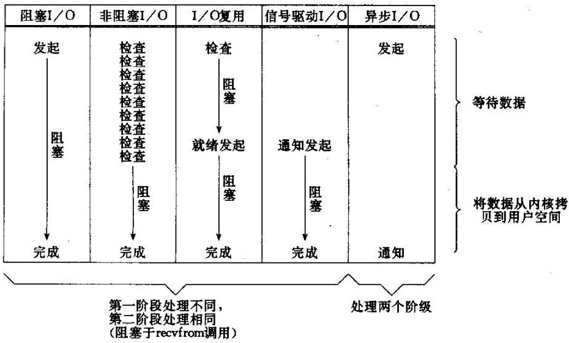

### 于是便有了NIO

IO指的是对内存的输入/输出（Input/Output），IO交互的对象主要有硬盘和网络（Socket）。

最基本的IO是Blocked IO（阻塞式IO，简称BIO）。**BIO**使用简单，但应用程序需等待IO完成才会继续执行，而阻塞意味着CPU空闲。

在**网络编程**中，如果使用阻塞式IO，想要提升CPU的使用率以及程序的并发量，最直接的方法是为每个连接都创建一个线程。

但这种直接使用多线程的方法，在面对高并发数（大于1000），或者网络环境复杂（非局域网环境）时，将凸显以下缺点：

1. 线程的创建、销毁都是调用重量级的系统函数，成本高。
2. 一个Java线程至少分配512KB，内存占用多。
3. 线程的切换成本高，并且越多的线程意味着越频繁的切换。
4. 面对网络IO时，一旦网络不稳定，就会出现大量线程阻塞，系统负载陡增。

即便引入线程池，也无法有效缓解上述问题，[于是便有了NIO](https://tech.meituan.com/2016/11/04/nio.html)。

### IO比较

IO过程分为**2**阶段：

1. **等待就绪**，不消耗CPU。没有收到数据或无法写入时：

   1. **BIO**会阻塞，即一直进行“空等”。
   2. **NIO**不会阻塞，即不进行等待，会直接返回。

      1. 不阻塞指的是不对File Descriptor进行阻塞。
      2. “**NIO**不等待并直接返回”不代表着程序的结束，我们仍然需要编写代码，不停地检查所有的File Descriptor，即等待读写的就绪。
   3. **AIO**（Asynchronous I/O）不同于前两种IO，它的IO过程只有**1**个阶段：
      1. 前两种IO的实际过程需要我们编写代码来完成，但**AIO**将实际的IO过程交由**OS**来完成，**AIO**会一直等待**OS**完成异步IO然后回调用户代码。
      2. 不难看出，同步、异步针对的是用户线程和内核的交互，且**AIO**需要**OS**底层支持。
   5. 至于**信号驱动IO**，它与**AIO**类似，不同点在于**AIO**是通知应用读写完成，**信号驱动IO**是通知应用可以开始读写。
   6. 换句话说，**BIO**是“我要读”，**NIO**是“我可以读了”，**AIO**是“读完了”。
2. **读写操作**，消耗CPU，虽然是阻塞的，但操作的是内存，过程很快，基本不耗时。

### NIO基本组件

在介绍**NIO**的如何实现并发之前，我们先简单介绍Java **NIO**中的**3**个基本组件：

1. **Buffer**
   1. **BIO**会逐字节进行读写，而**NIO**按照块（即字节数组）进行读写，而**Buffer**就是对块的封装。
   2. 按块读写速度快，但是也增加了程序的复杂度。
   
2. **Channel**

   1. 直译为管道。
   2. **BIO**基于**Stream**，而**NIO**基于**Channel**；**Stream**是单向的，而**Channel**是双向的。
   3. 文件IO阻塞是可以接受的，并且为文件IO设置非阻塞[是没有意义的](https://www.cyc2018.xyz/Java/Java IO.html#选择器)，所以Java对文件的**NIO**实际上还是阻塞的，而对网络的**NIO**是非阻塞的，并且**NIO**的出现主要为解决网络编程中的并发，所以下面的讨论都是关于网络IO的。

3. **Selector**
   1. 直译为选择器。
   2. **NIO**在无法读写时也会立即返回，但仅仅这样是不能实现并发读写的。**BIO**使用多线程实现并发，而**NIO**基于多路复用模型实现并发，而**Selector**则是多路复用模型中的核心组件。

### NIO实现并发

多路复用模型基于事件，其事件主要有**4**种：

1. **Read**，读就绪。
2. **Write**，写就绪。
3. **Connect**，可进行连接。
4. **Accept**，新连接到来。

确切地说，Java **NIO**采用的是多路复用中的**Reactor**模型，它是这样实现并发的：

1. 令一个线程持有一个**Selector**，我们将**Channel**及对应事件注册到**Selector**上，**Selector**会监听这些**Channel**上的事件，从而获取那些**就绪**（事件到来）的**Channel**。

2. **Selector**获取**就绪**的**Channel**的过程是阻塞的，即**Selector**会一直等待，直到有**Channel**就绪。
   1. 该过程实际上是调用**OS**接口来寻找可读写的网络描述符（Socket Descriptor）。
   
3. **Channel**等待就绪（相应事件到来）的过程是非阻塞的，即当**Channel**上的相关事件未到达时，不会阻塞，即直接返回，这样**Selector**才能**Channel**间进行切换，不被卡住。

4. 而我们需要以**轮询**的方式不停地询问**Selector**，从而不停地获取就绪的**Channel**，并遍历这些就绪的**Channel**，以实现并发。

5. 当**Channel**不能读写（读完**Buffer**、写满**Buffer**）时，我们可以将其记录下来，然后切换到其它就绪的**Channel**上进行读写。

   1. 记录方式为在**Selector**上注册标记位，**SelectionKey**这个类就是用来标识标记位的。
   2. **Selector**是线程安全的，但**SelectionKey**不是。

常见的多路复用模型有**2**种：

1. **Reactor**，反应堆
   1. 该模型基于同步IO，即**Selector**会等待事件（如File Descriptor可读写）的到来，待事件到来后将其分发给相应的事件处理器，由<u>事件处理器来完成IO</u>。
   2. **Redis**、**Netty**也是基于此模型。
   
2. **Proactor**，前摄器

   1. 该模型基于异步IO，即事件处理器（或者由**Selector**代其）直接发起异步IO；**Selector**会一直等待，直到**OS**完成IO后通过回调函数通知它，然后**Selector**将事件分发给相应的事件处理器。
   2. 可以看出，该模型依赖**OS**底层的异步接口，并且不止需要向**OS**传递回调函数，还需要传递**Buffer**、数据读取量等参数。

### 优化NIO

单线程处理IO开销小，程序只需拼命地读、写、选择事件，效率高。

单线程的能力是有极限的，除非超越单线程（我不做人了，Jojo！）。当单线程到达上限时，我们还是需要借助多线程来优化，但是需要对线程的数量加以控制，否则还是会发生与直接使用多线程同样的问题。

优化主要从**3**个方面入手：

1. **Selector**，事件分发器

   1. 可以改为多线程，或多实例来选择就绪**Channel**。
   2. 但是需要注意，Java的**Selector**对Linux来说，同一**Channel**的select不能被并发调用，即一个**Socket**只能属于一个IO线程，当然一个IO线程可以持有多个Socket。

2. IO处理器

   1. 对于connect、read、write这些纯CPU操作，我们可以开启CPU核心数个线程来优化程序。
   2. 另外，与connect操作相比，read/write操作要占用跟多的CPU，所以我们可以将分开其分开，即将海量连接的注册与读写分开，以提升程序的并发量。

3. 业务线程

   1. 在处理完IO后，往往还会有业务逻辑需要执行，如数据库操作、RPC等阻塞操作，这时我们可以另起线程来处理这些操作，避免IO被阻塞。

对于需要保证请求处理顺序的场景，我们可以借助Redis中的队列将请求数据缓冲，然后pipeline发送，返回future，然后channel可读时，直接在队列中把future取回来，done()就可以了。

对于多连接、短链接的HTTP Client，我们可以使用NIO来处理。但由于HTTP是无状态的，同时没办法使用队列，此时我们可以将不同的**Socket**作为Key存储到Map中。

Thrift、Dubbo等RPC框架会在内部维护请求号，我们可以将请求号作为Key，结果的Result作为Future的Map，结合NIO+长连接来获取不错的性能。

### NIO框架

Java[没有基于NIO实现](https://blog.hufeifei.cn/2021/06/13/Java/nio/#netty-mina)HTTP等协议，而是通过制定**Server** API让**Servlet**容器来实现HTTP等协议，实现方式究竟是**BIO**、**NIO**、**APR**由**Servlet**容器自行决定。

而**Netty**、**Mina**等**NIO**框架没有使用**Servlet**，而是自行实现了对HTTP的支持。

1. 其中**Netty**甚至完全脱离Java **NIO**，基于Linux的epoll、BSD的kqueue通过JNI自行实现了一套IO-Multiplex。
2. 并且**Netty**比**Mina**更简洁，模块划分更加清晰。