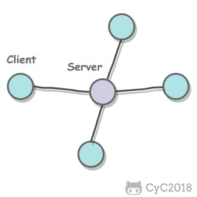
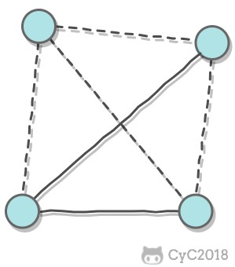

## 概述

本篇总结自[CS-Notes](http://www.cyc2018.xyz/计算机基础/网络基础/计算机网络 - 目录.html)。

### 主机之间的通信方式

Client/Server，C/S，客户端/服务端：客户端是服务的请求方，服务端是服务的提供方。

Peer-to-Peer，P2P，对等：不区分客户端、服务端。

### 分层模型

#### Open Systems Interconnection model，OSI model

##### Application layer，应用层

- 面向应用程序。
- 数据单位为Data/报文。
- 主要包括HTTP、DNS、FTP、SMTP等协议。

##### Presentation layer，表示层

- 负责压缩、加密以及描述数据，使应用程序不必关心各台主机中内部数据格式的不同。

##### Session layer，会话层 

- 建立及管理会话。

##### Transfer layer，传输层

- 面向进程。
- 主要包括TCP、UDP等协议。
  - TCP的数据单位为Segment。
  - UDP的数据单位为Datagram。

##### Network layer，网络层

- 面向主机。
- 数据单位为Packet/分组。
- 主要包括IP、ICMP等协议。

##### Data link layer，数据链路层

- 面向链路。
- 数据单位为Frame/帧。

##### Physical layer，物理层

- 屏蔽传输媒体和通信手段的差异。
- 数据单位为Bit，Symbol。

> 另外：
>
> - 应用层、表示层、会话层、传输层都属于主机层（Host layers）。
> - 网络层、链路层、物理层都属于媒体层（Media layers）。

#### 五层协议

五层协议没有<u>表示层</u>和<u>会话层</u>，将这些功能留给应用程序开发者处理。

#### 四层协议

四层协议相当于将五层协议中<u>数据链路层</u>和<u>物理层</u>合并为<u>网络接口层</u>。

四层协议不严格遵循OSI model，应用层可能会直接使用<u>传输层</u>或<u>网络接口层</u>。

