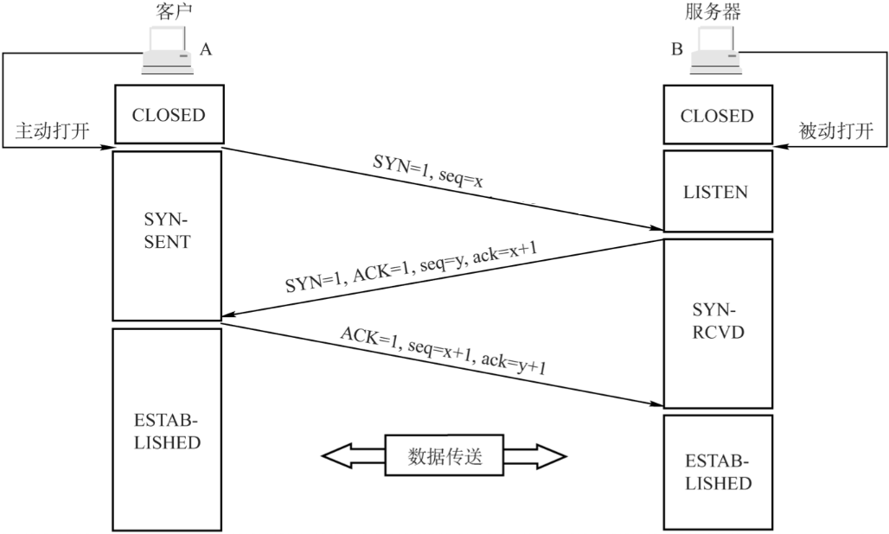
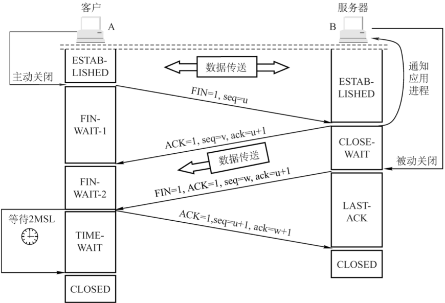

## 传输层协议

### TCP

1. Transport Control Protocol。

2. 面向连接的协议。

3. 基于字节流。

4. 具有可靠性：

   1. 保证数据的完整性、有验证重发机制。
   2. 保证数据到达顺序。

5. **ACK**是累积的：一个确认字节号`N`的**ACK**表示所有直到`N`的字节（不包括`N`）已经成功被接收了。

   > 这样如果一个**ACK**丢失，后续的**ACK**也足以确认前面的报文段了。
   >
   > **ACK**还用来丢弃重复报文。

#### 握手和挥手[[1]](https://segmentfault.com/a/1190000039165592)

[3次握手](https://zhuanlan.zhihu.com/p/53374516)的目的不只是让通信双方都了解到一个连接正在建立、双方都有发送/接收能力，还在于利用数据包交换**ISN**。

### UDP

1. User Datagram Protocol。
2. 面向无连接的协议。
3. 基于数据报。
4. 不可靠，但是段结构简单、网络开销小，实时性也好。

**URL**，Uniform Resource Locator，由**协议**、**IP**、**端口号**、**资源名称**等4部分组成，而TCP、UDP属于不同的协议，故使用相同的端口仍能区分资源。

> [C10K问题](http://www.52im.net/thread-566-1-1.html)

## 应用层协议

### HTTP
