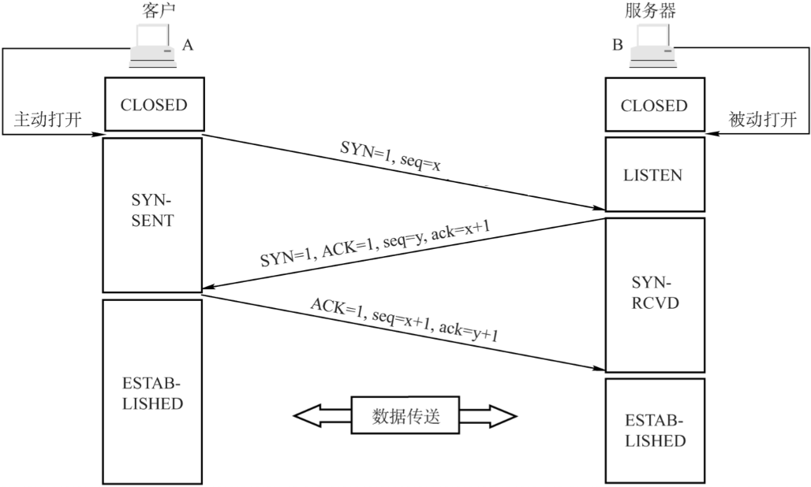
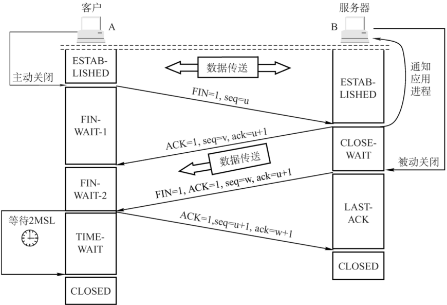
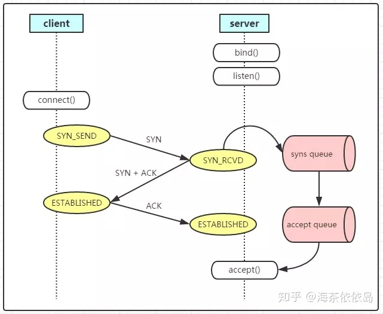
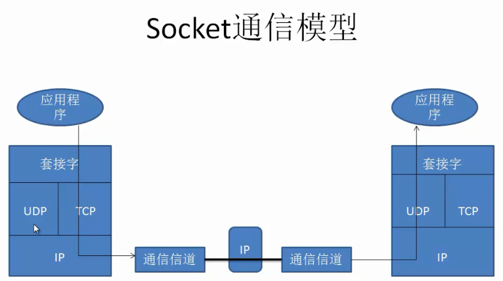

## User Datagram Protocol，UDP

用户数据报协议：

1. 面向无连接。
2. 数据单位为用户数据报。
   1. 对于应用层传下来的报文不合并也不切分，只是添加UDP首部。
3. 不可靠、没有拥塞控制，但是段结构简单、网络开销小，实时性也好。

## Transmission Control Protocol，TCP

传输控制协议：

1. 面向连接。

2. 基于字节流，数据单位为报文段。

   1. 把应用层传下来的报文看成字节流，把字节流组织成大小不等的数据块。

3. 具有可靠性：

   1. 保证数据的完整性、有验证重发机制。
   2. 保证数据到达顺序。

4. 有流量控制、拥塞控制。

5. **ACK**是累积的：一个确认字节号`N`的**ACK**表示所有直到`N`的字节（不包括`N`）已经成功被接收了。

   > 这样如果一个**ACK**丢失，后续的**ACK**也足以确认前面的报文段了。
   >
   > **ACK**还用来丢弃重复报文。

### 握手和挥手[[1]](https://segmentfault.com/a/1190000039165592)

[3次握手](https://zhuanlan.zhihu.com/p/53374516)的目的不只是让通信双方都了解到一个连接正在建立、双方都有发送/接收能力，还在于利用数据包交换初始序列号（Initial Sequence Number，ISN）。

四次挥手是为了能传送完数据。

Client等待由时间计时器设置的时间2MSL（一个报文的来回时间），而没有直接进入`CLOSED`，是为了：

- 确保最后一个确认报文能够送达Server，如果Server没收到Client发送来的<u>确认报文</u>，就会重新发送<u>连接释放请求报文</u>。
- 同时也是为了让本连接持续时间内所产生的所有报文都从网络中消失，避免下一个新的连接收到旧的连接的<u>请求报文</u>。

### 滑动窗口

滑动窗口用于缓存字节流。

Client和Server各有一个窗口，Server通过TCP报文段中的窗口字段告诉Client自己的窗口大小，Client根据窗口字段和其它信息设置自己的窗口大小。

### 两个队列

如[下图](https://zhuanlan.zhihu.com/p/57869001)所示：

- 当Server收到`SYN`请求时，会将半连接请求的状态由`SYN_SEND`改为`SYNRCVD`，并将请求放入Syns Queue中。
- 当Server收到`ACK`请求时，会将全连接请求的状态修改为`ESTABLISHED`，并将请求由Syns Queue放入Accept Queue。

并且：

- Syns Queue的大小，是通过`/proc/sys/net/ipv4/tcp_max_syn_backlog`（简称`backlog`）这一参数来控制的。
  - `backlog`默认大小`512`，[也有一说是](https://juejin.cn/post/7071528892053323813)`128`，不过，应用可以指定自己的`backlog`。
- Accept Queue的大小，是通过`/proc/sys/net/core/somaxconn`（简称`somaxconn`）这一参数来控制的。
  - 确切地说，是取`backlog`和`somaxconn`中的最小值。

Server处理半连接是需要一定时间的，当Syns Queue已满时，Server就会拒绝新的Socket连接，从而避免应用与Client建立过多的Socket，即，Syns Queue[起限制容量、控制资源的作用](https://www.cnblogs.com/qq3511107946/articles/12820031.html)。

> 而`backlog`的[大小讲究适中](https://juejin.cn/post/6844903949221232647)，一般为峰值QPS的`1`~`1.5`倍：
>
> - `backlog`过大，会在流量激增时，导致Client不能快速失败，造成读取连接超时，同时加重Server的CPU、内存负载。
> - `backlog`过小，或导致Client连接失败，Server资源闲置。
>
> 应用的`backlog`的大小可通过`ss -tnlp`命令进行查看。
>
> - `ss -tnlp`往往会结合`netstat -nat | awk '/tcp/{print $6}'|sort|uniq -c`，来查看处于不同状态的TCP连接的数量。
> - `ss -tnlp`往往会结合`netstat -s|grep -iE LISTEN`，来查看Syns Queue溢出而丢弃包的次数。

### Socket

如[下图](https://blog.csdn.net/sinat_33924041/article/details/83828559)所示，Socket并非一种协议，而是一种对TCP/IP协议的封装，是一种连接模式。

