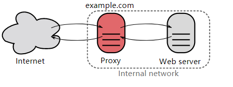

## 常见协议及端口

|  协议  |       中文       | 端口号  | 传输层  |            备注             |
| :----: | :--------------: | :-----: | :-----: | :-------------------------: |
|  DNS   |     域名解析     |   53    | UDP/TCP | 长度超过 512 字节时使用 TCP |
|  DHCP  | 动态主机配置协议 |  67/68  |   UDP   |                             |
|  SNMP  | 简单网络管理协议 | 161/162 |   UDP   |                             |
|  FTP   |   文件传送协议   |  20/21  |   TCP   |  控制连接 21，数据连接 20   |
| TELNET |   远程终端协议   |   23    |   TCP   |                             |
|  HTTP  |  超文本传送协议  |   80    |   TCP   |                             |
|  SMTP  | 简单邮件传送协议 |   25    |   TCP   |                             |
|  POP3  |   邮件读取协议   |   110   |   TCP   |                             |
|  IMAP  | 网际报文存取协议 |   143   |   TCP   |                             |

### 网页请求过程

1. DHCP配置主机信息。
2. ARP解析MAC地址。
3. DNS解析域名。
4. HTTP请求页面。

## Dynamic Host Configuration Protocol，DHCP

DHCP提供了即插即用的连网方式，用户不再需要手动配置IP地址等信息。

## Domain Name System，DNS

DNS提供主机名和IP地址的相互转换。

## File Transfer Protocol，FTP

FTP需要`2`个连接：

- 控制连接：Server打开端口号`21`等待Client的连接，Client主动建立连接后，使用这个连接将Client的命令传送给Server，并传回Server的应答。
- 数据连接：用来传送文件数据。

FTP有`2`种数据连接建立模式：

- 主动模式：Server主动建立数据连接，其中Server的端口号为`20`，Client的端口号随机。
- 被动模式：Client主动建立数据连接，其中Client的端口号由Client自己指定，Server端的端口号随机。

## Telnet

Telnet用于登录远程主机。

## Hypertext Transfer Protocol，HTTP[[1]](http://www.cyc2018.xyz/计算机基础/HTTP/HTTP.html)

### URL

Uniform Resource Locator，URL，统一资源定位符，由**协议**、**IP**、**端口号**、**资源名称**等`4`部分组成，而TCP、UDP属于不同的协议，故使用相同的端口仍能区分资源。

> Universal Resource Identifier，URI，统一资源标识符。
>
> Uniform Resource Name，URN，统一资源名称。
>
> URI包含URL和URN。

> [C10K问题](http://www.52im.net/thread-566-1-1.html)

#### 转义字符

`+`，` `，`/`，`?`，`%`，`#`，`&`，`=`等符号对URL来说是特殊字符，需要[进行转义](https://developer.aliyun.com/article/618753)，否则服务器无法获得正确的参数值。

| 符号 | 含义                           | 转义码 |
| ---- | ------------------------------ | ------ |
| `+`  | 空格                           | `%2B`  |
| ` `  | ` `可以用`+`或者转义码进行代替 | `%20`  |
| `/`  | 分隔目录和子目录               | `%2F`  |
| `?`  | 分隔资源名称和参数             | `%3F`  |
| `%`  | 指定特殊字符                   | `%25`  |
| `#`  | 书签                           | `%23`  |
| `&`  | 分隔参数                       | `%26`  |
| `=`  | 分隔参数名和参数值             | `%3D`  |

### Session与Cookie⭐

[两者不是同一层次的概念](https://www.zhihu.com/question/19786827/answer/84540780)，Cookie可用于实现Session。

- ##### Session

  - 由于HTTP是无状态的，所以才有了`session id`，用于标识**Session**是否有效，可进而用于标识用户。
  - `session id`往往只在请求中携带，易失；如有需要，可以持久化到数据库，或持久化到Cookie中。

- ##### Cookie

  - Cookie用于将数据持久化到浏览器中，以方便服务端下次来取。
  - Cookie不仅可以用于保存`session id`，进而保存会话状态，还可用于追踪用户行为，以及用于保存用户的个性化配置、文本编辑器的内容。
  - Web storage API（本地存储和会话存储）、IndexedDB等本地存储，可部分代替Cookie作用，但是Cookie会在请求中携带，而前两者不会。

### 特性

HTTP/1.1引入了TCP长连接、多TCP连接、流水线、Cookie等特性。

但HTTP/1.1仍然存在：

- Client需要使用多个连接才能实现并发、缩短延迟。
- 不压缩请求和响应首部，无法节省流量。
- 不支持有效的资源优先级，使TCP连接的利用率低下。

HTTP/2.0引入了二进制分帧层、服务端推送、首部压缩等特性，解决了上述问题。

### 代理

Proxy接受Client的请求，并且转发给Server，以便实现：

- 缓存。
- 负载均衡。
- 网络访问控制。
- 访问日志记录。

正向代理，用户察觉得到。

反向代理一般位于内部网络中，用户察觉不到。

### HTTPS

HTTP有安全问题：

- 无加密：使用明文进行通信，存在内容被窃听的风险。
- 无认证：不验证通信方的身份，存在身份伪装的风险。
- 无完整性保护：无法验证内容的完整性，存在内容被篡改的风险。

不过，我们可以使用隧道技术，让HTTP变得安全。

- 让HTTP先和SSL（Secure Sockets Layer）通信。
- 再由SSL和TCP通信。

> SSL是TLS（Transport Layer Security）的早期版本，[均已经被废弃](https://hit-alibaba.github.io/interview/basic/network/HTTPS.html)，不再受主流浏览器的支持。

而使用SSL的HTTP也就是HTTPS。

> 因为会进行加密/解密，所有HTTPS的吞吐会逊于HTTP。

#### 加密

对称加密速度快，但无法安全地将密钥传输给对方；非对称加密速度慢，但是可以安全地将密钥传输给对方。

所以SSL采用了混合加密的方式，即，先使用非对称加密，将对称加密所需的密钥传给对方，之后就可以只使用对称加密来通信了。

#### 认证

Certificate Authority，CA，数字证书认证机构，是Client与Server都可信赖的第三方机构。

站长为Server向CA申请公开密钥，CA 在判明申请者的身份之后，会对其申请的公开密钥做数字签名，然后分配这个已签名的公开密钥，并将该公开密钥放入公开密钥证书后绑定在一起。

之后，Client在与Server进行SSL通信时，Server会把该证书发给Client，Client从中获取公开密钥后，先使用数字签名进行验证，若验证通过，就会开始通信。

#### 完整性保护

SSL提供报文摘要，并结合加密和认证，来实现完整性保护。

### 状态码

以下图片源自[HTTP Cats](https://http.cat/)，但原网站响应较慢，故搬运之。

<ul>
<li style="width:30%;list-style:none;float:left"></li>
<li style="width:30%;list-style:none;float:left"></li>
<li style="width:30%;list-style:none;float:left"></li>
<li style="width:30%;list-style:none;float:left"></li>
<li style="width:30%;list-style:none;float:left"></li>
<li style="width:30%;list-style:none;float:left"></li>
<li style="width:30%;list-style:none;float:left"></li>
<li style="width:30%;list-style:none;float:left"></li>
<li style="width:30%;list-style:none;float:left"></li>
<li style="width:30%;list-style:none;float:left"></li>
<li style="width:30%;list-style:none;float:left"></li>
<li style="width:30%;list-style:none;float:left"></li>
<li style="width:30%;list-style:none;float:left"></li>
<li style="width:30%;list-style:none;float:left"></li>
<li style="width:30%;list-style:none;float:left"></li>
<li style="width:30%;list-style:none;float:left"></li>
<li style="width:30%;list-style:none;float:left"></li>
<li style="width:30%;list-style:none;float:left"></li>
<li style="width:30%;list-style:none;float:left"></li>
<li style="width:30%;list-style:none;float:left"></li>
<li style="width:30%;list-style:none;float:left"></li>
<li style="width:30%;list-style:none;float:left"></li>
<li style="width:30%;list-style:none;float:left"></li>
<li style="width:30%;list-style:none;float:left"></li>
<li style="width:30%;list-style:none;float:left"></li>
<li style="width:30%;list-style:none;float:left"></li>
<li style="width:30%;list-style:none;float:left"></li>
<li style="width:30%;list-style:none;float:left"></li>
<li style="width:30%;list-style:none;float:left"></li>
<li style="width:30%;list-style:none;float:left"></li>
<li style="width:30%;list-style:none;float:left"></li>
<li style="width:30%;list-style:none;float:left"></li>
<li style="width:30%;list-style:none;float:left"></li>
<li style="width:30%;list-style:none;float:left"></li>
<li style="width:30%;list-style:none;float:left"></li>
<li style="width:30%;list-style:none;float:left"></li>
<li style="width:30%;list-style:none;float:left"></li>
<li style="width:30%;list-style:none;float:left"></li>
<li style="width:30%;list-style:none;float:left"></li>
<li style="width:30%;list-style:none;float:left"></li>
<li style="width:30%;list-style:none;float:left"></li>
<li style="width:30%;list-style:none;float:left"></li>
<li style="width:30%;list-style:none;float:left"></li>
<li style="width:30%;list-style:none;float:left"></li>
<li style="width:30%;list-style:none;float:left"></li>
<li style="width:30%;list-style:none;float:left"></li>
<li style="width:30%;list-style:none;float:left"></li>
<li style="width:30%;list-style:none;float:left"></li>
</ul>