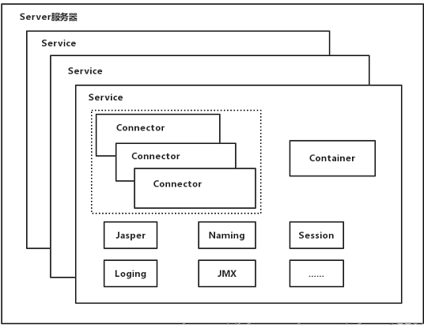
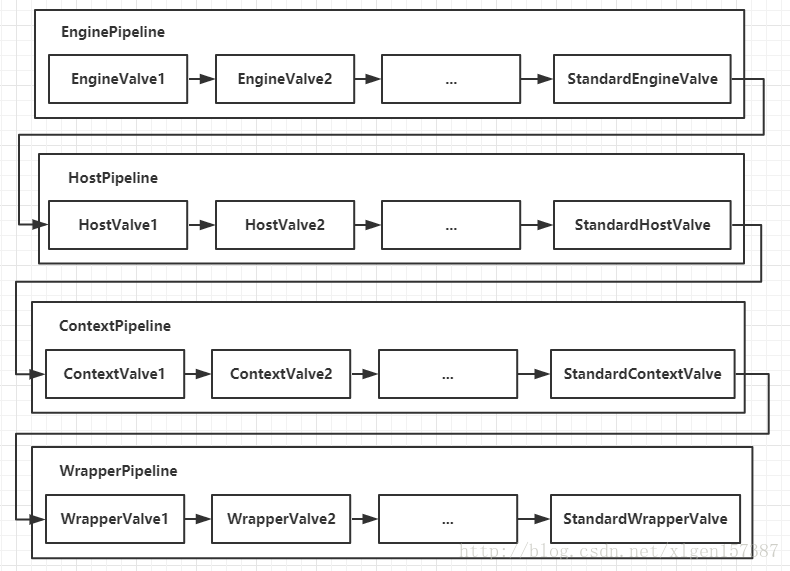
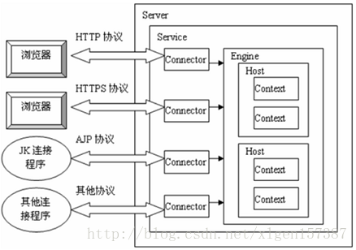

**Tomcat**结构如下图所示：

其实conf/server.xml就是**Tomcat**结构的反映，下面将结合该配置文件解析[Tomcat的架构](https://blog.csdn.net/xlgen157387/article/details/79006434)。

Server，Tomcat中的顶层容器，如图1、图2所示。

- Service，用于提供服务，一个**Server**有多个**Service**。
  - Connector，负责处理**Socket**，封装请求和响应。一个**Service**有多个**Connector**，如图3所示。
    - ProtocolHandler，协议处理器，有**Http11Protocol**、**Http11NioProtocol**等。
      - EndPoint，用于处理底层的**Socket**连接，也就是处理TCP/IP相关。
        - Acceptor，**AbstractEndpoint**的内部类，用于监听。
        - Handler，接口类，用于处理**Socket**，实际上时调用**Processor**进行处理。
        - AsyncTimeout，**AbstractEndpoint**，用于异步判读请求是否超时。
      - Processor，将Processor处理好的Socket封装为请求，也就是处理HTTP相关。
      - Adapter，将请求交给**Container**处理。
  - Container，用于封装、管理**Servlet**，当然也就包括处理**Connector**封装好的请求，如图4所示。一个**Service**仅有一个**Container**。
    - Engine，一个**Container**只有一个**Engine**，用于管理多个站点。
      - Host，一个**Engine**有多个**Host**，一个**Host**代表一个站点。
        - Context，一个**Host**有多个**Context**，一个**Context**表示一个应用，根节点表示/ROOT应用。
          - Wrapper，一个**Context**有多个**Servlet**，每个**Wrapper**封装了一个**Servlet**。
  - JMX，**Tomcat**基于JMX对每个组件进行注册、管理，即将每个组件封装为MBean。
  - Jasper、Naming、Session、Loging……

**Connector**采用**Pipeline**-**Valve**责任链的方式处理请求，其特点为：

1. **Pipeline**由多个**Valve**组成，并且每个**Pipeline**尾端都有一个**BaseValve**。
2. 由BaseValve来调用下一个**Pipeline**。

在依次调用完EnginePipeline、HostPipeline、ContextPipeline、WrapperPipeline之后，会调用FilterChain.doFilter()，也就是进入了过滤阶段，之后会依次调用所有的**Filter**，然后调用对应**Servlet**，请求处理完成后将响应返回给客户端。

处理流程如下图所示：

更多内容查看[Tomcat 8.0官方文档](http://tomcat.apache.org/tomcat-8.0-doc/index.html)。

**Tomcat**结构如图1所示：

**Tomcat**与**连接**如下图2所示：

**Connector**的结构如图3所示：

**Container**的结构如图4所示：