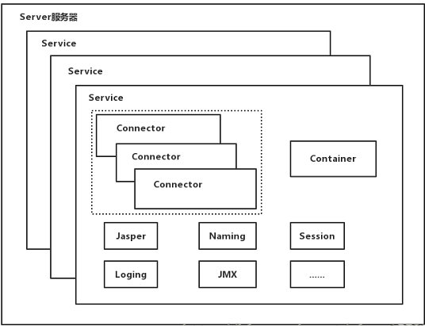
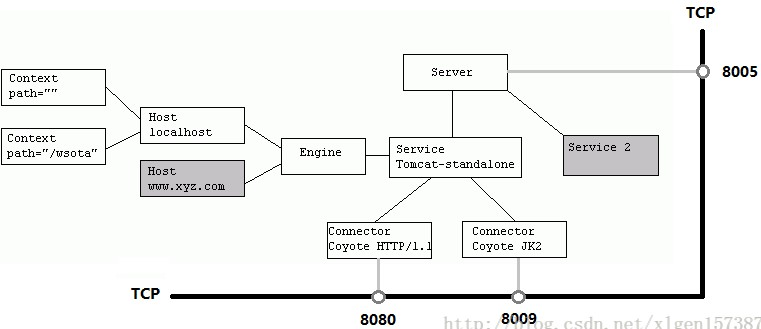
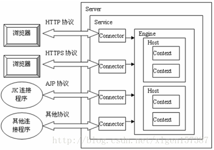
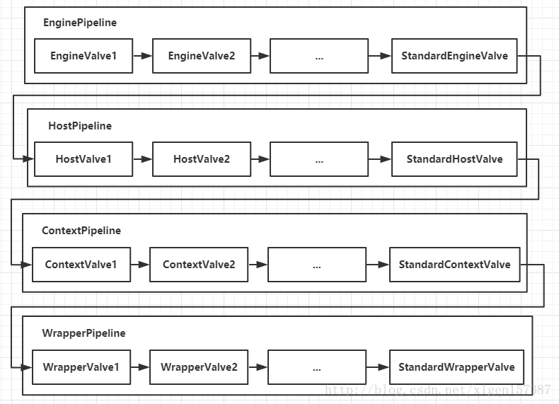
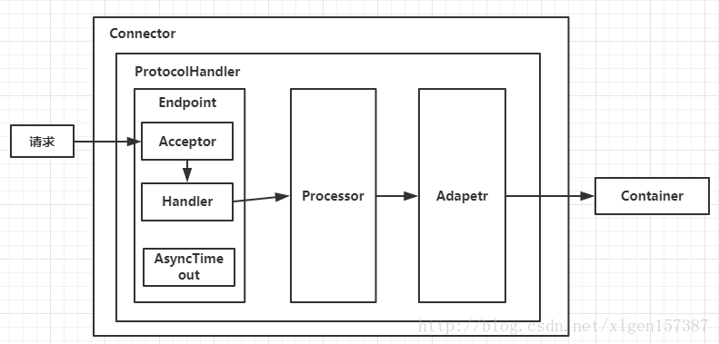
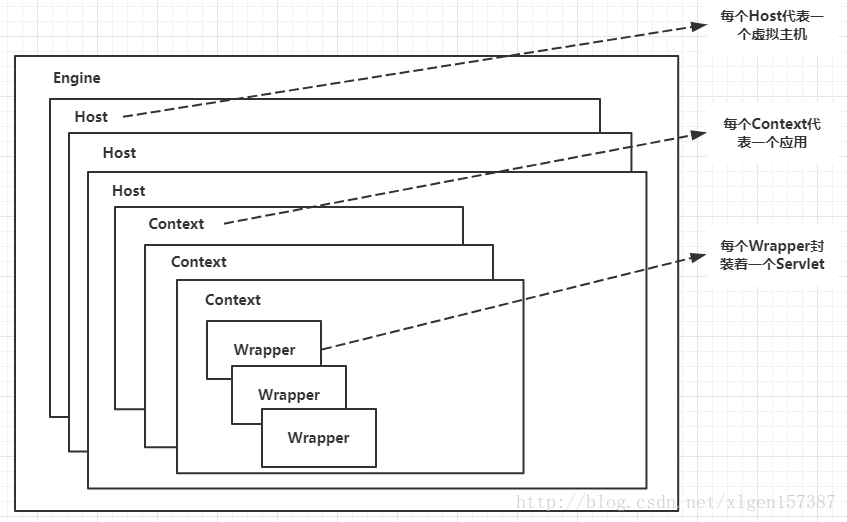

## 架构

### 层级

### 组件之间的关系

#### 总览

#### Service与Connector

### 配置文件

其实`conf/server.xml`就是**Tomcat**结构的反映，下面将结合该配置文件解析[Tomcat的架构](https://blog.csdn.net/xlgen157387/article/details/79006434)。

Server：Server是Tomcat中的顶层容器。

- Service：用于提供服务，一个**Server**有多个**Service**。
  - Connector：一个**Service**有多个**Connector**，每个**Connector**负责处理**Socket**，封装请求和响应。
    - ProtocolHandler：协议处理器，有**Http11Protocol**、**Http11NioProtocol**等。
      - EndPoint：用于处理底层的**Socket**连接，也就是处理TCP/IP相关。
        - Acceptor：**AbstractEndpoint**的内部类，用于监听。
        - Handler：接口类，用于处理**Socket**，实际上时调用**Processor**进行处理。
        - AsyncTimeout：**AbstractEndpoint**，用于异步判读请求是否超时。
      - Processor：将**Processor**处理好的**Socket**封装为请求，也就是处理HTTP相关。
      - Adapter：将请求交给**Container**处理。
  - Container：如图4所示，一个**Service**仅有一个**Container**，用于封装、管理**Servlet**，当然也就包括处理**Connector**封装好的请求。
    - Engine：一个**Container**只有一个**Engine**，用于管理多个站点。
      - Host：一个**Engine**有多个**Host**，一个**Host**代表一个站点。
        - Context：一个**Host**有多个**Context**，一个**Context**表示一个应用，`/`表示根节点/ROOT应用。
          - Wrapper：一个**Context**有多个**Servlet**，每个**Wrapper**封装了一个**Servlet**。
  - JMX：**Tomcat**基于JMX对每个组件进行注册、管理，即，将每个组件封装为MBean。
  - Jasper、Naming、Session、Loging……

> 更多内容查看[Tomcat 8.0官方文档](http://tomcat.apache.org/tomcat-8.0-doc/index.html)。

## Connector

### 处理连接

众所周知，**Connector**会通过新建线程（线程池）来处理每个连接，其线程创建模式，或者说运行模式有`3`种：

1. BIO：使用`java.io`中的类来处理线程问题，效率低，**Tomcat 7**及其以下版本默认采用该模式。
2. NIO：使用`java.nio`中的类来处理线程问题，性能高，**Tomcat 8**及其以上版本默认采用该模式。
3. APR：Apache Portable Runtime，可移植运行时，通过JNI调用**核心动态链接库**来处理文件读取和网络传输，是使用**OS**级别的**APR**来解决IO问题，性能最高，但是需要额外引入**APR**、**native**库。

> **Tomcat**自行实现了`ThreadPoolExecutor`，该线程池采用`LinkedBlockingQueue`。

### 处理请求

如下图所示，**Connector**采用**Pipeline**-**Valve**[责任链](../10、Linux、Maven、Git、设计模式/4.3 行为型设计模式.html#chain-of-responsibility责任链)的方式处理请求，其特点为：

1. **Pipeline**由多个**Valve**组成，并且每个**Pipeline**尾端都有一个**BaseValve**。
2. 由**BaseValve**来调用下一个**Pipeline**。

在依次调用完**EnginePipeline**、**HostPipeline**、**ContextPipeline**、**WrapperPipeline**之后，会调用`FilterChain.doFilter()`，也就是进入了过滤阶段，之后会依次调用所有的**Filter**，然后调用对应**Servlet**，请求处理完成后将响应返回给客户端。

## Container

