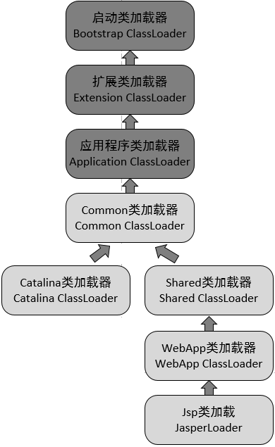
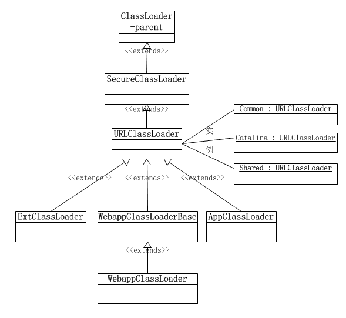

## 隔离与共享

**Tomcat**作为一个Web容器，自然而然地需要容纳多个应用（Webapp）。

**Tomcat**除了需要加载自身的代码、自身的依赖，还需要加载每个Webapp中的代码，包括`/webapp/WEB-INF/classes/*.class`和`/webapp/WEB-INF/lib/*.jar`。

1. **Tomcat**自身的代码与各个Webapp中的代码应该是部分隔离、部分共享的，如，**Tomcat**核心代码就需要隔离（出于安全考量），`servlet-api.jar`就应该被共享；
2. 而Webapp之间也应该是相互隔离，以避免用户代码相互干扰，以及同名但版本不同的JAR的相互干扰（全限定类名中可不包含版本号）；
3. 但同时Webapp之间往往存在着重复的JAR，最好能将这些JAR提取出来，然后各个Webapp共享这些JAR。

而直接使用上溯委托机制是无法解决这些问题的，于是**Tomcat**便在上溯委托机制的基础上实现了自己的类加载机制，如[下图](https://www.jianshu.com/p/abf6fd4531e7)所示：

**Tomcat**扩展了类加载器：

1. **Common Class Loader**
   1. 加载`$CATALINA_HOME/lib/common/`中的代码，路径中的代码完全共享。
2. **Catalina Class Loader**
   1. 加载`$CATALINA_HOME/lib/server/`中的代码，路径中的代码仅**Tomcat**享有，各Webapp无法访问。
3. **Shared Class Loader**
   1. 加载`$CATALINA_HOME/lib/shared/`中的代码，路径中的代码**Tomcat**无法访问，仅各Webapp享有。
   2. 以上三个类加载器以单例形式存在于**Tomcat**中。
   3. **Tomcat 6**后，以上三个目录都已经合并到`$CATALINA_HOME/lib/`中了。
4. **Webapp Class Loader**
   1. 加载`$CATALINA_HOME/webapps/Webapp/WEB-INF/`中的代码，不共享，各Webapp中的代码仅各Webapp自己享有。
   2. 一个Webapp对应一个**Webapp Class Loader**。
5. **Jasper Loader**
   1. 仅加载`*.jsp`编译出的`*.class`。
   2. 一个JSP对应一个**Jasper Loader**，以实现`*.jsp`的热加载（无需重启**Tomcat**）：当**Tomcat**感知到`*.jsp`有变化时，就会卸载对应的**Jasper Loader**然后重新加载**Jasper Loader**，**Jasper Loader**完成加载后会重新加载对应的JSP。

## 类加载器之间的关系

如[上图](https://blog.csdn.net/czmacd/article/details/54017027)所示，**Common Class Loader**、**Catalina Class Loader**、**Shared Class Loader**均是**URLClassLoader**的实例，只是加载路径不一样。加载路径可通过配置`$CATALINA_HOME/conf/catalina.properties`中的`common.loader`、`server.loader`、`shared.loader`来设置。

阅读源码可知，**Webapp Class Loader**会将**Shared Class Loader**设为父加载器，**Catalina Class Loader**、**Shared Class Loader**将**Common Class Loader**设为自己的父加载器，而**Common Class Loader**未主动设置父加载器，而未设置父加载器的类加载器会自动将**Application Class Loader**设为父加载器。

## 类加载器执行顺序

**Tomcat**启动后会初始化下面3个类加载器：

1. **Bootstrap Class Loader、Extension Class Loader**
   1. 类加载器加载后就会加载代码，其中的代码对**Tomcat**、各Webapp[可能不可见](http://tomcat.apache.org/tomcat-6.0-doc/class-loader-howto.html)。
2. **System Class Loader / Application Class Loader**
   1. 会从`$CATALINA_HOME/bin/bootstrap.jar`加载类加载器，然后去`$CATALINA_BASE/bin/tomcat-juli.jar`、`$CATALINA_HOME/bin/tomcat-juli.jar`、`$CATALINA_HOME/bin/commons-daemon.jar`加载代码，路径中的代码完全共享。
3. **Common Class Loader**
   1. 含**Catalina Class Loader**、**Shared Class Loader**，该类加载器完成加载后不会立即去加载`$CATALINA_HOME/lib/`中的代码。
4. **Webapp Class Loader**
   1. 之后加载Webapp中的代码时，会使用**Webapp Class Loader**，而**Webapp Class Loader**没有按照上溯委托机制加载类，对于未加载的非基础类，会自行加载，加载不到时才会交给**Common Class Loader**。
   2. 具体过程为：
      1. 由**Webapp Class Loader**来加载类，它会先从缓存中查找；
      2. 如未果，则由**Application Class Loader**进行加载，以防止基础类被Webapp中的类覆盖，如未果；
      3. **Webapp Class Loader**会自行加载，先在`/webapp/WEB-INF/classes/`中查找，如未果，则到`/WEB-INF/lib/`中查找；
      4. 如未果，才会由**Common Class Loader**去加载。

所以从整体来看，这些类加载器是按照以下顺序加载类文件：

1. **Bootstrap Class Loader**、**Extension Class Loader**
2. **System Class Loader** / **Application Class Loader**
3. **Webapp Class Loader**（`/WEB-INF/class/`）
4. **Webapp Class Loader**（`/WEB-INF/lib/`）
5. **Common Class Loader**

