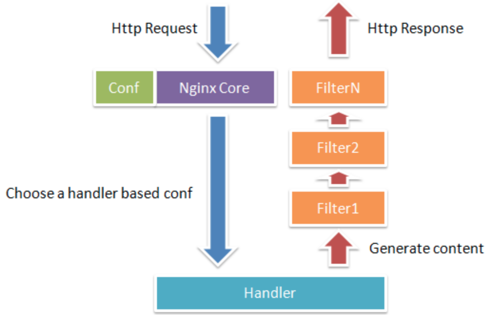

## 简述

**Nginx**是一个高性能HTTP服务器，主要功能有静态资源处理、反向代理。

## 进程模型

如[上图](https://www.cnblogs.com/youclk/p/8422378.html)所示，**Nginx**包含一个Master进程和多个Worker进程，其中：

- Master：负责外部通信和管理Worker，因此可以做到重启时不中断服务。
- Worker：采用异步、非阻塞的方式处理请求，以充分利用CPU资源。

## 请求/响应的处理过程

**Nginx**包含3个主要模块：

- Handler：负责处理请求，包括修改Headers等工作，以及输出内容，一般只有一个。
- Filter：对Handler输出的内容进行修改，然后输出。
- Proxy：其子模块upstream会与一些后端服务进行交互，实现服务代理和负载均衡等功能。

如下图所示，这些模块对请求/响应对处理过程为：

1. 收到请求后，**Nginx**会根据配置文件中的配置将其映射到一个`location block`，并按照配置的指令，启动不同的模块去完成工作。
2. 一个`location`通常会涉及一个Handler和多个Filter。
3. 另外，**Nginx**的模块属于静态编译方式，在启动后自动加载。

