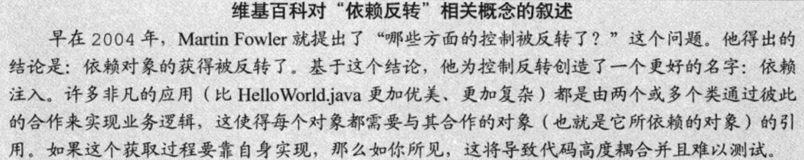

## 控制反转⭐

**IoC**，**I**nversion **o**f **C**ontrol，<span style=background:#c2e2ff>控制反转</span>。

<span style=background:#c2e2ff>控制反转</span>中的“<span style=background:#c2e2ff>反转</span>”指的是，将原本由开发者负责（<span style=background:#c2e2ff>控制</span>）的<span style=background:#d4fe7f>依赖注入</span>（Dependency Injection），交由（<span style=background:#c2e2ff>反转</span>）<u>实例容器</u>来负责，开发者从此只需关心如何使用这些实例，而这个<u>实例容器</u>也叫做<span style=background:#ffb8b8>IoC容器</span>。

**IoC**做到了服务与服务间的解耦，即，将服务间的耦合转换成了服务与<span style=background:#ffb8b8>IoC容器</span>的耦合。

<span style=background:#ffb8b8>IoC容器</span>是**Spring**的核心，该容器用于管理各类实例（Spring Bean），提供实例的生命周期管理、配置和组装，也就是说：

1. “生命周期管理”就是由<span style=background:#ffb8b8>IoC容器</span>来创建实例、销毁实例（桌面环境才需要考虑销毁）；
2. “<span style=background:#c9ccff>装配</span>”（<span style=background:#c9ccff>配</span>置和组<span style=background:#c9ccff>装</span>）就是由<span style=background:#ffb8b8>IoC容器</span>负责实例的共享，也就是负责所谓的<span style=background:#d4fe7f>依赖注入</span>。




## 装配

<span style=background:#c2e2ff>基于注解</span>的<u>装配</u>：开启组件扫描（`@ComponentScan`），使用`@Componet`来标识**Bean**，并通过`@Autowired`或`@Resource`<span style=background:#c9ccff>配</span>置**Bean**之间的依赖关系，之后<span style=background:#ffb8b8>IoC容器</span>会根据<span style=background:#c9ccff>配</span>置的依赖关系进行组<span style=background:#c9ccff>装</span>（注入）。

<span style=background:#c2e2ff>基于注解</span>的<u>装配</u>更简洁、便利，但是与<span style=background:#c2e2ff>基于XML</span>的<u>装配</u>[相比](https://wiki.jikexueyuan.com/project/spring/dependency-injection.html)，存在局限性：无法注入基本类型、`null`、空字符串，不够精确。

依赖注入有构造方法注入、Setter注入、属性注入三种方式，这三种方式基本通用，但受初始化顺序的影响，后两种[有时会引发](https://blog.csdn.net/qq_28163609/article/details/108769977)`NullPointerException`。

另外，**Bean**还能注入到集合（`List`、`Map`）中。

```java
@Autowired
private List<BeanInterface> list;
@Autowired
private Map<String, BeanInterface> map; // Key为BeanID。
```

### Component[[1]](https://github.com/giantray/stackoverflow-java-top-qa/blob/master/contents/whats-the-difference-between-component-repository-service-annotations-in.md)

`@Component`是最基本的注解，此外还提供了几个扩展注解：

- `@Controller`：用于标识Controller，使**Bean**具有处理<span style=background:#c9ccff>请求/响应</span>的能力。
- `@Repository`：用于标识持久层，能将数据库抛出的原生异常转换为更详细的异常。
- `@Service`：用于标识业务逻辑层，没有增强**Bean**，仅具有标识作用，以方便代码的管理、维护、扩展。


## @Autowired与@Resource

1. `@Autowired`是**Spring**提供的。
   1. 按照<span style=background:#f8d2ff>类型</span>进行注入，所以当同一接口存在多个实现类的时候，该注解无法区分实现类，会抛出`BeanCreationException`，但是我们可以借助`@Qualifier`（ByName）、`@Primary`注解来指定实现类。
   2. 该注解默认不允许为`null`，但是可以通过设置`required = false`的方式，允许为`null`。与`@Required`有相似之处。
2. `@Resource`是J2EE提供的。
   1. 如果不指定查找方式，默认则是按照<span style=background:#c9ccff>名称</span>，如未果，则会转而按照<span style=background:#f8d2ff>类型</span>来继续查找；当然，该注解可以显式指定是按照<span style=background:#c9ccff>名称</span>，还是按照<span style=background:#f8d2ff>类型</span>来进行注入；如果同时指定<span style=background:#f8d2ff>类型</span>和<span style=background:#c9ccff>名称</span>，则会寻找同时满足条件的类。所谓的<span style=background:#c9ccff>名称</span>就是类的**Bean Name**。
   2. 使用该注解时，如果不指定查找方式，当查找不到实现类时，会返回原始类型，如果指定了查找方式，当无法找到实现类也会抛出异常。
   3. 并且，如果指明按照<span style=background:#f8d2ff>类型</span>来查找的话，跟`@Autowired`一样，会有查找到多个实现类的可能，此时会抛出`BeanCreationException`。
3. [推荐使用](https://www.zhihu.com/question/39356740/answer/1907479772)`@Resource`，因为如上所述，该注解更宽容，同时也能减少对**Spring**的依赖。


## 在配置类中导入其它配置文件/配置类

```java
@Configuration													  // 配置类
@ImportResource("classpath:applicationContext-configuration.xml") // 导入配置文件
@Import(PhotoConfiguration.class)								  // 导入配置类
public class WebConfigu {
}
```

`@Import`[能令](https://www.baeldung.com/spring-import-annotation)我们方便地管理配置类。


## 注入配置

### @PropertySource

`@PropertySource`，将配置文件映射到配置类上，（该注解读取的配置是针对**Spring**全局的，之后就可以随便引用了）。

### @Value

`@Value("${propertey.key}")`，将某一配置映射到属性上。

`@Value("#{beanId.field}")`，将某一配置类的属性的值赋到该字段上。

`@Value("classpath:/*.txt") Resource resource`，将配置文件注入到配置文件类中。

### @Profile

`@Profile`，针对不同开发环境，可以通过JVM参数指定，`-Dspring.profiles.active=test,mysql`。

**Spring**也可以在XML文件里配置环境。


## 条件化装配

**Spring4**带来的<span style=background:#c2e2ff>条件化配置</span>主要通过`Condition`接口和`@Conditional`注解来使用：

1. 开发者实现`Condition.matches()`，即，在该方法中编写判断条件，如，类路径中是否包含某一类文件。
2. 然后在目标类上使用`@Conditional`注解，并将自定义的条件类传入到该注解上，根据判断条件是否成立决定是否实例化该类。

而**Spring Boot**的自动化配置正是基于<span style=background:#c2e2ff>条件化配置</span>。

