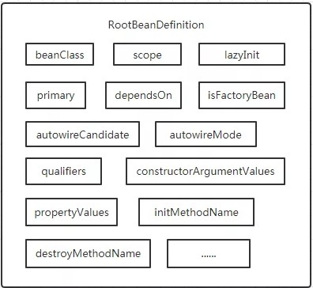

### 写在阅读源码前面的话

Spring源码分析是常见的面试考察点，也是“面试造航母，工作拧螺丝”这一现象的绝佳体现。

一个好的框架是抽象、透明、封装良好的，即屏蔽了底层细节，让我们能更好的专注于业务代码的编写。

阅读官方文档是了解一个框架的最好方式，而且Spring更是提供了堪称典范的好文档。

我不是说阅读源码没有意义，而是主张阅读源码应该作为学习框架的最后一步。

阅读源码当然能够帮助我们理解框架，但是在阅读的过程中我们很容易迷失在技术的细枝末节上，性价比太低。

源码的水太深，你真的能把握住吗？

[Spring源码解析专题——夜勿语](https://www.cnblogs.com/yewy/category/1786299.html)

[Spring专题——duanxz](https://www.cnblogs.com/duanxz/tag/spring/default.html?page=5)

### 核心组件

[Spring有3个核心组件](https://blog.csdn.net/zlfprogram/article/details/75937935)：

1. spring-beans，**Spring**将Object进一步封装为**Bean**，该组件主要负责**Bean**的定义、创建、解析。
2. spring-context，提供容器来管理这些**Bean**，尤其是**Bean**之间的依赖关系。
3. spring-core，提供了一系列发现、建立、维护依赖的工具，也就是控制反转（依赖注入）相关功能。

### Spring Bean

**Spring**采用工厂模式创建**Bean**，也就是采用**BeanFactory**。

**BeanDefinition**用于描述**Bean**，即保存**Bean**的各种元信息。

从XML中配置的**Bean**信息会被解析为**BeanDefinition**，之后IoC容器会根据**BeanDefinition**创建**Bean**。

**BeanDefinition**只是一个接口，其常用的实现类为**RootBeanDefinition**，该类描述的元数据包括：

1. class，类名称。
3. name，即Bean ID，唯一标识**Bean**。
4. scope，作用域。
4. parent，要继承的父类。
5. lazy-initialization mode，是否懒加载。
6. 构造参数列表
7. 依赖的**Bean**。
8. 是否自动注入。
9. 是否是**Primary**等等。

后置处理器有两种：

1. **BeanFactoryPostProcessor**，负责根据Class生成**BeanDefinition**，即寻找、创建、修改、注册**BeanDefinition**。
   1. 可用于初始化前修改**Bean**的属性。
1. **BeanPostProcessor**，负责根据**BeanDefinition**生成**Bean**，包括属性赋值（注入依赖）、创建代理对象等工作，有两个方法：
   1. BeanPostProcessor.postProcessBeforeInstantiation()，IoC容器于**Bean**实例化前调用。
   2. BeanPostProcessor.postProcessAfterInitialization()，IoC容器于**Bean**初始化后调用。

### Spring Context

**ApplicationContext**接口继承了**BeanFactory**接口，**BeanFactory**提供最基本的IoC容器的功能，包括创建**Bean**、保存**Bean**关系。

**ApplicationContext**与**BeanFactory**相比，添加了企业特定的功能，如标识运行环境、捕获异常、发布事件等。

1. 如，调用ApplicationContext.refresh()，就会发布ContextRefreshedEvent。
2. 此外还有ContextStartedEvent、ContextStoppedEvent、ContextClosedEvent、RequestHandledEvent。

**ApplicationContext**主要有两个子接口：

1. **ConfigurableApplicationContext**，表示**ApplicationContext**是可修改的，能够动态的添加修改已有配置信息。
2. **WebApplicationContext**，为Web开发准备的，允许我们访问**ServletContext**。

### Spring Core

**Spring**包含了很多关键类，其中一部分是资源的访问，如**ResourceLoader**。

**ApplicationContext**就是通过继承了**ResourceLoader**，得以从Path、Class Path、URL等地方加载外部资源。

