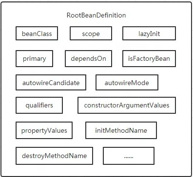

## 写在阅读源码前面的话

**Spring**源码分析是常见的面试考察点，也是“面试造航母，工作拧螺丝”这一现象的绝佳体现。

一个好的框架是抽象、透明、封装良好的，即，屏蔽了底层细节，让我们能更好的专注于业务代码的编写。

阅读官方文档是了解一个框架的最好方式，而且**Spring**更是提供了堪称典范的好文档。

我不是说阅读源码没有意义，而是主张阅读源码应该作为学习框架的最后一步。

阅读源码当然能够帮助我们理解框架，但是在阅读的过程中我们很容易迷失在技术的细枝末节上，投入产出比（Return On Investment，ROI）太低。

源码的水太深，你真的能把握住吗？

[Spring源码解析专题——夜勿语](https://www.cnblogs.com/yewy/category/1786299.html)

[Spring专题——duanxz](https://www.cnblogs.com/duanxz/tag/spring/default.html?page=5)

## 核心组件[[1]](https://blog.csdn.net/zlfprogram/article/details/75937935)⭐

| 名称           | 功能                                                         |
| -------------- | ------------------------------------------------------------ |
| spring-beans   | **Spring**将Object进一步封装为**Bean**，该组件主要负责**Bean**的定义、创建、解析 |
| spring-context | 提供容器来管理**Bean**，主要是**Bean**之间的依赖关系 |
| spring-core    | 提供了一系列发现、建立、维护依赖的工具类 |

## Spring Bean

每个**Spring Bean**都有一个唯一的**Name**，也就是**Bean**的**ID**，用于标识**Bean**。

但是**Bean**可以拥有多个**Aliases**，也就是别名。

### 定义

`BeanDefinition`用于描述**Bean**，即，保存**Bean**的各种元信息。

从XML中配置的**Bean**信息会被解析为`BeanDefinition`，之后IoC容器会根据`BeanDefinition`创建**Bean**。

`BeanDefinition`只是一个接口，其常用的实现类为`RootBeanDefinition`，该类描述的元数据包括：

1. `class`：类名称。
2. `name`：即，Bean ID，唯一标识**Bean**。
3. `scope`：作用域。
4. `parent`：要继承的父类。
5. `lazy-initialization mode`：是否懒加载。
6. 构造参数列表。
7. 依赖的**Bean**。
8. 是否自动注入。
9. 是否是**Primary**。
10. ……

### 作用域

**Spring Bean**有多种作用域：

1. ##### Singleton

   1. 单例，默认作用域，即，所有依赖的地方都共享一个实例。

2. ##### Prototype

   1. 原型，用于需要每次都创建**Bean**的场景，比如多线程场景；内部**Bean**通常是匿名的，其作用域一般也是原型。
   2. 使用时需要配合`ApplicationContext.getBean()`或者设置代理（`proxyMode=ScopedProxyMode.TARGET_CLASS`）。
   3. 使用时才会被初始化。

3. ##### Web-aware作用域

   1. 此外还有**Request**、**Session**、**Global-Session**、**Application**、**WebSocket**等拓展作用域，应用于Web项目。

### 后置处理器

后置处理器有`2`种：

1. `BeanFactoryPostProcessor`
   1. 负责根据`Class`生成`BeanDefinition`，即，寻找、创建、修改、注册`BeanDefinition`。
   2. 可用于初始化前修改**Bean**的属性。
   
2. `BeanPostProcessor`
   1. 负责根据`BeanDefinition`生成**Bean**，包括属性赋值（注入依赖）、创建代理对象等工作，有两个方法：
      1. `BeanPostProcessor.postProcessBeforeInstantiation()`，IoC容器于**Bean**实例化**前**调用。
      2. `BeanPostProcessor.postProcessAfterInitialization()`，IoC容器于**Bean**实例化**后**调用。

## Spring Context

`BeanFactory`提供最基本的IoC容器的功能，包括创建**Bean**、保存**Bean**关系。

`ApplicationContext`接口继承了`BeanFactory`接口，添加了企业特定的功能，如标识运行环境、捕获异常、发布事件等。

1. 如，调用`ApplicationContext.refresh()`，就会发布`ContextRefreshedEvent`。
2. 此外还有`ContextStartedEvent`、`ContextStoppedEvent`、`ContextClosedEvent`、`RequestHandledEvent`。

> `BeanFactory`采用延迟加载，只有当使用到某个**Bean**时才会对其实例化；而`ApplicationContext`则会在启动时一次性创建所有**Bean**，所以在移动设备中往往使用基于`BeanFactory`的IoC容器。

`ApplicationContext`主要有`2`个子接口：

1. `ConfigurableApplicationContext`，表示`ApplicationContext`是可修改的，能够动态的添加修改已有配置信息。
2. `WebApplicationContext`，为Web开发准备的，允许我们访问`ServletContext`。

### 实现类

`ApplicationContext`最常用的`4`种实现类：

1. `ClassPathXmlApplicationContext`
   1. 从类路径下读取配置文件。
   2. 需指定一个XML类型的配置文件，该文件可用来配置实例间的依赖关系。

2. `FileSystemXmlApplicationContext`
   1. 从文件系统中读取配置文件。
   2. 需指定一个XML类型的配置文件，该文件可用来配置实例间的依赖关系。

3. `AnnotationConfigApplicationContext`
   1. 从经`@Configuration`修饰的配置类中读取配置。
   2. 需传入一个经`@Configuration`修饰的配置类，该配置类可用来配置实例间的依赖关系。

4. `WebApplicationContext`
   1. 从Web应用的根目录读取XML类型的配置文件。
   2. `WebApplicationContext`需要先在`web.xml`中配置`Listener`或`Servlet`来实现。

### BeanFactory与FactoryBean

**Spring**采用工厂模式创建**Bean**，也就是采用`BeanFactory`。

`FactoryBean`是一种**Spring Bean**，主要用于创建复杂的**Bean**，如数据库连接池。

`FactoryBean`跟`BeanFactory`只是名字很像。

要想通过`ApplicationContext.getBean(String)`获取真正的`FactoryBean`，需要在**BeanID**前加`&`。

## Spring Core

**Spring**包含了很多关键类，其中一部分是资源的访问，如`ResourceLoader`。

`ApplicationContext`就是通过继承了`ResourceLoader`，得以从`path`、`classpath`、URL等地方加载外部资源。

