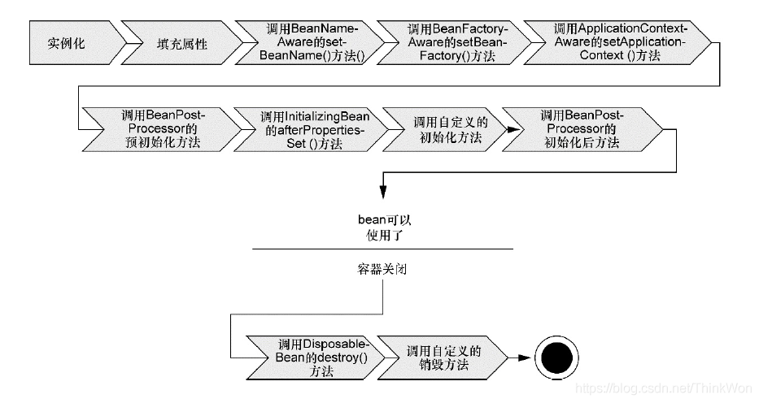

### 预启动流程

以**AnnotationConfigApplicationContext**（ACAC）为例，介绍IoC容器的[预启动流程](https://mp.weixin.qq.com/s?__biz=MzA4ODI0MTIxOA==&mid=2257483769&idx=1&sn=9ba6435401f9a96c8bf7ae65894ab2a5&scene=21#wechat_redirect)。

**ACAC**依次继承了三个类：

1. **DefaultResourceLoader**，负责加载资源。
2. **AbstractApplicationContext**，实现了**ApplicationContext**接口，负责IoC容器的启动（refresh()）、提供**Bean**（getBean()）、发布事件。
3. **GenericApplicationContext**，以组合的方式引入了最底层的**BeanFactory**的实现类**DefaultListableBeanFactory**，并借助这个实现类实现了注册**Bean**操作。

**ACAC**启动流程：

1. 实例化**DefaultResourceLoader**，主要是获取类加载器。
2. 实例化**AbstractApplicationContext**，主要是引入资源解析器。
3. 实例化**GenericApplicationContext**，主要是引入**BeanFactory**的实现**DefaultListableBeanFactory**。
4. 实例化本身，主要是实例化**BeanDefinition**扫描器：

   1. 实例化基于注解的**BeanDefinition**扫描器**AnnotatedBeanDefinitionReader**。
      1. 引入条件表达式计算器，处理@Conditional注解。
      2. 注册所有与注解相关的**BeanPostProcessor**，这里的注解指的是@Autowired、@Resource、@EventListener等注解。
   2. 实例化基于**ClassPath**的**Bean**定义扫描器**ClassPathBeanDefinitionScanner**。
      1. 设置环境。
      2. 设置资源加载器。
      3. 添加加入过滤器，包括默认过滤器、扫描@Component的过滤器、扫描JSR-250规范的注解的过滤器等。
5. 将配置类的**BeanDefinition**注册到容器中。
   1. 通过扫描来获取经@Component等注解标注的类，根据这些类生成**BeanDefinition**，并调用
6. 调用AbstractApplicationContext.refresh()，启动容器。

   1. 创建**Bean**容器。
   2. 加载**Bean**。
   3. 注册**Bean**。
   4. [调用后置处理器、注入依赖](https://zhuanlan.zhihu.com/p/138328035)
   

这个系列的源码分析就是流水账式的分析，观感很不好。

1. [BeanDefinition从何而来？](https://mp.weixin.qq.com/s?__biz=MzA4ODI0MTIxOA==&mid=2257484189&idx=1&sn=2117d0151f9de4e48ff201ad8de27a23&scene=21#wechat_redirect)
2. [如何根据BeanDefinition生产Bean的？](https://mp.weixin.qq.com/s?__biz=MzA4ODI0MTIxOA==&mid=2257484591&idx=1&sn=ce92f4f1cf538d754c19708d7e7ae173&scene=21#wechat_redirect)
   1. 实例化并放入缓存
   2. 填充属性，包括设置属性值、注入依赖。
   3. 初始化，setAware、init、调用**BeanPostProcessor**。
   4. 放入单例缓存池。

