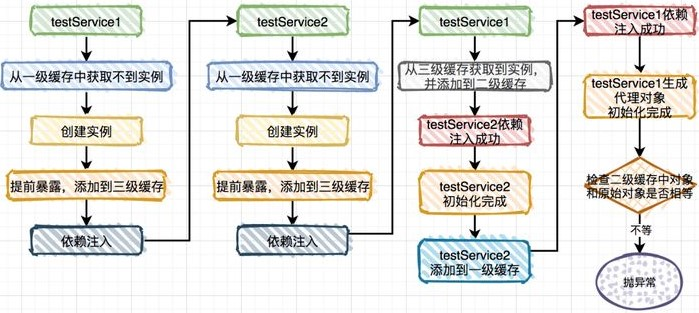

对于两个普通**Bean**的循环依赖，**Spring**会通过递归实例化自动解决：

1. 假设有A、B两个**Bean**相互依赖，先实例化一个A的**ObjectFactory**，并将这个**ObjectFactory**放入<span style=background:#c2e2ff>三级缓存</span>中，然后装配A，

2. 这时发现A<span style=background:#ffb8b8>依赖</span>了B，会去<span style=background:#c9ccff>一级缓存</span>和<span style=background:#c2e2ff>三级缓存</span>中寻找B，没能找到，然后会实例化一个B的**ObjectFactory**，并放入<span style=background:#c2e2ff>三级缓存</span>，然后装配B，

3. 这时发现B<span style=background:#ffb8b8>依赖</span>了A，从<span style=background:#c9ccff>一级缓存</span>和<span style=background:#c2e2ff>三级缓存</span>寻找A，并在<span style=background:#c2e2ff>三级缓存</span>找到了A的**ObjectFactory**，该**ObjectFactory**会生成一个A的**Bean**并放入<span style=background:#f8d2ff>二级缓存</span>，放入时会从<span style=background:#c2e2ff>三级缓存</span>移除该**ObjectFactory**，将A的**Bean**装配给B，B的装配完成，

   ```java
   this.earlySingletonObjects.put(beanName, singletonObject); // 放入二级缓存
   this.singletonFactories.remove(beanName);				   // 从三级缓存中移除
   ```

4. B在<span style=background:#c2e2ff>三级缓存</span>中的**ObjectFactory**生成B的Bean并放入<span style=background:#c9ccff>一级缓存</span>，放入时会从<span style=background:#c2e2ff>三级缓存</span>中移除B的**ObjectFactory**，B的实例化完成，

5. 然后触发回调，回到A的装配，将<span style=background:#c9ccff>一级缓存</span>中的B装配给<span style=background:#f8d2ff>二级缓存</span>中的A，A从<span style=background:#f8d2ff>二级缓存</span>移入<span style=background:#c9ccff>一级缓存</span>，A的实例化完成。

[下图](https://www.zhihu.com/question/438247718/answer/1730527725)能更好的描述解决过程：


从<span style=background:#c2e2ff>三级缓存</span>中获取到的都是**ObjectFactory**对象，通过<span style=background:#b3b3b3>ObjectFactory.getBean()</span>可获取**Bean**，而通过<span style=background:#b3b3b3>ObjectFactory.getBean()</span>获取到的**Bean**[可能每次都不一样](https://www.zhihu.com/question/438247718/answer/1730527725)。放入<span style=background:#f8d2ff>二级缓存</span>的是真正的**Bean**。


而对于先创建的**Bean**是代理对象的情况，**Spring**是无法解决的，因为先前放入<span style=background:#f8d2ff>二级缓存</span>的<span style=background:#d4fe7f>被代理</span>的**Bean**，而到最后生成时生成的却是<span style=background:#d4fe7f>代理</span>**Bean**，**Spring**会比较此时生成的**Bean**与之前放入<span style=background:#f8d2ff>二级缓存</span>的**Bean**是否是同一个，而<span style=background:#d4fe7f>被代理</span>**Bean**和<span style=background:#d4fe7f>代理</span>**Bean**显然是两个不同的**Bean**，此时会直接抛出**BeanCurrentlyInCreationException**，如下图所示：




总之，**Spring**[可以解决部分循环依赖](https://www.zhihu.com/question/438247718/answer/1730527725)：

1. 单例的Setter注入，<span style=background:#19d02a>能</span>。
2. 多例的Setter注入，<span style=background:#ff4343>不能</span>。
   1. 但是程序能启动。
   2. 改为单例可解决。
3. 构造器注入，<span style=background:#ff4343>不能</span>。
   1. [因为此时对象还在创建中](https://zhuanlan.zhihu.com/p/84267654)，JVM中都没有实例，没法注入。
   2. 改为Setter注入可解决；使用<span style=background:#e6e6e6>@Lazy</span>，延迟加载，也可解决。
4. 单例的代理对象Setter注入，<span style=background:#fdc200>部分能</span>。
   1. 使用<span style=background:#e6e6e6>@Async</span>时，**Spring**会通过**AOP**来自动创建代理对象，依赖注入后会生成代理**Bean**。
   2. 可使用<span style=background:#e6e6e6>@Lazy</span>解决；或使用<span style=background:#e6e6e6>@DependsOn</span>，或修改类名，以调整类的<span style=background:#c2e2ff>加载顺序</span>。
5. <span style=background:#e6e6e6>@DependsOn</span>循环依赖，<span style=background:#ff4343>不能</span>。
   1. **Spring**如果检测到经<span style=background:#e6e6e6>@DependsOn</span>修饰的**Bean**形成循环依赖会直接抛出**BeanCreationException**。


