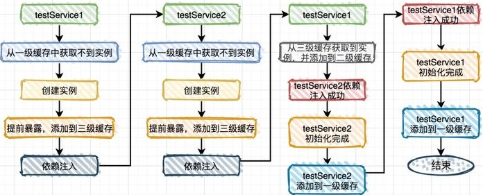
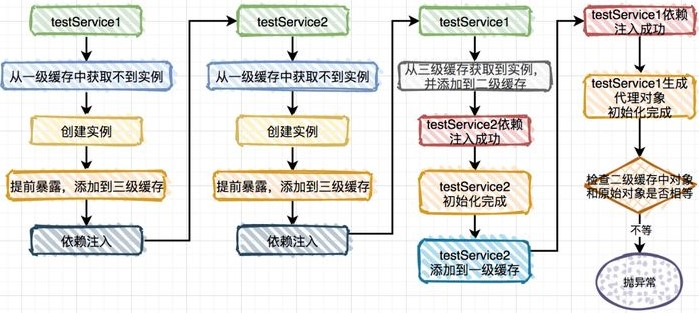

## 普通Bean

对于两个普通**Bean**的循环依赖，**Spring**会通过递归实例化自动解决：

1. 假设有A、B两个**Bean**相互依赖，先实例化一个A的`ObjectFactory`，并将这个`ObjectFactory`放入<span style=background:#c2e2ff>三级缓存</span>中，然后装配A，

2. 这时发现A<span style=background:#ffb8b8>依赖</span>了B，会去<span style=background:#c9ccff>一级缓存</span>和<span style=background:#c2e2ff>三级缓存</span>中寻找B，没能找到，然后会实例化一个B的`ObjectFactory`，并放入<span style=background:#c2e2ff>三级缓存</span>，然后装配B，

3. 这时发现B<span style=background:#ffb8b8>依赖</span>了A，从<span style=background:#c9ccff>一级缓存</span>和<span style=background:#c2e2ff>三级缓存</span>寻找A，并在<span style=background:#c2e2ff>三级缓存</span>找到了A的`ObjectFactory`，该`ObjectFactory`会生成一个A的**Bean**并放入<span style=background:#f8d2ff>二级缓存</span>，放入时会从<span style=background:#c2e2ff>三级缓存</span>移除该`ObjectFactory`，将A的**Bean**装配给B，B的装配完成，

   ```java
   this.earlySingletonObjects.put(beanName, singletonObject); // 放入二级缓存
   this.singletonFactories.remove(beanName);				   // 从三级缓存中移除
   ```

4. B在<span style=background:#c2e2ff>三级缓存</span>中的`ObjectFactory`生成B的**Bean**并放入<span style=background:#c9ccff>一级缓存</span>，放入时会从<span style=background:#c2e2ff>三级缓存</span>中移除B的`ObjectFactory`，B的实例化完成，

5. 然后触发回调，回到A的装配，将<span style=background:#c9ccff>一级缓存</span>中的B装配给<span style=background:#f8d2ff>二级缓存</span>中的A，A从<span style=background:#f8d2ff>二级缓存</span>移入<span style=background:#c9ccff>一级缓存</span>，A的实例化完成。

[下图](https://www.zhihu.com/question/438247718/answer/1730527725)能更好的描述解决过程：



> 从<span style=background:#c2e2ff>三级缓存</span>中获取到的都是`ObjectFactory`对象，通过`ObjectFactory.getBean()`可获取**Bean**，但通过`ObjectFactory.getBean()`获取到的**Bean**[可能每次都不一样](https://www.zhihu.com/question/438247718/answer/1730527725)。
>
> 放入<span style=background:#f8d2ff>二级缓存</span>的是真正的**Bean**。


## 代理Bean

而对于先创建的**Bean**是代理对象的情况，**Spring**是无法解决的，因为先前放入<span style=background:#f8d2ff>二级缓存</span>的<span style=background:#d4fe7f>被代理</span>的**Bean**，而到最后生成时生成的却是<span style=background:#d4fe7f>代理</span>**Bean**，**Spring此时**会比较生成的**Bean**与之前放入<span style=background:#f8d2ff>二级缓存</span>的**Bean**是否是同一个，而<span style=background:#d4fe7f>被代理</span>**Bean**和<span style=background:#d4fe7f>代理</span>**Bean**显然是两个不同的**Bean**，此时会直接抛出`BeanCurrentlyInCreationException`，如下图所示：




## 总结🌙

总之，**Spring**[可以解决部分循环依赖](https://www.zhihu.com/question/438247718/answer/1730527725)。

| 类型                     | 能否自动解决                                 | 原因                                                         | 解决方法                                                     |
| ------------------------ | -------------------------------------------- | ------------------------------------------------------------ | ------------------------------------------------------------ |
| 单例的Setter注入         | <span style=background:#19d02a>能</span>     | -                                                            | -                                                            |
| 原型的Setter注入         | <span style=background:#ff4343>不能</span>   | 因为不会被提前初始化，所以程序能启动                         | 改为单例可解决                                               |
| 构造器注入               | <span style=background:#ff4343>不能</span>   | [因为此时对象还在创建中](https://zhuanlan.zhihu.com/p/84267654)，JVM中都没有实例，没法注入 | 改为Setter注入可解决；<br>使用`@Lazy`，延迟加载，也可解决   |
| 单例的代理对象Setter注入 | <span style=background:#fdc200>部分能</span> | 当中间对象与最终对象不是同一个，**Spring**会<u>直接</u>抛出`BeanCreationException`<br>如：使用`@Async`时，**Spring**会通过**AOP**来自动创建代理对象，依赖注入后会生成代理**Bean** | 可使用`@Lazy`解决；<br>或使用`@DependsOn`，或修改类名，以调整类的<span style=background:#c2e2ff>加载顺序</span> |
| `@DependsOn`循环依赖     | <span style=background:#ff4343>不能</span>   | 当检测到经`@DependsOn`修饰的**Bean**形成循环依赖，**Spring**会<u>直接</u>抛出`BeanCreationException` | 修改类名，以调整类的<span style=background:#c2e2ff>加载顺序</span> |

