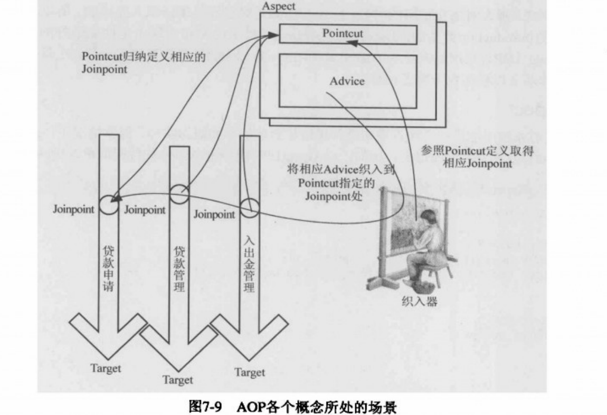

## 核心概念[[1]](https://www.jianshu.com/p/a21256903fdd)：

#### Target Object

- 目标对象，执行业务/核心逻辑的对象，被代理的对象。

#### Join Point

- 连接点，执行目标对象的方法的过程中的一个点，如执行构造方法、属性赋值、执行指定实例方法（**Spring**只支持这个）。

#### Pointcut

- 切点，一个<span style=background:#c2e2ff>正则表达式</span>，匹配一组**Join Point**。
- 当**Join Point**被匹配到**Pointcut**时，一个关联到该**Pointcut**的**Advice**会被执行。

#### Advice

- 通知，也被译为“增强”，是在特定**Join Point**要执行的代码。

#### Interceptor

- 拦截器，一种实现**Advice**的方式。
- **Spring**主要有[5种拦截器](https://docs.spring.io/spring-framework/docs/current/reference/html/core.html#aop-introduction-defn)：`@Before`、`@After`、`@AfterReturning`、`@AfterThrowing`、`@Around`。

#### Aspect

- 切面，跨业务/核心逻辑的功能，如事务管理、安全检查 / 权限认证、日志打印、缓存等。
- **Aspect**由**Pointcut**和**Advice**组成，往往被定义为类。

#### Weaving

- 织入，将**Aspect**和**Target Object**连接。

几个核心概念的关系如[下图](https://blog.csdn.net/q982151756/article/details/80513340)所示：




## 次要概念

#### Advisor

- 增强器（Advisor）的概念，是**Spring AOP**独有的概念，AspectJ中[没有等价的概念](https://docs.spring.io/spring-framework/docs/current/reference/html/core.html#aop-schema-advisors)。
  - [**Advice**可以看作是**Aspect**的一种实现](https://blog.csdn.net/j080624/article/details/53996875)，而**Advisor**是**Aspect**的另一种实现。
  - **Advisor**能将**Advice**以更复杂的方式**Weave**到**Target Object**中，具体是以“将**Advice**包装为更复杂的的**Aspect**的装配器”来实现的，**Advisor**由**Pointcut**和**Advice**组成。
  - **Advisor**就像一个小的、自包含的、只有一个**Advice**的**Aspect**。**Advice**自身通过一个**Bean**表示，并且必须实现一个**Advice**接口，大多数情况下会和事务**Advice**一起使用。


#### Introduction

- 引入（Introduction）是一种特殊的**Advice**，可以为**Target Object**添加一些原本没有的属性和方法。


## 切点指示器，Pointcut Designators[[2]](https://docs.spring.io/spring-framework/docs/current/reference/html/core.html#aop-ataspectj)

#### execution

- 匹配 ( 指定类的指定方法 )，最常用。

#### args

- 匹配 [ 拥有 ( 指定类型参数 ) 的方法 ]，对参数个数、定义顺序都有要求。

#### within

- 匹配 ( 指定包、类中的所有方法 )，<span style=background:#c9ccff>不包括</span>相应的扩展类、实现类等子类。

#### this、target

- 匹配 ( 指定代理类、被代理类的所有方法 )，<span style=background:#f8d2ff>包括</span>相应的扩展类、实现类等子类。
- 代理类会继承被代理类（**Target Object**）。

#### `@annotation`

- 匹配 [ 拥有 ( 指定类型注解 ) 的方法 ]。
- 这种指示器往往配合我们“自定义的注解”来使用，比较灵活、易于扩展。

#### `@args`

- 匹配 { 拥有 [ 经 ( 指定类型的注解 ) 修饰的参数 ] 的方法 }。

#### `@within`、`@target`

- 匹配 { [ 拥有 ( 指定类型的注解 ) 的类 ] 的所有方法 }。

- 并且[这两个指示器都](https://endwas.cn/blog/75)只针对扩展（类），不针对实现（接口），因为调用接口方法，只能是调用实现类的方法，即，接口只声明方法，不定义方法。

- 但[这两个指示器的区别](https://blog.csdn.net/demon7552003/article/details/97601209)在于：

   - `@within`要求对象的<span style=background:#c2e2ff>运行时类型</span>可以是被注解修饰的的类的子类，即，<span style=background:#f8d2ff>可以</span>匹配 { 通过子类 [ 调用( 被注解修饰的父类 ) 的方法 ] }。

   - `@target`要求对象的<span style=background:#c2e2ff>运行时类型</span>只能是被注解修饰的类型，即，<span style=background:#c9ccff>不会</span>匹配 { 通过子类 [ 调用( 被注解修饰的父类 ) 的方法 ] }。

   - 详细测试代码见[网页](https://github.com/LeanLeeOne/example/blob/master/src/test/java/com/leanlee/example/AOPApplicationTests.java)，以下为简例：

      ```java
      @AnnotationFather
      public class FatherClass { void fatherClassMethod() {} }
      public class SubClass extends FatherClass {}
      public class Test {    
          @Test
          void test(){
              SubClass subClassInstance = new SubClass();
              subClassInstance.fatherClassMethod(); // “@within”会匹配“@AnnotationFather”，但“@target”不会匹配“@AnnotationFather”。
          }
      }
      ```

> 另外，除`execution`、`within`外，其它指示器都支持[<span style=background:#c2e2ff>类型绑定</span>](https://docs.spring.io/spring-framework/docs/current/reference/html/core.html#aop-ataspectj-advice-params-passing)。
>
> 示例代码：[Spring AOP 切点指示器](https://www.jianshu.com/p/f26850aa32f0)


## 实现方式[[3]](https://www.liaoxuefeng.com/wiki/1252599548343744/1266265125480448)

### 编译期

由编译器将切面调用编译成字节码，这种方式需要定义新的关键字，**AspectJ**就是这种方式，关键字为`aspect`。

### 类加载器

在类装载到JVM中时，对类进行扩展。

### 动态代理

**Spring**就是通过这种方式，开启**AOP**后（`@EnableAspectJAutoProxy`），<span style=background:#ffb8b8>IoC容器</span>会为被连接的类创建一个代理类，代理类会继承并在内部引用将被连接的类，并且**Spring**不会初始化代理类的成员变量，也不会调用`super()`，这就导致我们直接获取成员变量只能获取空，代理类会覆写所有方法，除了经`final`修饰的方法。


## 应用场景

- [使用注解实现权限控制](https://segmentfault.com/a/1190000018001477)。
- 日志打印：**AOP**不是万能的，像事务就适合切面处理，但是日志打印不一定适合。因为事务的代码基本相同，而且参数相对固定，但是日志打印有时会需要捕获局部变量，参数有时不那么固定。

