## 架构图

上图参考自[文章](https://blog.csdn.net/luanlouis/article/details/40422941)。

## 接口层

接口层定义了调用方式。

### 直接基于SqlSession

`SqlSession`接口定义的一系列CURD方法与数据库交互，每个方法都需要传递Statement ID和查询参数。

但是这种方式不符合面向对象的思想，所以便有了基于`Mapper`接口的调用方式。

### 基于Mapper接口

**MyBatis**将一组组的CURD方法抽象为一个个`Mapper`对象，调用指定`Mapper`实例的指定CURD方法就可获取相应的返回结果。

基于**Mapper**接口的调用方式其实是对**SqlSession**的封装：
1. **MyBatis**基于动态代理通过`SqlSession.getMapper(XXXMapper.class)`创建一个个的`Mapper`实例。
2. 调用`Mapper`实例的某一方法时，`MyBatis`会根据<u>方法名</u>和<u>参数类型</u>确定Statement ID。
3. 然后实例化一个`SqlSession`，并调用其相应的CURD方法。

注意：每次通过`Mapper`访问数据库，都会创建一个`SqlSession`，但[同一事务中请求会共用一个](https://www.jianshu.com/p/5a72006e7779)`SqlSession`。

## 数据处理层

数据处理层负责构建SQL（包括参数解析）、执行SQL、封装查询结果。

其中，“封装查询结果”，支持结果集关系一对多和多对一的转换，转换方式支持两种，一种为嵌套查询语句，另一种为嵌套结果集。

一对多查询时，会使用基于**CGLib**的懒加载。

## 支撑层

### DataSource

**MyBatis**有三种`DataSource`：

1. Unpooled，不使用`ConnectionPool`的`DataSource`。
2. Pooled，使用`ConnectionPool`的`DataSource`。
3. JNDI，使用JNDI实现的`DataSource`。

**MyBatis**使用工厂模式创建`DataSource`。

创建`SqlSession`执行SQL时，**MyBatis**才会调用`DataSource`来实例化`java.sql.Connection`。

### Connection Pool

每次执行SQL都创建`Connection`是浪费的，而将`Connection`池化是一个很好的选择。

**MyBatis**的`ConnectionPool`中的`Connection`有两种空闲（Idle）和活动（Active）两种状态，且两种状态的`Connection`会分别放置在`IdleConnections`和`ActiveConnections`中。

当从`ConnectionPool`中获取`Connection`时：

1. 若`IdleConnections`不为空，则直接返回一个`Connection`；
2. 若`IdleConnections`为空，但`ActiveConnections`未满，则会返回一个新的`Connection`；
3. 若`IdleConnections`为空，且`ActiveConnections`满，会查看最先放入`ActiveConnections`中的连接是否过期，如果过期，则移除该`Connection`，并新建一个`Connection`；
4. 否则，返回第二步。

使用完的`Connection`会被调用`close()`，但是该方法经过了代理，不会释放资源，而是将`Connection`放入`IdleConnections`中。

> 上面提到的`Connection`实际上是**MyBatis**对`java.sql.Connection`的代理类，即，使用了[代理模式](../10、Linux、Maven、Git、设计模式/4.2 结构型设计模式.html#proxy代理)。

连接数问题

### 事务

**MyBatis**提供了两种事务管理方式：

1. `JdbcTransaction`，使用`java.sql.Connection`来管理事务（GetConnection、Commit、Rollback、Close）。
   1. 开启“auto commit”后，会忽略Commit和Rollback。
2. `ManagedTransaction`，将事务管理托管给JBoss、WebLogic等容器。
   3. 在事务中调用`Mapper`的方法时，会增加引用次数，调用完成，就减少引用次数，不会真正关闭`SqlSession`；[但如果会话不存在事务](https://segmentfault.com/a/1190000015138959)，则直接关闭`SqlSession`。

> MyBatis使用了[工厂方法模式](../10、Linux、Maven、Git、设计模式/4.1 创建型设计模式.html#factory-method工厂方法模式）)来创建事务。

### 缓存

**MyBatis**提供两级缓存：

1. ##### 会话级别
   
   1. 该缓存位于`Executor`中，而`SqlSession`又持有`Executor`中，查询结果会存入该缓存。
   
      
   
   2. `SqlSession`中的任何修改操作都会清空该缓存。
   
   3. 该缓存实际上是一个`HashMap`实例，由Statement ID、传入参数、rowBounds（limit、offset）组成Key，也没有额外的到期失效机制。
   
2. ##### 应用级别

   1. 该缓存的生命周期与应用相同。
   
   2. 开启该缓存后，**MyBatis**会在为`SqlSession`创建`Executor`时，对`Executor`对象加上一个装饰者`CachingExecutor`，之后的实际请求都会经过`CachingExecutor`，而`CachingExecutor`会将结果缓存。
   
      > `CachingExecutor`的设计体现了[装饰者模式](../10、Linux、Maven、Git、设计模式/4.2 结构型设计模式.html#decorator装饰器)。
      
   3. 该缓存有两种使用方式：
   
      1. `<cache/>`，每个`Mapper`独享一个缓存。
      2. `<cache-ref/>`，多个`Mapper`共用一个缓存。
   
   4. 该缓存支持如LRU、FIFO等多种缓存刷新策略，还支持自定义策略，集成**Redis**。

## 引导层

实例化配置类，实例化`SqlSessionFactory`。

> 实例化`SqlSessionFactory`时使用了[Builder模式](../10、Linux、Maven、Git、设计模式/4.1 创建型设计模式.html#builder建造者)。

## 核心类

### 核心类及其功能

| 核心类           | 功能                                                         |
| ---------------- | ------------------------------------------------------------ |
| SqlSession       | 会话，与数据库交互的入口                                     |
| Executor         | 执行器，负责生成SQL和维护查询缓存                            |
| StatementHandler | 对JDBC Statement的封装，负责对设置JDBC Statement的参数、将JDBC Statement结果集转换成集合 |
| ParameterHandler | 将传入SqlSession的参数转换成JDBC Statement所需要的参数       |
| ResultSetHandler | 将JDBC返回的ResultSet转换成集合                              |
| TypeHandler      | Java数据类型和JDBC数据类型相互映射、转换                     |
| MappedStatement  | 对CURD的封装                                                 |
| SqlSource        | 根据传入的ParameterObject，动态生成SQL，封装为BoundSql对象并返回 |
| BoundSql         | 动态生成的SQL以及相应的参数信息                              |
| Configuration    | 配置类                                                       |

### 核心类之间的关系

