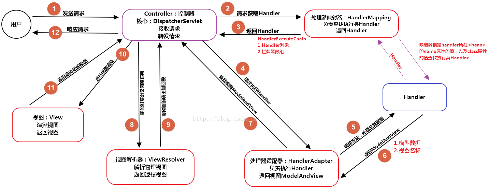
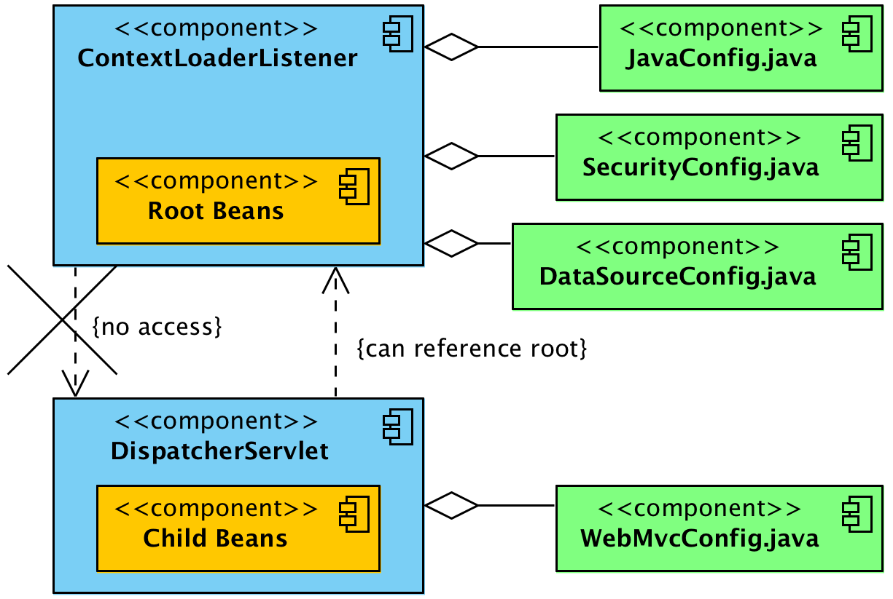

### MVC 与 Spring

服务器提供**Servlet**容器，由**Servlet**容器来创建<span style=background:#ffb8b8>IoC容器</span>：

1. 可通过**Listener**（**ServletListener**），有通过**Servlet**（**DisptachServlet**）来创建。
2. 可以采用XML形式，也可采用注解的形式。

这里的<span style=background:#ffb8b8>IoC容器</span>指的是针对Web的**ApplicationContext**，会初始化所有的**Bean**，包括**Controller**，


### DispatcherServlet、ContextLoaderListener

**DispatcherServlet**处理所有的HTTP请求。

<span style=background:#b3b3b3>DispatcherServlet.onRefresh()</span>会初始化各种请求处理策略，如，文件上传处理策略、URL请求处理策略、视图映射处理策略、异常处理策略等。

这些策略的大部分执行逻辑都是先从**WebApplicationContext**中查找，找不到的情况下再加载<span style=background:#e6e6e6>DispatcherServlet.properties</span>中的各个策略，如，初始化HandlerMapping、注册各种请求的处理策略及处理类。


**ContextLoaderListener**、**DispatcherServlet**在实例化后都会分别创建一个**WebApplicationContext**并将其封装为键值对[注册到](https://www.cnblogs.com/nizuimeiabc1/p/12542570.html)**RequestContext**中，这样**Servlet**容器就与<span style=background:#ffb8b8>IoC容器</span>关联起来了。

```java
WebApplicationContext.ROOT_WEB_APPLICATION_CONTEXT_ATTRIBUTE = WebApplicationContext.class.getName() + ".ROOT";
servletContext.setAttribute(WebApplicationContext.ROOT_WEB_APPLICATION_CONTEXT_ATTRIBUTE, this.context);
```

**WebApplicationContext**启动后会遍历所有的**Bean**，将**Controller**中经<span style=background:#e6e6e6>@RequestMapping</span>修饰的方法进行封装：

1. <span style=background:#e6e6e6>@RequestMapping</span>的相关参数（value、method）封装为**RequestMappingInfo**。
2. **Controller**实例、方法、方法参数（类型、注解）封装为**HandlerMethod**。
3. 将上面的\<**RequestMappingInfo**, **HandlerMethod**\>作为键值对存入handlerMethods
4. 然后将\<URL, **RequestMappingInfo**\>作为键值对存入urlMap中，URL就是<span style=background:#e6e6e6>@RequestMapping</span>的value。



如[上图](https://blog.csdn.net/qq_39003467/article/details/85173265)所示，然后当客户端发起请求时：

1. **DispatcherServlet**会根据URL找到对应的**HandlerMethod**，并将其封装为**HandlerExecutionChain**，
2. 然后遍历并找到所有支持本次请求的**HandlerAdapter**实现类，
3. 然后执行<span style=background:#b3b3b3>Interceptor.preHandle()</span>，对请求参数进行解析和转换，
4. 然后使用反射调用**Controller**中的具体方法，返回一个**ModelAndView**，
5. 然后执行<span style=background:#b3b3b3>Interceptor.postHandle()</span>，处理返回结果，最后执行afterCompletion。
6. 然后**ViewResolver**解析**ModelAndView**，返回具体的**View**。
7. **DispatcherServlet**根据**View**渲染视图，即填充数据，然后返回响应。


### DispatcherServlet、ContextLoaderListener启动顺序

Java Web开发的核心组件：**Listener**、**Filter**、**Servlet** / **JSP**，而各组件的启动顺序为：**Listener** -> **Filter** -> **Servlet**。

受启动顺序的影响，想在**Listener**、**Filter**中如果想获取**Bean**，只能通过如下方式：

```java
public class UserFilter  implements Filter {
    private IUser user;
    @Override
    public void init(FilterConfig filterConfig) throws ServletException {
        ApplicationContext applicationContext = WebApplicationContextUtils.getWebApplicationContext(filterConfig.getServletContext()); //获取的是DispatcherServlet.webApplicationContext 
        this.user = ((IUser)(applicationContext.getBean("User")));
    }
……
}
```


### DispatcherServlet、ContextLoaderListener配置

Spring MVC同样提供了[基于XML的和基于注解的两种配置](https://www.cnblogs.com/duanxz/p/7493276.html)，但无论哪种都需要在<span style=background:#e6e6e6>web.xml</span>中配置**ContextLoaderListener**和**DispatcherServlet**。

**ContextLoaderListener**只能创建一个，**DispatcherServlet**可以创建多个（匹配不同的URL），**ContextLoaderListener**和**DispatcherServlet**都会创建自己的<span style=background:#ffb8b8>IoC容器</span>。

其实**Spring**应用中可以同时存在多个<span style=background:#ffb8b8>IoC容器</span>：

1. 但是只有一个<span style=background:#c2e2ff>root</span>，其他的<span style=background:#c9ccff>子容器</span>会将<span style=background:#c2e2ff>root</span>设为<span style=background:#c2e2ff>parent</span>，在Web应用中，<span style=background:#b3b3b3>ContextLoaderListener.webApplicationContext</span>会被设为<span style=background:#c2e2ff>root</span>。
2. <span style=background:#c9ccff>子容器</span>可以访问<span style=background:#c9ccff>父容器</span>中的内容，反之则不成立，当<span style=background:#c9ccff>子容器</span>获取不到**Bean**时就会去<span style=background:#c9ccff>父容器</span>中查找。

<span style=background:#b3b3b3>ContextLoaderListener.webApplicationContext</span>包含所有全局可见的**Bean**，如@Service、@Repository、@Configuration（security、datasource）等基础**Bean**，<span style=background:#b3b3b3>DispatcherServlet.webApplicationContext</span>只包含MVC相关的**Bean**。



##### XML

```xml
<web-app>
    <context-param>
        <param-name>contextConfigLocation</param-name> /* 配置文件 */
        <param-value>/WEB-INF/applicationContext.xml</param-value>
    </context-param>
    
    <listener>
        <listener-class>org.springframework.web.context.ContextLoaderListener</listener-class>
    </listener>
    <servlet>
	    <servlet-name>sampleServlet</servlet-name>
    	<servlet-class>org.springframework.web.servlet.DispatcherServlet</servlet-class>
    </servlet>
</web-app>
```

##### Annotation

```xml
<web-app>
    <context-param>
        <param-name>contextConfigLocation</param-name> /* 配置类 */
        <param-value>com.lean.exmaple.AppContextConfiguration</param-value>
    </context-param>
    <context-param>
        <param-name>contextClass</param-name>
        <param-value>org.springframework.web.context.support.AnnotationConfigWebApplicationContext</param-value>
    </context-param>
    
    <listener>
        <listener-class>org.springframework.web.context.ContextLoaderListener</listener-class>
    </listener>
    <servlet>
	    <servlet-name>sampleServlet</servlet-name>
    	<servlet-class>org.springframework.web.servlet.DispatcherServlet</servlet-class>     
        <load-on-startup>0</load-on-startup> /*指定启动顺序*/
    </servlet>
</web-app>
```

<span style=background:#e6e6e6>\<load-on-startup/></span>有多个值：

1. 大于等于0，表示在**Servlet**容器启动时就加载该**Servlet**，值越小越优先加载。
2. 小于0，或没有指定时，表示收到HTTP请求时才会加载该**Servlet**。

<span style=background:#e6e6e6>\<load-on-startup/></span>虽然不是强制的，但如果不配置，<span style=background:#b3b3b3>DispatcherServlet.webApplicationContext</span>不会初始化，而且第一个请求的处理时间也会延长。


### Interceptor

**Interceptor**，拦截器，由**Spring**提供，与**Filter**一样，都是为过滤请求，但它的作用范围要比**Filter**小，仅对**Controller**的方法进行拦截。**Interceptor**基于**AOP**，最大优点在于它在<span style=background:#ffb8b8>IoC容器</span>内，由**Spring**直接管理，可以自然的调用其他**Bean**。

要想使用该类，我们还需要在**WebMvcConfigurer**中注册开启，在注册的同时通过<span style=background:#b3b3b3>HandlerInterceptor .addPathPatterns()</span>指定要拦截的路径。

更多关于**Interceptor**和**Filter**的比较，可以查看[这篇文章](https://blog.csdn.net/zzhongcy/article/details/102498081)（博主其实也没说清楚，都是东平西凑的）。

```java
         │   ▲                                                     │   ▲
         ▼   │                                                     ▼   │
       ┌───────┐                                                 ┌───────┐
       │Filter1│                                                 │Filter1│
       └───────┘                                                 └───────┘
         │   ▲                                                     │   ▲
         ▼   │                                                     ▼   │
       ┌───────┐                                                 ┌───────┐
┌ ─ ─ ─│Filter2│─ ─ ─ ─ ─ ─ ─ ─ ┐                                │Filter2│
       └───────┘                                                 └───────┘
│        │   ▲                  │                                  │   ▲
         ▼   │                                                     ▼   │
│ ┌─────────────────┐           │                           ┌─────────────────┐
  │DispatcherServlet│<───┐                                  │DispatcherServlet│<───┐
│ └─────────────────┘    │      │                           └─────────────────┘    │
   │              ┌────────────┐                             │              ┌────────────┐
│  │              │ModelAndView││                            │              │ModelAndView│
   │              └────────────┘                             │              └────────────┘
│  │                     ▲      │                            │ ┌ ─ ─ ─ ─ ─ ─ ─ ─ ┐ ▲
   │    ┌───────────┐    │                                   │    ┌───────────┐    │
│  ├───>│Controller1│────┤      │                            ├─┼─>│Controller1│──┼─┤
   │    └───────────┘    │                                   │    └───────────┘    │
│  │                     │      │                            │ │                 │ │
   │    ┌───────────┐    │                                   │    ┌───────────┐    │
│  └───>│Controller2│────┘      │                            └─┼─>│Controller2│──┼─┘
        └───────────┘                                             └───────────┘
└ ─ ─ ─ ─ ─ ─ ─ ─ ─ ─ ─ ─ ─ ─ ─ ┘                                    └ ─ ─ ─ ─ ─ ─ ─ ─ ┘
```


### 实用注解

#### Controller

**Spring**还允许在**Controller**中定义基于<span style=background:#e6e6e6>@ExceptionHandler</span>的异常处理方法，

但是改方法的作用范围仅限当前**Controller**，不过我们配合<span style=background:#e6e6e6>@ControllerAdvice</span>将范围扩大到所有**Controller**上。

<span style=background:#e6e6e6>@RequestBody</span>将接收到的**JSON**转换为**POJO**。

<span style=background:#e6e6e6>@ResponseBody</span>将Conreoller方法返回的**POJO**转化为**JSON**返回给客户。

<span style=background:#e6e6e6>@RestController</span>相当于@ResponseBody ＋ @Controller。

#### 跨域

关于跨域，Spring提供了3种简化操作：

1. 为<span style=background:#e6e6e6>@RequestMapping</span>补充<span style=background:#e6e6e6>@CrossOrigin</span>，该方法最简便。
2. 在**WebMvcConfigurer**中使用**CoreRegistry**
3. 在<span style=background:#e6e6e6>web.xml</span>中添加**CoreFilter**

#### 异步响应

**Spring**还支持异步响应，使用前需要在<span style=background:#e6e6e6>web.xml</span>中为**DispatcherServlet**开启。使用方式分为：

1. 返回**Callable**对象，**Spring MVC**会自动把**Callable**对象放入线程池中，带返回结果后再响应。
2. 返回**DeferredResult**对象，创建的同时可以指定超时时间，然后新启线程设置返回值。

**Servlet3.0**虽然支持处理，但是效率并不高，因为它采用的异步模型不是真正的原生异步。

~~java.nio是真正的异步，使用少量线程实现大量并发，但是nio编程很复杂，实际上高性能nio采用的都是Netty这种框架。~~

#### 与JSON

在JavaBean的字段上使用<span style=background:#e6e6e6>@JsonProperty(access=Access.WRITE_ONLY)</span>可以控制字段JSON化时忽略该字段。

此外还有<span style=background:#e6e6e6>@JsonIgnore</span>注解，<span style=background:#e6e6e6>@JsonProperty(access=Access.READ_ONLY)</span>。


