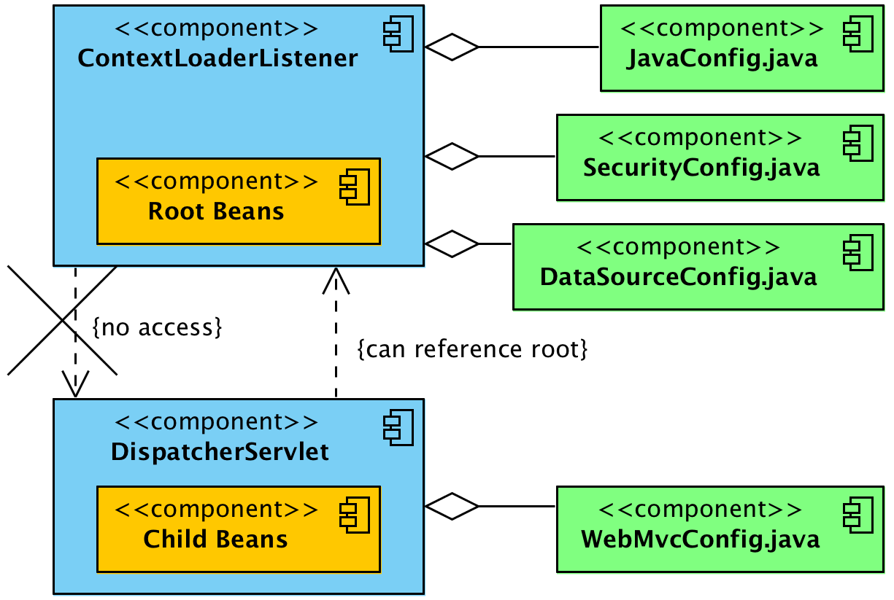
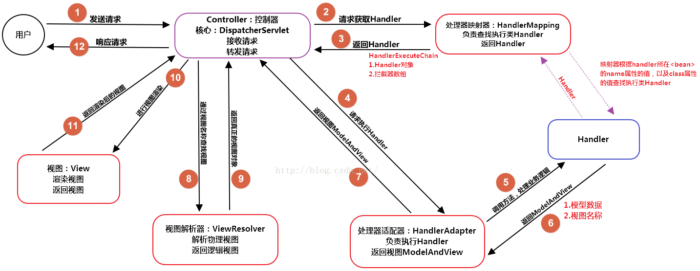

## Spring与MVC

服务器提供`Servlet`容器，由`Servlet`容器来创建<span style=background:#ffb8b8>IoC容器</span>：

1. 创建方式有过`Listener`（`ContextLoaderListener`）、`Servlet`（`DisptachServlet`）。
2. 配置方式有XML形式、注解的形式。

这里的<span style=background:#ffb8b8>IoC容器</span>指的是针对Web的`ApplicationContext`，会初始化所有的**Bean**，包括`Controller`，


## WebApplicationContext

`ContextLoaderListener`、`DispatcherServlet`在实例化后都会分别创建一个`WebApplicationContext`并将其封装为键值对[注册到](https://www.cnblogs.com/nizuimeiabc1/p/12542570.html)`RequestContext`中，这样`Servlet`容器就与<span style=background:#ffb8b8>IoC容器</span>关联起来了。

```java
WebApplicationContext.ROOT_WEB_APPLICATION_CONTEXT_ATTRIBUTE = WebApplicationContext.class.getName() + ".ROOT";
servletContext.setAttribute(WebApplicationContext.ROOT_WEB_APPLICATION_CONTEXT_ATTRIBUTE, this.context);
```

`WebApplicationContext`启动后会遍历所有的**Bean**，将`Controller`中经`@RequestMapping`修饰的方法进行封装：

1. `@RequestMapping`的相关参数（Value、Method）封装为`RequestMappingInfo`。
2. `Controller`实例、方法、方法参数（类型、注解）封装为`HandlerMethod`。
3. 将上面的`<RequestMappingInfo, HandlerMethod>`作为<u>键值对</u>存入`handlerMethods`。
4. 然后将`<URL, RequestMappingInfo>`作为<u>键值对</u>存入`urlMap`中，URL就是`@RequestMapping`的Value。

> `@RequestMapping`于**Spring MVC 4.0**引入`name`属性，[主要用于](https://segmentfault.com/q/1010000010879255)在JSP中构建URL。如不指定`name`，则默认为“类名的大写字符”+“#”+“方法名”。


## ContextLoaderListener、DispatcherServlet

### 关系

`ContextLoaderListener`只能创建一个，`DispatcherServlet`可以创建多个，以匹配不同的URL。

`ContextLoaderListener`和`DispatcherServlet`都会创建自己的<span style=background:#ffb8b8>IoC容器</span>。

其实**Spring**应用中可以同时存在多个<span style=background:#ffb8b8>IoC容器</span>：

1. 但是只有一个<span style=background:#c2e2ff>root</span>，其它的<span style=background:#c9ccff>子容器</span>会将<span style=background:#c2e2ff>root</span>设为<span style=background:#c2e2ff>parent</span>，在Web应用中，`ContextLoaderListener.webApplicationContext`会被设为<span style=background:#c2e2ff>root</span>。
2. <span style=background:#c9ccff>子容器</span>可以访问<span style=background:#c9ccff>父容器</span>中的内容，反之则不成立。当<span style=background:#c9ccff>子容器</span>获取不到**Bean**时就会去<span style=background:#c9ccff>父容器</span>中查找。

`ContextLoaderListener.webApplicationContext`包含所有全局可见的**Bean**，如`@Service`、`@Repository`、`@Configuration(security、datasource)`等基础**Bean**；`DispatcherServlet.webApplicationContext`只包含MVC相关的**Bean**。



### 启动顺序

Java Web开发的核心组件：`Listener`、`Filter`、`Servlet`/`JSP`，而各组件的启动顺序为：`Listener` -> `Filter` -> `Servlet`。

受启动顺序的影响，想在`Listener`、`Filter`、`JSP`中如果想获取**Bean**，只能通过`WebApplicationContextUtils`，如：

```java
public class UserFilter  implements Filter {
    private IUser user;
    @Override
    public void init(FilterConfig filterConfig) throws ServletException {
        ApplicationContext applicationContext = WebApplicationContextUtils.getWebApplicationContext(filterConfig.getServletContext()); //获取的是DispatcherServlet.webApplicationContext 
        this.user = ((IUser)(applicationContext.getBean("User")));
    }
……
}
```

### 配置方式

**Spring MVC**同样提供了[基于XML的和基于注解的两种配置](https://www.cnblogs.com/duanxz/p/7493276.html)，但无论哪种都需要在`web.xml`中配置`ContextLoaderListener`或`DispatcherServlet`。

#### XML

```xml
<web-app>
    <context-param>
        <param-name>contextConfigLocation</param-name> /* 配置文件 */
        <param-value>/WEB-INF/applicationContext.xml</param-value>
    </context-param>

    <listener>
        <listener-class>org.springframework.web.context.ContextLoaderListener</listener-class>
    </listener>
    <servlet>
	    <servlet-name>sampleServlet</servlet-name>
    	<servlet-class>org.springframework.web.servlet.DispatcherServlet</servlet-class>
    </servlet>
</web-app>
```

#### Annotation

```xml
<web-app>
    <context-param>
        <param-name>contextConfigLocation</param-name> /* 配置类 */
        <param-value>com.lean.exmaple.AppContextConfiguration</param-value>
    </context-param>
    <context-param>
        <param-name>contextClass</param-name>
        <param-value>org.springframework.web.context.support.AnnotationConfigWebApplicationContext</param-value>
    </context-param>

    <listener>
        <listener-class>org.springframework.web.context.ContextLoaderListener</listener-class>
    </listener>
    <servlet>
	    <servlet-name>sampleServlet</servlet-name>
    	<servlet-class>org.springframework.web.servlet.DispatcherServlet</servlet-class>
        <load-on-startup>0</load-on-startup> /*指定Servlet的启动顺序*/
    </servlet>
</web-app>
```

#### 补充

`<load-on-startup/>`有多个值：

1. 大于等于`0`：表示在**Servlet**容器启动时就加载该`Servlet`，值越小越优先加载。
2. 小于`0`或没有指定：表示收到HTTP请求时才会加载该`Servlet`。

`<load-on-startup/>`虽然不是强制的，但如果不配置，`DispatcherServlet.webApplicationContext`不会初始化，而且第一个请求的处理时间也会延长。


## 请求响应过程

`DispatcherServlet`处理所有的HTTP请求。

`DispatcherServlet.onRefresh()`会初始化各种请求处理策略，如，文件上传处理策略、URL请求处理策略、视图映射处理策略、异常处理策略等。

这些策略的大部分执行逻辑都是先从`WebApplicationContext`中查找，找不到的情况下再加载`DispatcherServlet.properties`中的各个策略，如，初始化`HandlerMapping`、注册各种请求的处理策略及处理类。


如[下图](https://blog.csdn.net/qq_39003467/article/details/85173265)所示，然后当客户端发起请求时：

1. `DispatcherServlet`会根据URL找到对应的`HandlerMethod`，并将其封装为`HandlerExecutionChain`，
2. 然后遍历并找到所有支持本次请求的`HandlerAdapter`实现类，
3. 然后执行`Interceptor.preHandle()`，对请求参数进行解析和转换，
4. 然后使用反射调用`Controller`中的具体方法，返回一个`ModelAndView`，
5. 然后执行`Interceptor.postHandle()`，处理返回结果，最后执行`afterCompletion()`。
6. 然后`ViewResolver`解析`ModelAndView`，返回具体的`View`。
7. `DispatcherServlet`根据`View`渲染视图，即，填充数据，然后返回响应。




## 实用注解

### Controller

**Spring**还允许在`Controller`中定义基于`@ExceptionHandler`的异常处理方法，但是该方法的作用范围仅限当前`Controller`，不过我们配合`@ControllerAdvice`将范围扩大到所有`Controller`上。

`@RequestBody`将接收到的**JSON**转换为POJO。

`@ResponseBody`将`Conreoller`方法返回的POJO转化为**JSON**返回给客户。

`@RestController`相当于`@ResponseBody` ＋ `@Controller`。

### 跨域

关于跨域，**Spring**提供了3种简化操作：

1. 为`@RequestMapping`补充`@CrossOrigin`，该方法最简便。
2. 在`WebMvcConfigurer`中使用`CoreRegistry`。
3. 在`web.xml`中添加`CoreFilter`。

### 异步响应

**Spring**还支持异步响应，使用前需要在`web.xml`中为`DispatcherServlet`开启。

使用方式分为：

1. 返回`Callable`对象，**Spring MVC**会自动把`Callable`对象放入线程池中，带返回结果后再响应。
2. 返回`DeferredResult`对象，创建的同时可以指定超时时间，然后新启线程设置返回值。

**Servlet3.0**虽然支持处理，但是效率并不高，因为它采用的异步模型不是真正的原生异步。

~~java.nio是真正的异步，使用少量线程实现大量并发，但是nio编程很复杂，实际上高性能nio采用的都是Netty这种框架。~~

### 与JSON

在JavaBean的字段上使用`@JsonProperty(access=Access.WRITE_ONLY)`可以控制字段JSON化时忽略该字段。

此外还有`@JsonIgnore`注解，`@JsonProperty(access=Access.READ_ONLY)`。


## Interceptor

`Interceptor`，拦截器，由**Spring**提供，与`Filter`一样，都是为过滤请求，但它的作用范围要比`Filter`小，仅对`Controller`的方法进行拦截。

`Interceptor`基于**AOP**，最大优点在于它在<span style=background:#ffb8b8>IoC容器</span>内，由**Spring**直接管理，可以自然的调用其它**Bean**。

> 可用`@Order`来调整`Interceptor`间的执行顺序。
>
> 注意：`@Order`作用的是同一类“`@Component`之间的方法”的执行顺序，而非`@Component`之间的加载顺序，加载顺序可用`@DependsOn`来调整。

> 更多关于`Interceptor`和`Filter`的比较，可以查看[这篇文章](https://blog.csdn.net/zzhongcy/article/details/102498081)（博主其实也没说清楚，都是东拼西凑的）。

```java
         │   ▲                                                     │   ▲
         ▼   │                                                     ▼   │
       ┌───────┐                                                 ┌───────┐
       │Filter1│                                                 │Filter1│
       └───────┘                                                 └───────┘
         │   ▲                                                     │   ▲
         ▼   │                                                     ▼   │
       ┌───────┐                                                 ┌───────┐
┌ ─ ─ ─│Filter2│─ ─ ─ ─ ─ ─ ─ ─ ┐                                │Filter2│
       └───────┘                                                 └───────┘
│        │   ▲                  │                                  │   ▲
         ▼   │                                                     ▼   │
│ ┌─────────────────┐           │                           ┌─────────────────┐
  │DispatcherServlet│<───┐                                  │DispatcherServlet│<───┐
│ └─────────────────┘    │      │                           └─────────────────┘    │
   │              ┌────────────┐                             │              ┌────────────┐
│  │              │ModelAndView││                            │              │ModelAndView│
   │              └────────────┘                             │              └────────────┘
│  │                     ▲      │                            │ ┌ ─ ─ ─ ─ ─ ─ ─ ─ ┐ ▲
   │    ┌───────────┐    │                                   │    ┌───────────┐    │
│  ├───>│Controller1│────┤      │                            ├─┼─>│Controller1│──┼─┤
   │    └───────────┘    │                                   │    └───────────┘    │
│  │                     │      │                            │ │                 │ │
   │    ┌───────────┐    │                                   │    ┌───────────┐    │
│  └───>│Controller2│────┘      │                            └─┼─>│Controller2│──┼─┘
        └───────────┘                                             └───────────┘
└ ─ ─ ─ ─ ─ ─ ─ ─ ─ ─ ─ ─ ─ ─ ─ ┘                              └ ─ ─ ─ ─ ─ ─ ─ ─ ┘
```

### 使用[[1]](https://www.cnblogs.com/h-c-g/p/10849644.html)

可通过扩展`HandlerInterceptorAdapter`或实现`HandlerInterceptor`来编写`Interceptor`。

推荐使用`HandlerInterceptorAdapter`，因为可以按需选择要实现的方法。

要想使用该类，我们还需要在`WebMvcConfigurer`中注册开启，在注册的同时通过`HandlerInterceptor.addPathPatterns()`指定要拦截的路径。


## Paoding Rose

[Paoding Rose](https://blog.csdn.net/DLUTBruceZhang/article/details/48734769)，是一个在**Spring**基础上构建的Web开发框架，它符合**Servlet**规范，且大量的采用<u>约定优于配置</u>的策略。

```java
// 该Controller的URL为：localhost:8080/packageName/rose_study/
@Path("rose_study")
public class HelloController {

    //  该方法即支持Get访问，也支持Post访问，其URL为：localhost:8080/packageName/rose_study/helloworld
    @Get("helloworld")
    @Post("helloworld")
    public String helloWorld(Invocation inv) {
        return "@Hello, world. This is the first rose app";
    }
}
```

如上所示：

- **Rose**中约定，所有的`Controller`都必须要以`Controller`结尾。
- `@Path`：用于指定访问路径。
- `@Get`/`@Post`：用于指定访问路径、访问方式。
- 返回值：见下表

| url返回形式        | 值                   |
| ------------------ | -------------------- |
| `"@" + String`     | 返回字符串           |
| `"@json" + String` | 返回JSON类型的字符串 |
| `String`           | 返回自定义的页面     |
