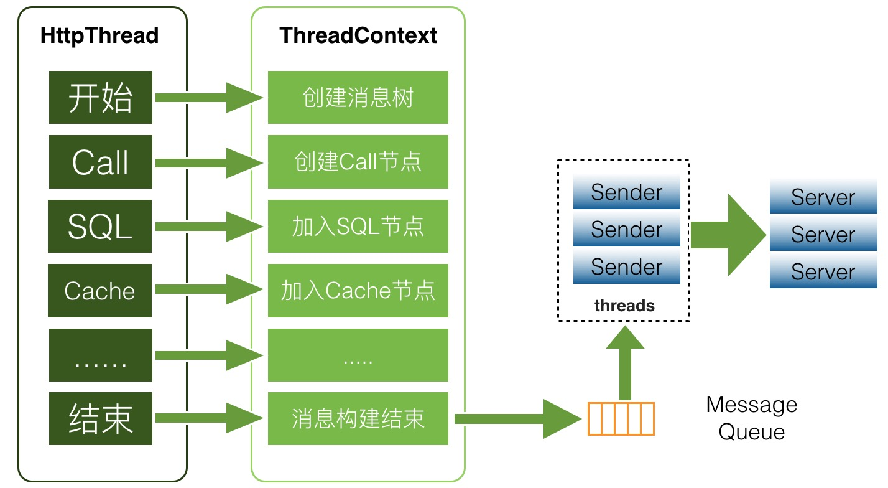

## 简介

**Spring**简化了Java的开发，而**Spring Boot**是为了简化**Spring**的开发。

**Spring Boot**主要包括4部分：

1. ##### Spring Boot Starter

   1. 将常用的依赖进行分组，然后整合为一个个的依赖，以方便向**Maven**、**Gradle**（基于**Groovy**语言）的添加。

2. ##### 自动配置🌙

   1. 基于**Spring4**的条件化配置以及**SPI**，自动将所有符合条件的<u>条件化<span style=background:#c9ccff>配置类</span></u>都加载到<span style=background:#ffb8b8>IoC容器</span>中。

3. ##### 命令行接口

   1. Command Line Interface，CLI，发挥**Groovy**语言优势，结合自动配置，进一步简化了**Spring**的开发。

4. ##### Actuator

   1. 为**Spring Boot**应用添加了一定的管理特性。


## 自动配置🌙

### 原理

[自动配置靠`@EnableAutoConfiguration`实现](https://blog.csdn.net/zxc123e/article/details/80222967)。

```java
@Target({ElementType.TYPE})
@Retention(RetentionPolicy.RUNTIME)
@Documented
@Inherited
@SpringBootConfiguration
@EnableAutoConfiguration /* 自动配置 */
@ComponentScan( excludeFilters = {
	@Filter(type = FilterType.CUSTOM, classes = {TypeExcludeFilter.class}),
    @Filter( type = FilterType.CUSTOM, classes = {AutoConfigurationExcludeFilter.class})})
public @interface SpringBootApplication {……}
```

`@EnableAutoConfiguration`会借助`AutoConfigurationImportSelector`，自动将所有符合条件的<u>条件化<span style=background:#c9ccff>配置类</span></u>都加载到<span style=background:#ffb8b8>IoC容器</span>中。

1. `@EnableAutoConfiguration`如下：

   ```java
   @Target(ElementType.TYPE)
   @Retention(RetentionPolicy.RUNTIME)
   @Documented
   @Inherited
   @AutoConfigurationPackage
   @Import(AutoConfigurationImportSelector.class)
   public @interface EnableAutoConfiguration {……}
   ```

2. `AutoConfigurationImportSelector`会使用**SPI**加载这些<u>条件化<span style=background:#c9ccff>配置类</span></u>。

   1. 原生的**SPI**会加载<span style=background:#c2e2ff>全部</span>实现类，所以**Spring**实现了自己的**SPI**，以便能够<span style=background:#c2e2ff>按需</span>加载，
   2. 即调用`SpringFactoriesLoader.loadFactories(Class<T>, @Nullable ClassLoader)`，根据`jar/META-INF/spring.factories`中的配置来加载这些<u>条件化<span style=background:#c9ccff>配置类</span></u>。

3. <u>条件化<span style=background:#c9ccff>配置类</span></u>就是`@Configuration`、`@Conditional`搭配使用的类，如下所示。

   ```java
   @Configuration
   public class AnimalConfiguration {
   	@Bean
   	@Conditional(DogCondition.class)
   	public Animal dog(){
   		return new Dog();
   	}
   }
   ```

4. 这些<span style=background:#c9ccff>配置类</span>往往会再使用`@Import(OtherConfiguration.class)`进行组合。

5. 通过`@EnableAutoConfiguration(excludes=DatasourceAutoConfiguration.class)`来排除某些自动配置。

### 扩展配置类

**Spring Boot**对`@Conditional`进行了扩展：

| 条件化注解                      | 配置生效条件                                                 |
| ------------------------------- | ------------------------------------------------------------ |
| @ConditionalOnClass             | `classpath`里存在指定的类时起效                              |
| @ConditionalOnMissingClass      | `classpath`里缺少指定的类时起效                              |
| @ConditionalOnBean              | <span style=background:#ffb8b8>IoC容器</span>中存在指定类型的**Bean**时起效 |
| @ConditionalOnMissingBean       | <span style=background:#ffb8b8>IoC容器</span>中不存在指定类型的**Bean**时起效 |
| @ConditionalOnExpression        | 给定的**SpEL**（**Sp**ring **E**xpression **L**anguage）算结果为`true`时起效 |
| @ConditionalOnJava              | Java的版本为特定值或者范围值时起效                           |
| @ConditionalOnJndi              | 存在指定的JNDI时起效。如果不指定JNDI，则需要JNDI InitialContext |
| @ConditionalOnProperty          | 配置的值与指定的值一致时起效                                 |
| @ConditionalOnResource          | `classpath`里存在指定的文件时起效                            |
| @ConditionalOnWebApplication    | Web环境时起效                                                |
| @ConditionalOnNotWebApplication | Web环境时不起效                                              |
| @ConditionalOnSingleCandidate   | <span style=background:#ffb8b8>IoC容器</span>中指定类型的**Bean**只有一个或经`@Primary`修饰的**Bean**只有一个时起效。 |

### 补充

使用**Spring Boot**时，最好从`spring-boot-starter-parent`中继承，这样可以引入预置。

**Spring Boot**提供更简便的**Filter**编写。

- **Spring**会自动扫描`FilterRegistrationBean`，将它们返回的**Filter**注册的**Servlet**容器中，纯Java，无需任何配置。


## 配置文件

配置文件`application.yml`

1. `*.yml`采用树状配置。
2. **Spring**可以使用`${Environment_Variable:default_value}`的方式获取值，即，从环境变量中获取值，如果没有则取默认值。
3. 通过`@ConfigurationProperty`将`application.yml`中的配置赋值给属性类。

[配置的加载顺序](https://blog.csdn.net/J080624/article/details/80508606)：

1. `boostrap.properties`
2. `boostrap.yml`
3. `application.properties`
4. `application.yml`
5. 系统环境变量
6. 命令行参数

后加载的配置会覆盖已加载的配置，即，前者的优先级高于后者。

但`boostrap.properties/yml`于**ApplicationContext**的引导阶段生效，且其中的配置不会被覆盖。


## Actuator

Actuator，监视器。

1. **Actuator**会将自己收集到的信息暴露给**JMX**，
2. **Actuator**会通过`/actuator/`挂载一些监控点，`info`、`health`、`beans`、`env`、`metrics`等，
   1. 这些信息都会提供给**JMX**，但出于安全考量，只向Web提供`health`、`info`信息，想要暴露到**JMX**需要额外配置。
   2. `metrics`是一款监控指标的度量类库，提供应用的性能统计。

### 功能介绍

| HTTP方法 | 接口            | 功能描述                                              |
| -------- | --------------- | ----------------------------------------------------- |
| GET      | /autoconfig     | 描述了Spring Boot在使用自动配置的时候，所做出的决策。 |
| GET      | /beans          | 列出运行应用所配置的bean。                            |
| GET      | /configprops    | 列出应用中能够用来配置bean的所有属性及其当前的值。    |
| GET      | /dump           | 列出应用的线程，包括每个线程的栈跟踪信息。            |
| GET      | /env            | 列出应用上下文中所有可用的环境和系统属性变量。        |
| GET      | /env/{name}     | 展现某个特定环境变量和属性变量的值。                  |
| GET      | /health         | 展现当前应用的健康状况。                              |
| GET      | /info           | 展现应用特定的信息。                                  |
| GET      | /metrics        | 列出应用相关的指标，包括请求特定端点的运行次数。      |
| GET      | /metrics/{name} | 展现应用特定指标项的指标状况。                        |
| POST     | /shutdown       | 强制关闭应用。                                        |
| GET      | /trace          | 列出应用最近请求相关的元数据，包括请求和响应头。      |


## 监控

监控应用一般包括3个维度：

1. 进程的CPU、内存、IO等使用量。
2. JVM的服务质量，如：**GC**、并发数/线程数、内存分布等。
3. 业务信息，各类计时、计数，如：代码执行、订单、交易等。

<span style=background:#ffee7c>将信息发送到消息队列中，以邮件、短信等方式通知负责人。</span>

### Zabbix

### Jolokia

### CAT

Central Application Tracking，CAT，是一个针对应用的实时监控系统。

**CAT**包含3个模块：

1. Client：供业务代码、中间件使用的SDK。
2. Consumer：负责事实分析Client提供的数据。
3. Home：可视化监控数据。

> CAT有考虑多机房的场景：
> 
> 1. Client在启动时会访问<u>路由中心</u>来获取同机房中的Consumer，以向其上报监控数据。
> 2. Home会对Consumer进行跨机房调用，将数据合再展示。
> 
> Consumer、Home、路由中心往往会部署在同一个进程中，以减少系统层级。

#### 客户端



如[上图](https://tech.meituan.com/2018/11/01/cat-in-depth-java-application-monitoring.html)所示，Client使用`ThreadLocal`才收集数据，以应对多线程场景。在业务线程结束后，Client会将收集到的数据存入队列，由额外的消费线程将数据异步上报。

Client每分钟会发送一次自身的状态信息。

针对不同的业务场景，CAT设计了不同的业务监控对象：`Transaction`、`Event`、`Heartbeat`、`Metric`。

CAT使用了自定义的序列化协议，并基于**Netty**进行通信，以提升网络IO性能。

#### 比较[[0]](https://blog.csdn.net/tjiyu/article/details/90757319)

**CAT**倾向于指标、链路事件监控，但只能看到最新的样本数据和出问题的数据，且无法对日志进行搜索。

大量业务日志的场景应该用ELK。


https://cloud.tencent.com/developer/article/1706632

### 云原生时代下，监控的特点

云原生时代对应用架构提出了全面的挑战，监控方面也不例外。但是本质核心的东西没有变，只是形式有不同。以 docker 为例，云上应用监控它的粒度比物理机和虚拟机 VM 都要小，以前很多系统是以 IP 地址来区分集群节点的，如果一个 docker 实例的 IP 地址不断地变化，会对监控有挑战；在 Kubernetes 的 Pod 中的 docker 实例，可能是内部 IP 地址，对外可见 IP 地址是 Pod 地址，这样可能会导致一些场景串不起来；另一方面，docker 容器应用生命周期可能会比较短，VM 上的应用是重部署，docker 则是销毁重建，对监控系统可能会有一些新的影响。 

### 为什么要使用cat实时监控

1. 线上发布了服务，怎么知道它一切正常，比如发布5台服务器，如何直观了解是否有请求进来，访问一切正常。
2. 当年有一次将线上的库配置到了Beta，这么低级的错误，排错花了一个通宵，十几个人。
3. 某个核心服务挂了，导致大量报错，如何确定到底是哪里出了问题。
4. SOA带来的问题，调用XX服务出问题，很慢，是否可以衡量？     
5. 应用程序有性能瓶颈，如何提供一些有效工具发现？
6. 如何实时查看线上借口的性能，包括压测，借口太慢如何定位?
7. 如何统计线上流量以及接口调用量?
8. 线上接口可用率不到100%，如何进行告警？
9. 线上服务器缓存,jvm，GC如何进行实时监控?
10. 程序代码运行情况监控,监控一段代码运行情况，运行时间统计，次数，错误次数等等.
11. 异常/错误等问题监控.
12. SQL执行监控.SQL执行监控可以看到每个DAO方法执行解析的SQL语句，SQL语句执行时长，
13. 链接到那个数据库（URL）执行;如果SQL执行出现异常，还会记录异常信息，另外还可以过滤出慢SQL.

