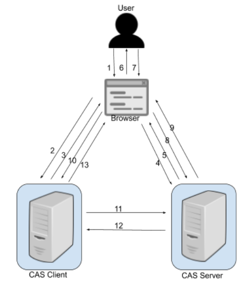
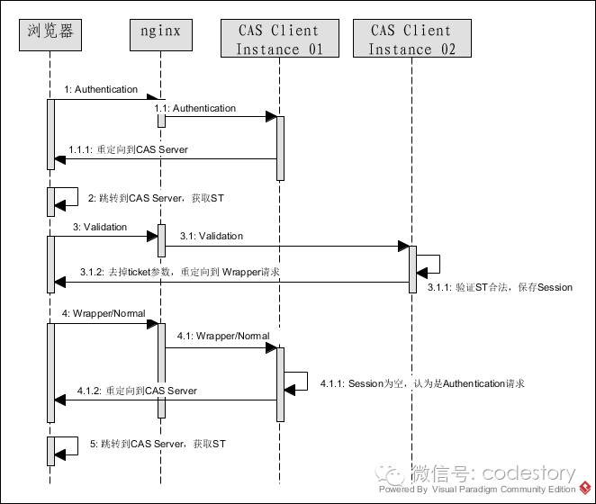

## 登录

[广义的登录](https://cloud.tencent.com/developer/article/1727265)包括认证（<span style=background:#ffb8b8>Authentication</span>）和授权（<span style=background:#f8d2ff>Authorization</span>）：

- <span style=background:#ffb8b8>Authentication</span>是确认该用户的身份，<span style=background:#ffb8b8>认证</span>其实是狭义的登录。
- <span style=background:#f8d2ff>Authorization</span>是向用户授予资源的权限。

> 在实际生产中，脱离<span style=background:#ffb8b8>认证</span>的<span style=background:#f8d2ff>授权</span>是没有意义的，反过来也是。

### 单点登录

单点登录，Single Sign On，SSO，用户仅需登录一次，即可访问所有应用。

- <u>用户</u>只需进行一次身份验证，通常是验证<u>用户名和密码</u>，<u>用户名和密码</u>通过<u><span style=background:#ffb8b8>认证</span>服务器</u>的验证后会生成<u>票据</u>，并以Cookie的形式发放<u>票据</u>。
- 之后再需要验证身份时，应用会重定向到<u><span style=background:#ffb8b8>认证</span>服务器</u>，<u><span style=background:#ffb8b8>认证</span>服务器</u>对<u>票据</u>的有效性进行验证，无需用户进行操作。

> “单点登录”的“登录”是狭义的登录，即，<span style=background:#ffb8b8>认证</span>。


## 协议

### CAS

[CAS](https://zh.wikipedia.org/zh-cn/集中式认证服务)，Central Authentication Service，一种**SSO**协议。

> 既然是“单点登录”，也就是仅支持<span style=background:#ffb8b8>认证</span>，不支持<span style=background:#f8d2ff>授权</span>。

#### 基本概念

**CAS**有`3`个基本概念：用户、客户端、服务端。

- 服务端，Server：提供<span style=background:#ffb8b8>认证</span>服务的应用，也就是<u><span style=background:#ffb8b8>认证</span>服务器</u>。
- 客户端，Client：这里的指的是业务系统，包括第二方业务系统、第三方业务系统。这里的客户端是相对于<u><span style=background:#ffb8b8>认证</span>服务器</u>而言的。
- 用户，User Terminal：确切地说是用户终端，包括浏览器、手机应用、桌面应用等。

#### 流程



1. <u>User</u>通过浏览器访问Client，当前场景中<u>浏览器</u>就是<u>User Termial</u>；
2. <u>浏览器</u>发起一个`GET`请求访问<u>Client</u>。
3. <u>Client</u>发现该<u>User</u>未处于登录状态，`redirect`到<u>Server</u>。
4. <u>User</u>通过<u>浏览器</u>请求<u>Server</u>进行<span style=background:#ffb8b8>认证</span>。
5. <u>Server</u>发现该<u>User</u>未在<u>Server</u>中登录，要求<u>User</u>进行登录。
6. <u>Server</u>向<u>浏览器</u>返回登录页面，<u>浏览器</u>`redirect`到登录页。
7. <u>User</u>在登录页中输入<u>用户名和密码</u>。
8. <u>浏览器</u>通过`POST`请求将<u>用户名和密码</u>提交到<u>Server</u>。
9. <u>Server</u>通过<u>用户名和密码</u>对用户身份进行<span style=background:#ffb8b8>认证</span>，若<u>用户名和密码</u>正确，则生成SSO会话，并把会话ID通过Cookie的方式返回给<u>浏览器</u>，此时，<u>User</u>完成在<u>Server</u>上的登录。
10. 返回Session的同时，<u>Server</u>会让<u>浏览器</u>`redirect`到<u>Client</u>，且同时发送一个<u>票据</u>（`Ticket`）。
11. <u>Client</u>收到`Ticket`后会请求<u>Server</u>对该`Ticket`进行校验。
12. <u>Server</u>向<u>Client</u>返回校验结果，校验结果包括：该`Ticket`是否合法、<u>User</u>的相关信息。
13. <u>Client</u>根据`Ticket`得知当前<u>User</u>的身份，完成在<u>Client</u>上的登录。

> 步骤`3`、`5`、`9`、`13`还是基于Session的，所以，如果<u>Client</u>是以集群模式进行部署的，此时受<span style=background:#d4fe7f>负载均衡</span>的影响，会有跨Session的问题，可以通过使用基于**Redis**共享Session的方式来解决。
>
> **CAS 3.0**基于**SAML**对`Ticket`进行校验。
>
> <u>Client</u>和<u>Server</u>之间的通信没有任何的加密/签名机制，双方均无法确保对方的身份，Client与Server之间的网络需要是可行的。所以**CAS**往往只用于局域网。<span style=background:#ffee7c>OAuth 2.0就不存在这个问题了吗？</span>

### OAuth

[OAuth](https://zh.wikipedia.org/zh-cn/开放授权)，Open Authorization，是一种<span style=background:#f8d2ff>授权</span>协议，而非<span style=background:#ffb8b8>认证</span>协议。

> **OAuth 2.0**是**OAuth**的下一版本，但不向下兼容**OAuth 1.0**。
>
> 下文的**OAuth**指的是**OAuth 2.0**。

**OAuth**常用于对第三方应用的资源<span style=background:#f8d2ff>授权</span>。

#### 基本概念

**OAuth**有`4`个基本概念：

- Resource Owner：资源拥有者，通常为终端用户。
- Resource Server：资源提供者。
- Authorization Server：<span style=background:#f8d2ff>授权</span>服务器。
- Client：请求资源的应用。

#### 流程

```java
+--------+                               +---------------+
|        |--(A)- Authorization Request ->|   Resource    |
|        |                               |     Owner     |
|        |<-(B)-- Authorization Grant ---|               |
|        |                               +---------------+
|        |
|        |                               +---------------+
|        |--(C)-- Authorization Grant -->| Authorization |
| Client |                               |     Server    |
|        |<-(D)----- Access Token -------|               |
|        |                               +---------------+
|        |
|        |                               +---------------+
|        |--(E)----- Access Token ------>|    Resource   |
|        |                               |     Server    |
|        |<-(F)--- Protected Resource ---|               |
+--------+                               +---------------+
```

如[上图](https://datatracker.ietf.org/doc/html/rfc6749)所示，**OAuth**的流程为：

1. <u>Client</u>向<u>Resource Owner</u>发起<span style=background:#f8d2ff>授权</span>请求，请求<u>Owner</u>同意访问<u>Resource</u>。
2. 根据不同的<span style=background:#f8d2ff>授权</span>模式，该<u>Owner</u>同意该<span style=background:#f8d2ff>授权</span>，且返回一个"<span style=background:#f8d2ff>授权</span>"给<u>Client</u>。
3. <u>Client</u>携带<u>Owner</u>的<span style=background:#f8d2ff>授权</span>，请求<u>Authorization Server</u>颁发一个令牌（`Access Token`）用于访问`Resource`。
4. <u>Authorization Server</u>校验<u>Client</u>自身的合法性之后，颁发`Token`。
5. <u>Client</u>携带`Token`, 代表<u>Owner</u>请求<u>Resource Server</u>。
7. <u>Resource Server</u>校验完`Token`后，返回`Resource`。

在具体的实现中，前三步会有几个变种，即<span style=background:#f8d2ff>授权</span>模式，而常见的<span style=background:#f8d2ff>授权</span>模式有：

- **Authorization Code Grant**：<span style=background:#f8d2ff>授权</span>码模式，最安全，最常用。
- **Resource Owner Password Credentials Grant**：需要把<u>User</u>的<u>用户名和密码</u>暴露给<u>Client</u>；
- **Client Credential Grant**：整个流程没有<u>User</u>的概念，适用于服务端相互调用的场景。

### OIDC

OIDC，OpenID Connect，该协议扩展自**OAuth**，不仅支持<span style=background:#f8d2ff>授权</span>，还支持<span style=background:#ffb8b8>认证</span>，比**CAS**、**OAuth**都要流行。

为了支持<span style=background:#ffb8b8>认证</span>，**OIDC**引入了`id_token`来标识<u>Owner</u>的身份。`id_token`的标准格式为JWT。

> JWT，JSON Web Token是一个非常轻巧的规范，允许我们使用在用户和服务器之间安全可靠地通信。

#### 流程

如[下图](https://openid.net/specs/openid-connect-core-1_0.html)所示，**OIDC**的流程与**OAuth**基本一致，只不过换了术语：

- OP，OpenID Provider：负责<span style=background:#ffb8b8>认证</span>和<span style=background:#f8d2ff>授权</span>。
- RP，Relying Party：对应**OAuth**中的<u>Client</u>。

```java
+--------+                                   +--------+
|        |                                   |        |
|        |---------(1) AuthN Request-------->|        |
|        |                                   |        |
|        |  +--------+                       |        |
|        |  |        |                       |        |
|        |  |  End-  |<--(2) AuthN & AuthZ-->|        |
|        |  |  User  |                       |        |
|   RP   |  |        |                       |   OP   |
|        |  +--------+                       |        |
|        |                                   |        |
|        |<--------(3) AuthN Response--------|        |
|        |                                   |        |
|        |---------(4) UserInfo Request----->|        |
|        |                                   |        |
|        |<--------(5) UserInfo Response-----|        |
|        |                                   |        |
+--------+                                   +--------+
```

### SAML

SMAL，Security Assertion Markup Language，一个基于XML的<span style=background:#ffb8b8>认证</span>协议。

> <span style=background:#ffee7c>有时间再进行补充。</span>


## 存储用户信息

用户信息的存储有多种实现方式，如基于内存的、基于JDBC的、基于**LDAP**的。

但无论使用哪种方式，只需重写**Spring Security**的`WebSecurityConfigurerAdapter.configure()`即可。

### 内存

基于内存的实现，是通过使用`AuthenticationManagerBuilder.inMemoryAuthentication().withUser("user_name").password("password").authorities("ROLE_USER")`这种硬编码的方式来存储用户名、密码、权限等用户信息。

> 基于内存来存储用户信息，对测试来说比较方便。

### JDBC

基于JDBC的实现方式，是通过使用`AuthenticationManagerBuilder.jdbcAuthentication().dataSource(dataSource)`来存储用户信息。

用户信息的格式没有统一的标准，所以该实现方式提供了<span style=background:#ffb8b8>认证</span>SQL、<span style=background:#f8d2ff>授权</span>SQL的重写来应对这一问题。

> <span style=background:#ffb8b8>认证</span>SQL、<span style=background:#f8d2ff>授权</span>SQL默认基于`user_name`。

密码往往需要进行加密存储，**Spring Security**集成了几个加密器，当然，开发者也可以实现自己的加密器。

> **Spring Security**还提供`AuthenticationManagerBuilder.userDetailsService()`这种自定义的用户信息存储的实现方式，其使用方法与使用基于JDBC的方法相仿。

### LDAP

[LDAP](https://zh.wikipedia.org/wiki/轻型目录访问协议)，Lightweight Directory Access Protocol，该协议基于IP提供访问控制和维护分布式信息的目录信息，可用来存储用户用户信息。

**LDAP**中的[概念](https://houbb.github.io/2021/08/02/ldap-01-overview)主要有：

| 关键字 | 全称               | 含义       | 说明                                                         |
| :----- | :----------------- | :--------- | ------------------------------------------------------------ |
| dc     | Domain Component   | 域名的成分 | 其实就是将完整的域名按`.`分割，如：域名`example.com`为`dc=example,dc=com` |
| uid    | User Id            | 用户ID     | 如：`lixiaohui5`                                             |
| ou     | Organization Unit  | 组织单位   | ou可以包含其它对象，如其它组织单元，如：`oa组`               |
| cn     | Common Name        | 公共名称   | 如：`Thomas Johansson`                                       |
| sn     | Surname            | 姓         | 如：`李`                                                     |
| dn     | Distinguished Name | 位置，唯一 | 如：`uid=lixiaohui5,ou=oa组,dc=example,dc=com`               |
| rdn    | Relative DN        | 相对辨别名 | 类似于文件系统中的相对路径；rdn与目录树结构无关，如：`uid=tom`或`cn= Thomas Johansson` |

基于**LDAP**的实现方式，是通过使用`AuthenticationManagerBuilder.ldapAuthentication()`来配置**LDAP**的链接信息、存储用户信息。

> [如果不想](https://potoyang.gitbook.io/spring-in-action-v5/di-4-zhang-spring-an-quan/4.2-pei-zhi-spring-security/4.2.3-ldap-zhi-chi-de-yong-hu-cun-chu)使用远程的**LDAP**服务器，可以使用**Spring Security**内嵌的**LDAP**服务器。

#### 密码比较

针对**LDAP**进行身份验证的默认策略是执行绑定操作，将用户通过**LDAP**服务器直接进行验证。

另一种选择是执行比较操作，这包括将输入的密码发送到**LDAP**目录，并要求服务器将密码与用户的密码属性进行比较。因为比较是在**LDAP**服务器中进行的，所以实际的密码是保密的。

#### 引用远程LDAP服务器

使用`contextSource()`方法来配置位置，该方法返回`ContextSourceBuilder`，其中提供了`url()`来指定`LDAP`服务器的位置。


## 保护请求

**Spring Security**中的保护请求其实就是<span style=background:#ffb8b8>认证</span>和<span style=background:#f8d2ff>授权</span>，或者说，只有满足特定的安全规则，请求才允许访问服务。

**Spring Security**提供了丰富的安全规则，如：

| 名称                       | 功能                                             |
| -------------------------- | ------------------------------------------------ |
| access(String)             | 如果SpEL为 true，则允许访问                      |
| anonymous()                | 默认用户允许访问                                 |
| authenticated()            | 认证用户允许访问                                 |
| denyAll()                  | 无条件拒绝所有访问                               |
| fullyAuthenticated()       | 如果用户是完全授权的（不是记住用户），则允许访问 |
| hasAnyAuthority(String...) | 如果用户有任意给定的权限，则允许访问             |
| hasAnyRole(String...)      | 如果用户有任意给定的角色，则允许访问             |
| hasAuthority(String)       | 如果用户有给定的权限，则允许访问                 |
| hasIpAddress(String)       | 来自给定 IP 地址的请求允许访问                   |
| hasRole(String)            | 如果用户有给定的角色，则允许访问                 |
| not()                      | 拒绝任何其它访问方法                             |
| permitAll()                | 无条件允许访问                                   |
| rememberMe()               | 允许认证了的同时标记了记住我的用户访问           |

> 注意：<u>先声明</u>的安全规则优先于<u>后声明</u>的安全规则。

### 其它

**Spring Security**还提供了对登录、登出、阻止跨站请求伪造（CSRF）的支持，开发者只需调用相关方法即可完成配置。


## 实践

### CAS Client集群跨Session的问题

#### 不停地重定向



如[上图](https://www.cnblogs.com/codestory/p/5512104.html)所示，如果CAS Client以集群形式部署，即，使用了**Nginx**对多台Client进行反向代理，由于**CAS**登录状态的存储实际上还是基于Session的，所以未经特殊处理，Session在Client之间是不会共享的。

这样，User在登录成功后，Client集群只会有某一台Client记录User为登录成功，并将该User保存到相应的Session中，但其它的Client不会记录，也没有与之对应的Session。当然，CAS Server会记录User为登录成功，但是是基于**Nginx**的地址，而非Client的地址。

于是，当后续请求<span style=background:#d4fe7f>负载均衡</span>到其它的Client时，这些Client不会认为该User已经登录，于是将请求`redirect`
到Server的登录页，而Server是以**Nginx**的地址为依据，没有依据被反向代理的Client的地址，所以Server当然会认为User已经登录，于是又将请求`redirect`回Client。

如果**Nginx**的<span style=background:#d4fe7f>负载均衡</span>策略为`ip_hash`、`sticky`那不会有什么问题，但如果策略为`round`，那么请求将转发给没有保存User登录成功的Client，<u>不断地`redirect`</u>，直到请求又落在保存了User登录成功的那台Client上。

可通过设置**Nginx**的<span style=background:#d4fe7f>负载均衡</span>策略为`ip_hash`、`sticky`，或令Client集群共享Session来解决。

#### 统一注销

由于跨Session的问题，未经特殊处理，CAS<u>不会统一注销</u>。

可进行设置，令Server收到User的注销请求后，逐个通知Client，Client将Session注销。

#### 共享会话

共享Session的大体思路是：在所有的`Filter`之前插入一个自定义的`Filter`，这个自定义的`Filter`会悄无声息地根据旧的Request创建新的Request，并传递给后面的`Filter`、`Servlet`，而这个新创建Request的Session会基于**Redis**进行共享，即，Client创建新Request时，会根据`Session ID`从**Redis**中获取Session。<span style=background:#ffee7c>可否直接使用ST到Server中获取用户信息？Server是否提供了这样的接口？</span>

**Spring**已经集成了共享Session，并且有**Redis**、**MongoDB**、**JDBC**等多种实现。

共享Session不仅解决了<u>不断地`redirect`</u>的问题，还顺手解决了<u>不会统一注销</u>的问题。

#### 其它类型的代理模式

有[文章](https://www.cnblogs.com/richaaaard/p/5053108.html)指出，如果是**Nginx**代理多个Server的场景，那么`ip_hash`、`sticky`不能解决跨Session的问题，而应使用`jvm_route $cookie_JSESSIONID|sessionid reverse;`来解决。

另外，**CAS**本身也有“代理”的概念，其场景为：两个不同的Client（Client A，Client B），这两个Client均受**CAS**保护，Client A访问Client B时，就会被**CAS**拦截并`redirect`到Server。针对这种场景，**CAS**提供Client间的代理来解决。
