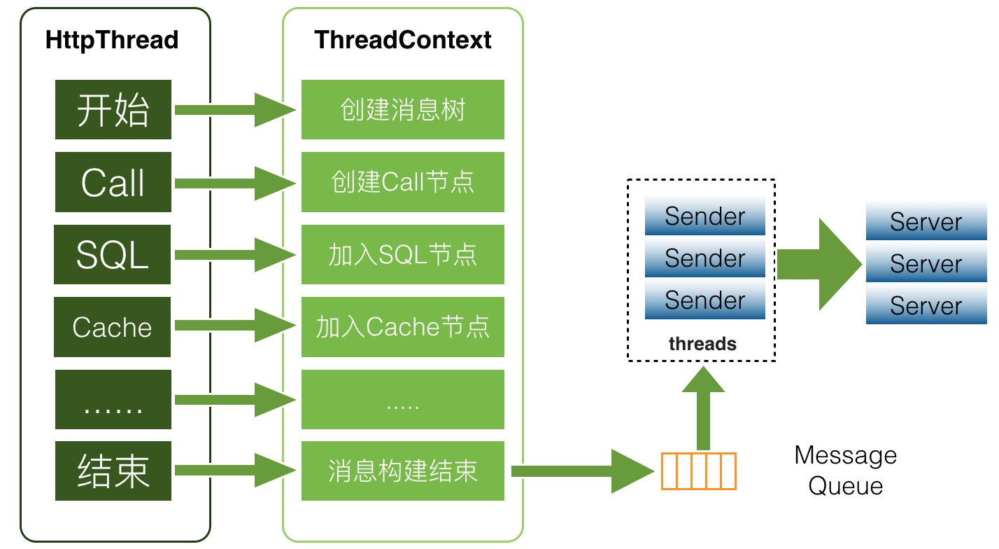

## 简介

监控应用一般包括3个维度：

1. 进程资源占用，如：CPU、内存、IO等使用量。
2. JVM的服务质量，如：**GC**、并发数/线程数、内存分布等。
3. 业务信息，各类计时、计数，如：代码执行、订单、交易等。

将信息发送到消息队列中，以邮件、短信等方式通知负责人。

常见的监控中间件有：Zabbix、Jolokia、CAT。

## Zabbix

### 架构

**Zabbix**[包括3部分](https://www.zabbix.com/documentation/current/zh/manual/introduction/overview)：

- Agent：部署在被监控的Host上，会主动的监控本地资源和应用，并上报给Server。
  - 部署在自动发现网络设备；
  - 发现设备后自动注册。
- Proxy：辅助Server收集数据，以减轻Server到负载。
- Server：收集监控数据，计算触发条件，发送警告。
  - 数据库：Server会将收集到到数据持久化到数据库中，
  - 可视化界面：改组将往往会与Server部署在同一台Host上。

### 数据流

想要收到`CPU load it too high on Server X` 的告警，需要以下3步：

1. 为`Server X`创建主机条目。
2. 创建一个关于CPU到监控项。
3. 创建一个触发器，并绑定相应动作。

> **Zabbix**提供模板来简化上述流程。

## Jolokia

## CAT

Central Application Tracking，CAT，是一个针对应用的实时监控系统。

**CAT**采用了CS架构：

1. Client：供业务代码、中间件上报日志的SDK。
   1. 每分钟会上报一次自身的状态信息。
2. Server：分为Consumer和Home
   1. Consumer：负责事实分析Client提供的数据。
   2. Home：可视化监控数据。

> **CAT**有考虑多机房的场景：
>
> 1. Client在启动时会访问<u>路由中心</u>来获取同机房中的Consumer，以向其上报监控数据。
> 2. Home会对Consumer进行跨机房调用，将数据合再展示。
>
> Consumer、Home、路由中心往往会部署在同一个进程中，以减少系统层级。

**CAT**基于[native协议](https://www.aliyun.com/sswc/141781.html)进行序列化/反序列化，并基于**Netty**在Client和Server间进行通信，以提升网络IO性能。

### 客户端

如[上图](https://tech.meituan.com/2018/11/01/cat-in-depth-java-application-monitoring.html)所示，Client会将监控日志封装为树状的`logview`，并采用存入`ThreadLocal`的方式来应对多线程场景。在业务线程结束后，Client会将收集到的数据存入队列，由额外的消费线程将数据异步上报。

针对不同的业务场景，**CAT**设计了不同的业务监控对象，如：`Transaction`、`Event`、`Problem`、`Heartbeat`、`Matrix`、`RPC`、`Cache`、`Dependency`、`Metric`等，**CAT**会基于这些监控对象生成丰富的报表。

> 跨越边界的行为是容易报错的地方。

### 服务端

Server同样采用了异步处理的设计，如：[先将数据存到本地](https://www.infoq.cn/article/distributed-real-time-monitoring-and-control-system/#heading4)，然后再将原始数据持久化到**HDFS**、将报表数据以<u>键值对</u>的形式持久化到**MySQL**。

[需要强调的是](https://blog.csdn.net/tjiyu/article/details/90757319)：

- **CAT**是一个监控系统，倾向于监控指标、链路事件，也就是说，**CAT**虽然带有一些链路监控功能，但不是一个标准全链路监控系统，与**Dapper**、**Hawk**、**Zipkin**等中间件进行比较是不合适。
- **CAT**是一个实时系统，能看到最新的样本数据和出问题的数据，但无法对日志进行搜索、聚合分析，也就不适合用于长期存储海量业务日志。海量业务日志的场景应该用**ELK**。

> 确切地说，**CAT**只做到了“监视”，没有“控制”。
>
> **CAT**的实时是基于<u>日志只读</u>、<u>内存增量计算</u>来实现的。

## 云原生时代下，监控的特点

[云原生时代对应用架构提出了全面的挑战](https://cloud.tencent.com/developer/article/1706632)，监控也不例外，虽然监控的本质没有变，但形式发生了变化。

以**Docker**为例：

- 一些应用是根据IP来区分集群节点的，如果一个**Docker**容器的IP不断地变化，会对监控有挑战。
- 而**Kubernetes**的**Pod**中的**Docker**容器，使用的可能是内部IP，而对外可见的IP是**Pod**的，而这会监控链路中断。
- **Docker**容器的生命周期可能会比较短，运行结束后可能会直接被销毁重建，不像物理机/虚拟机上的应用会重新部署，而这也会对监控产生影响。

