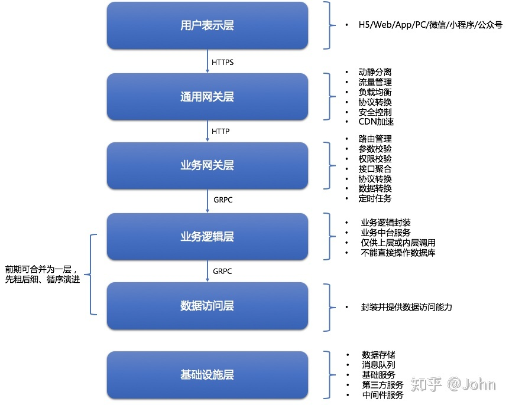

## 简述

微服务架构的优势：复杂可控、独立部署、技术选型灵活、容灾、扩展。

> 但如果刻意追求微服务化，这些优势反而会成为梦魇。

[Spring Cloud](https://spring.io/projects/spring-cloud)是一系列微服务框架的有序集合。它将目前各家公司开发的比较成熟、经得起实际考验的服务框架组合起来，并使用**Spring Boot**进行再封装，屏蔽掉了原组件的复杂配置和实现原理。

## 出现过程[[1]](https://www.zhihu.com/question/451313635/answer/1849701932)

1. 服务间通信：**Feign**

2. 服务治理：**Eureka**
   1. **CAP**
   2. 超时续约
   3. 注册、发现

3. 负载均衡：**Ribbon**

   ------

4. 限流、降级、熔断：**Hystrix**（豪猪）

5. 配置中心：**Config**
   1. 周期拉取、离线缓存
   2. 默认Git

6. 网关：**Gateway**

   --------------------------------------------------

7. 消息总线：**Bus**

8. 安全：**Security**

   1. 基于OAuth2，提供单点登录、资源授权、令牌管理。

9. 监控/指标聚合：**Metrics**

   1. 机器状态（CPU、内存、网络）
   2. 进程（JVM **Heap**、**GC**，MBean）
   3. **Zabbix**、**Jolokia**、**CAT**

10. 全链路追踪：

    1. **Sleuth**：埋点、收集
    2. **Zipkin**：存储、统计、展示

11. 日志收集：**ELK**

12. 全链路压测

## 分层模型[[2]](https://zhuanlan.zhihu.com/p/333384719)

请求过程应当是从上往下的；除非通过中间件进行，否则不允许跨层请求。

### 业务层总结[[3]](https://www.infoq.cn/article/nd0rofaup0wtlvlqarbu)

1. [前后端分离](https://mp.weixin.qq.com/s?__biz=MzI1NzYzODk4OQ==&mid=2247484791&idx=1&sn=4cb4fb04b481c3aee8a882934c8d925f&chksm=ea151255dd629b43c6383d912234ae0d53fad34e354fdf985a6461aa2774deaf313a234d64fb&scene=21#wechat_redirect)
2. [持续集成](https://mp.weixin.qq.com/s?__biz=MzI1NzYzODk4OQ==&mid=2247484778&idx=1&sn=f3a29677d7030370fdd9b8931a0449d0&chksm=ea151248dd629b5e1439bc4fa84411cdb5444d0bf0e8c09267a868fcb18f78602482dea51107&scene=21#wechat_redirect)
3. [应用层无状态化、容器化](https://mp.weixin.qq.com/s?__biz=MzI1NzYzODk4OQ==&mid=2247484852&idx=1&sn=bf08e717f6d0b4dde432109753c00f36&chksm=ea151296dd629b80fbf9d623b7fa7c8c063b9bfab74913ca3e7e7eb3daf0bfa331e7125678de&scene=21#wechat_redirect)
4. [服务拆分与服务发现](https://mp.weixin.qq.com/s?__biz=MzI1NzYzODk4OQ==&mid=2247484821&idx=1&sn=1d73b718ddb6bcbdd28a7fa98d7dcda0&chksm=ea1512b7dd629ba12412b22a213f281638b2e21161938fbb82c176a2b8a869753afa46a841f6&scene=21#wechat_redirect)
5. 性能优化
   1. [数据库设计、读写分离](https://mp.weixin.qq.com/s?__biz=MzI1NzYzODk4OQ==&mid=2247484821&idx=1&sn=1d73b718ddb6bcbdd28a7fa98d7dcda0&chksm=ea1512b7dd629ba12412b22a213f281638b2e21161938fbb82c176a2b8a869753afa46a841f6&scene=21#wechat_redirect)
   2. [缓存设计](https://mp.weixin.qq.com/s?__biz=MzI1NzYzODk4OQ==&mid=2247484868&idx=1&sn=5e6a6960557e373b4e21afa05f9a49ab&chksm=ea1512e6dd629bf0e53545da90b761965033ed1447db0a4d22d5c6a70b4c4364ef443c5aa3e7&scene=21#wechat_redirect)
   3. 异步与消息队列

## 拆分规范[[4]](https://zhuanlan.zhihu.com/p/333393446)⭐

没有规范的拆分，只会为后期维护带来混乱。

### 高内聚、低耦合

1. ##### 单一职责

   1. 每个服务是对单一职责的业务逻辑的封装。
   2. 具体来说，就是按业务领域拆、按功能拆、按核心/非核心拆。

2. ##### 正交性原则

   1. 一个服务的变化不影响另一个服务，那么这两个服务就是正交的。
   2. 正交能够使得服务易于开发、测试、维护。
   3. 服务变化包括接口参数类型的变化。

3. ##### 避免环形依赖

   1. 环形依赖只会加剧系统耦合。
   2. 可将循环依赖的部分独立为第三个服务，或者采用异步、消息中间件进行解耦。

4. ##### 避免共享数据库

   1. <u>共享数据库</u>实际上会带来服务间的耦合，造成服务难以独立部署。
   2. <u>共享数据库</u>还会导致数据库难以扩展，只能扩展单个数据库，进而增加“服务性能受限于数据库”的风险。

5. ##### 接口通用

   1. 尽可能通用，面向功能来开发，而非面向调用方。

### 粒度适中

1. ##### 粒度适中

   1. 一个微服务要足够微小，只需2人负责。
   2. 如果负责人数过多，要么服务过于复杂，要么服务边界不明确，要么人员职责不清。

2. ##### 渐进式

   1. 拆分不是一蹴而就的，可先进行粗粒度的拆分，随后续的需要，进行细粒度的拆分。
   
   2. 按照先拆非核心逻辑，再拆核心逻辑的方式，以降低拆分过程中的风险。
   
   3. 按照自顶向下的方式进行拆分，如有需要，可[对基础设施层进行容器化](https://mp.weixin.qq.com/s/3QtukcDRvyuzIaGpYs7pGg)。
   

### 其他

1. ##### 调用链最多3层

   1. 以避免调用链过长，导致响应变慢。
   2. 可采用异步、消息中间件来解决。

2. ##### 接口幂等[[5]](https://www.cnblogs.com/54chensongxia/p/12598944.html)

   1. 受网络影响，接口往往存在重试，部分接口应实现幂等。
   2. 幂等主要针对`insert`、`update`，因为`select`、`delete`天生幂等。
   3. 可使用全局唯一ID/唯一索引/唯一字段、序列号/多版本控制、状态机实现幂等。

> **幂等**指的是：进行1次变换和N次变换的效果相同；而**接口幂等**指的是：相同的请求调用接口1次和调用N次，产生的结果相同。
>
> 防止**重复提交**不止要做到**接口幂等**，前端也应采取相应措施，如`disabled`按钮、跳转到结果页等。

## 拆分时机⭐

微服务是用于解决业务痛点，即，解决高并发和快速迭代，而大跃进式的拆分只会将应用拆得七零八落，徒增开发、运维的成本。

### 高并发

1. 满足细粒度水平扩容的需要。

### 快速迭代

1. 满足快速迭代的需要。
2. 微服务架构要求开发者分工明确，这在一定程度上能减少代码提交冲突，同时有助于单个功能的快速上线，减弱其他功能开发进度的拖累。
3. 拆分后的逻辑能方便以后的复用。

