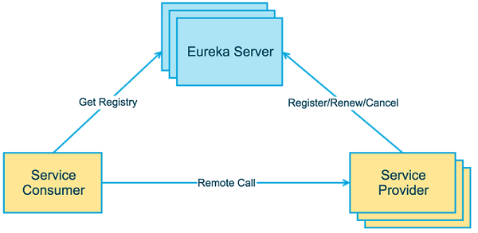
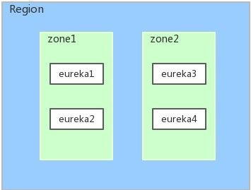
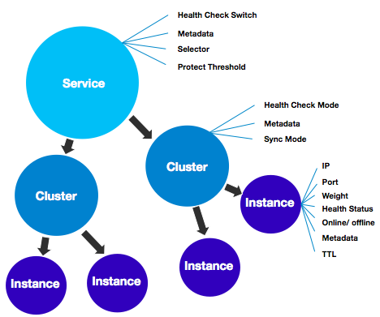

## 角色⭐

> **Eureka**这个词源于古希腊语，意为 “我找到了！我发现了！”。据传，阿基米德在洗澡时发现浮力原理，高兴得来不及穿上裤子，跑到街上大喊：“Eureka！”

如[下图](https://blog.csdn.net/qiansg123/article/details/80127590)所示，**Eureka**将连同自己在内的所有服务都视作一个服务实例（Service Instance），这些实例分为：

1. Server：注册中心，<span style=background:#c2e2ff>服务治理</span>的核心，提供服务**注册**、服务**发现**功能。
   1. 服务注册：Client向Server注册Host，并定时发送心跳，而Server维护注册的服务列表。
   2. 服务发现：通过服务名找到IP。

2. Client：注册中心之外的服务，或者说提供功能逻辑的服务。
   1. 而这些服务按照调用关系又分为：服务提供者（Provider）、服务调用者（Consumer）。

Server往往会部署多个实例来组成集群，以解决单点风险。

Server集群采用了去中心化的设计，Server间会相互注册、同步注册表，以提升集群的可用性。

> 当某一Server宕机时，其上Client会自动切换到其他可用的Server上。




## 数据结构🌙

Server上的核心数据为注册表，包含服务的名字和对应的网络地址。

**Eureka**的[注册表分为3级](https://developer.aliyun.com/article/740352)：

1. <span style=background:#ffb8b8>注册表</span>

   ```java
   private final ConcurrentHashMap<String, Map<String, Lease<InstanceInfo>>> registry = new ConcurrentHashMap<>();
   ```

2. <span style=background:#c9ccff>一级缓存</span>

   ```java
   private final ConcurrentMap<Key, Value> readOnlyCacheMap = new ConcurrentHashMap<>();
   ```

3. <span style=background:#f8d2ff>二级缓存</span>，基于**Guava**，包含失效机制。

   ```java
   private final LoadingCache<Key, Value> readWriteCacheMap;
   ```

<span style=background:#ffb8b8>注册表</span>中只保存数据结构，缓存中保存Ready的服务信息。

### 缓存的更新

Client有注册、续约、下线、剔除、获取等行为，Server有同步行为，这些行为都会引起注册表、缓存表内容的变化。⭐

1. 删除<span style=background:#f8d2ff>二级缓存</span>：
   1. Client发送`register`、`renew`、`cancel`请求时，Server更新<span style=background:#ffb8b8>注册表</span>后会删除<span style=background:#f8d2ff>二级缓存</span>。
   2. Server自身的Evict任务剔除Client时也会删除<span style=background:#f8d2ff>二级缓存</span>。
   3. <span style=background:#f8d2ff>二级缓存</span>超时失效会自动清空。
2. 加载<span style=background:#f8d2ff>二级缓存</span>
   1. Client发送`get`请求获取服务列表时，如果<span style=background:#f8d2ff>二级缓存</span>为空，就会触发**Guava**的加载，即，获取并处理<span style=background:#ffb8b8>注册表</span>中的服务信息并放入<span style=background:#f8d2ff>二级缓存</span>。
   2. Server更新<span style=background:#c9ccff>一级缓存</span>时，如果<span style=background:#f8d2ff>二级缓存</span>为空，也会触发**Guava**的加载。
3. 更新<span style=background:#c9ccff>一级缓存</span>
   1. Server内置的定时任务会定期将<span style=background:#f8d2ff>二级缓存</span>同步到<span style=background:#c9ccff>一级缓存</span>中，包括delete、update。

### 服务行为


如[上图](https://www.cnblogs.com/jichi/p/12797557.html)所示，**Eureka**[有如下行为(https://developer.aliyun.com/article/740352)：

1. `register`
   1. Server收到该请求后会将Client保存到<span style=background:#ffb8b8>注册表</span>中。
   2. Server会将该请求封装为事件放入更新队列，增量发送给其它Client。
   3. 清空<span style=background:#f8d2ff>二级缓存</span>，保证数据一致性。
   4. 更新阈值，并将信息同步给其它Server。
2. `renew`
   1. Client会定期发送该请求（心跳）以续约。
   2. Server收到请求后会更新对应Client的到期时间，并将信息同步给其它Server。
3. `cancel`
   1. Server收到该请求后会将Client从<span style=background:#ffb8b8>注册表</span>中删除。
   2. 之后的行为与收到`register`请求一致。
4. Eviction
   1. 将不能正常`cancel`的Client剔除。
   2. 剔除过程分为3步：判断剔除条件、找出过期服务、剔除过期服务。
5. Fetch Registries
   1. Client会定期向Server请求服务列表。
6. 服务同步
   1. 即Server之间的同步，分为启动时同步和运行时同步。


## 网络划分

**Eureka**将网络划分为**Region**、Zone。

**Region**、**Zone**的概念均来自AWS，而在非AWS环境下，**Zone**可以简单地理解为机房，**Region**为跨机房的网络。




## 自我保护模式

当Server在短时间内丢失过多的心跳时（比如发生了网络分区故障），那么这个Server就会进入<u>自我保护模式</u>。

在<u>自我保护模式</u>中，Server会保护服务注册表中的信息，不再注销任何服务实例。当它收到的心跳数重新恢复到阈值以上时，该Server就会自动退出<u>自我保护模式</u>。

该模式可以通过`eureka.server.enable-self-preservation = false`来禁用。

> 将异常下线客户端最大感知时间设置为`20s`：
>
> - `eureka.instance.lease-renewal-interval-in-seconds` + `eureka.instance.lease-expiration-duration-in-seconds` + `eureka.server.eviction-interval-timer-in-ms`
> - = `5s` + `10s` + `5s` = `20s`

### 设计哲学⭐

它的设计哲学前面提到过，那就是**<u>宁可保留错误的服务注册信息，也不盲目注销任何可能健康的服务实例</u>**。

这样做会使Client很容易拿到实际已经不存在的服务实例，进而出现调用失败的情况，因此Client要有容错机制，比如请求重试、断路器。


## 其它注册中心⭐

不同的注册中心会对CAP有不同的侧重，但对注册中心来说，[应侧重AP，而非CP](https://mp.weixin.qq.com/s?__biz=MzI4MTY5NTk4Ng==&mid=2247489041&idx=1&sn=b58745994c0c98662e2330c966b5036f&source=41#wechat_redirect)：

- 注册表不一致对服务治理来说影响不大。
- 但服务之间不连通、不可用，对服务治理来说是致命的。

### Zookeeper

**Zookeeper**常用来维护分布式系统中的信息，可以用来做注册中心，但不完全适合做注册中心：

- 侧重CP。
  - 会不可用。例如，当Master因网络故障与其他节点失去联系而发起选举时，**Zookeeper**集群会变为不可用，服务的注册与发现功能也会不可用，而这会持续`30~120`秒。
  - Master的写能力是难以扩展的，在服务发现和健康监测场景下，当Client数量到达一定规模时，Master就会不堪重负。
- 另外：
  - **Zookeeper**会将内存中的数据以及数据的变更历史持久化到磁盘，而注册中心更关注实时数据，持久化这一行为对注册中心来说也是多余的。
  - **Zookeeper**的服务健康检查的粒度太粗，仅针对TCP连接，而非服务能力的健康，并且，**Zookeeper**的长连接/Session管理对服务发现来说太过复杂。

### Consul

**Consul**除了服务发现和服务注册，[还内置了](https://blog.csdn.net/fly910905/article/details/100023415)健康检查、键值对存储，还实现了一致性协议（Raft算法）、多数据中心。

**Consul**侧重CP，而这也导致了其服务注册速度会略逊于**Eureka**，因为**Consul**的Raft算法要求“写入成功的节点数过半”才算注册成功。

服务中心分为2种：

- 应用内：直接集成到应用中，依赖于应用自身完成服务的注册与发现，如：[Eureka](https://github.com/Netflix/eureka)等。
- 应用外：把应用当成黑盒，通过应用外的某种机制将服务进行注册，对应用的侵入小，如：Airbnb的[SmartStack](http://nerds.airbnb.com/smartstack-service-discovery-cloud/)，HashiCorp的[Consul](https://www.consul.io/)等。

### Nacos

**Nacos**支持AP或CP，分别采用简化的Raft和自研的Distro实现，以适应不同的场景。

**Eureka**、**Consul**仅采用了`Service`-`Instance`两层设计，而**Nacos**考虑了多环境/集群/机房的场景，在两层设计的基础上引入了Cluster，即，采用了`Service`-`Cluster`-`Instance`的三层设计，如[下图](https://developer.aliyun.com/article/698930)所示：

> 可是**Eureka**也有集群的概念呀。




## Service Mesh