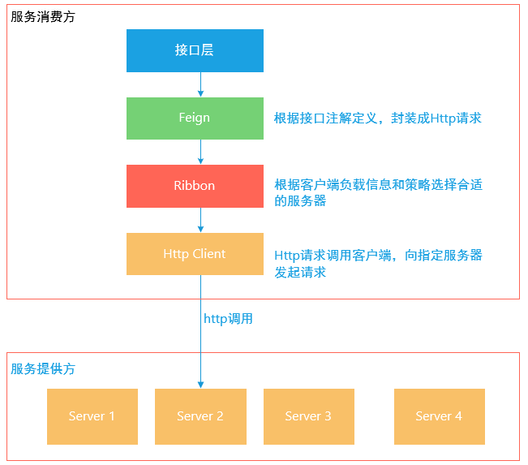
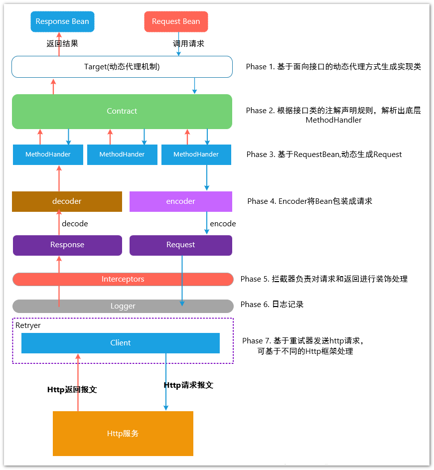
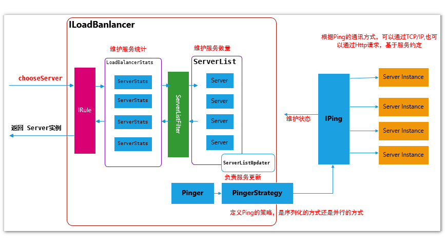

## 服务间通信

### 总体流程

### 封装为请求

**Feign**是一个声明式Web Service客户端，提供HTTP请求模板，开发者仅需编写简单<u>接口</u>和插入<u>注解</u>，之后**Feign**会完全代理HTTP请求。

**Feign**有以下特点：

1. 可插拔的注解支持，包括独有注解和JAX-RS注解。
2. 支持可插拔的HTTP编码器和解码器。
3. 支持HTTP请求和响应压缩。
4. 整合了**Ribbon**、**Hystrix**。

> **Feign**其实不是**Netflix**的产品，但是被整合到了**Spring Cloud Netflix**中。

调用过程如[下图](https://louluan.blog.csdn.net/article/details/82821294)所示：

## 负载均衡[[1]](https://louluan.blog.csdn.net/article/details/83060310)

**Ribbon**包含6个组件：ServerList、ServerListFilter、IPing、IRule、ILoaderBalancer、RestClient。

**Ribbon**职责有：

1. 选择同一**Zone**且负载最轻的**Server**。
2. 定期从**Eureka**拉取**Server**列表。
3. 根据指定的策略，从**Server**列表中选择一个**Server**。
4. 使用**RestClient**调用服务（通信）。

## HttpClient

可使用**OkHttp**代替**Apache HttpClient**

