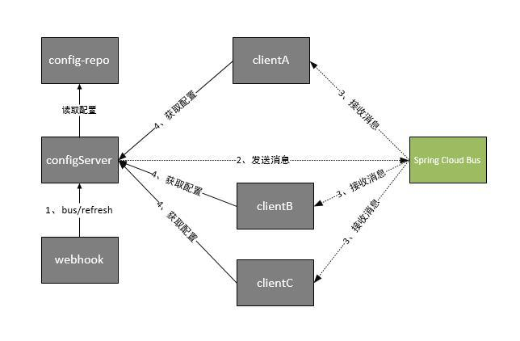

## 网关

**Nginx**是很常见的网关，虽然性能优越，但是功能不如**Spring Gateway**全面，它仅做到了路由（静态资源访问）、限流、负载均衡等功能。

而**Gateway**支持不仅支持[限流](http://www.ityouknow.com/springcloud/2019/01/26/spring-cloud-gateway-limit.html#限速路由器)、负载均衡，还提供更加丰富的路由规则，以及过滤（熔断、重试等）、拦截（权限控制）、监控、安全等功能。

- **Gateway**的限流基于令牌桶，依赖**Redis**。
- **Gateway**的负载均衡基于**Ribbon**，负载均衡策略稍微丰富一些。**Nginx**虽然也支持路由，但是是基于正则匹配链接的，相比较而言，较为单一。
- **Gateway**是可配置的，并且可编码的。

## 其它网关

**Zuul1**是基于**Servlet**的，阻塞式。

**Zuul2**基于**Netty**，非阻塞式，但是**Spring**未集成，因为在**Zuul2**出来之前，**Spring**已经开始了**Gateway**项目。

## 配置中心

Spring Cloud Config也是将**Service Instance**分为两类：

1. Server：即配置中心，存储配置文件，接口形式发送配置文件。
2. Client：通过接口获取配置，并据此初始化自己。

Client在运行期间不会热更新配置，需要手动Refresh。

## 消息代理

Spring Cloud Bus提供轻量级的消息代理，使用AMQP消息代理作为通道。

可以将手动Refresh改为自动触发对应Client的Refresh。

