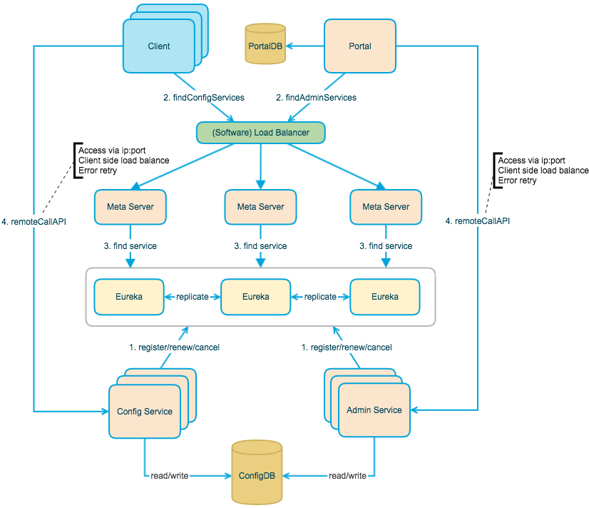

## 网关⭐

**Nginx**是很常见的网关，虽然性能优越，但是功能不如**Spring Gateway**全面，它仅做到了路由（静态资源访问）、限流、负载均衡等功能。

而**Gateway**支持不仅支持[限流](http://www.ityouknow.com/springcloud/2019/01/26/spring-cloud-gateway-limit.html#限速路由器)、负载均衡，还提供更加丰富的路由规则，以及过滤（熔断、重试等）、拦截（权限控制）、监控、安全等功能。

- **Gateway**的限流基于令牌桶，依赖**Redis**。
- **Gateway**的负载均衡基于**Ribbon**，负载均衡策略稍微丰富一些。
- **Gateway**是可配置的，并且可编码的。
  - **Nginx**虽然也支持路由，但是是基于正则匹配链接的，相比较而言，较为单一。

## 其它网关

**Zuul1**是基于**Servlet**的，阻塞式。

**Zuul2**基于**Netty**，非阻塞式，但是**Spring**未集成，因为在**Zuul2**出来之前，**Spring**已经开始了**Gateway**项目。

## 配置中心

### 诞生

配置是独立于程序的只读变量，经历了常量、配置文件、配置库、配置中心的演化，不同的配置形态适合不同规模的系统。

随着系统不断生长，单个服务/应用的功能会越来越复杂，相应的配置也会越来越多；同时，服务的数量也会越来越多，变得相对分散。这时，我们可以将这些配置从各个配置文件中“迁移”到数据库中进行集中管理，而服务/应用在启动时需到配置库中获取配置，另外，还应实现对配置变更的监听及实时生效。我们可以进一步将这部分逻辑进行剥离，剥离为单独的组件，也就是配置中心，而“服务/应用监听配置变更”也可改为配置中心进行推送。

也就是说，配置中心是用于集中管理不同环境、不同集群的配置，且配置修改后能实时应用到Client，当然，配置中心最好还能提供版本控制（记录、发布、回滚）、权限控制、友好的界面等实用功能。

配置中心将**Service Instance**分为两类：

1. Server：即配置中心，存储配置文件，接口形式发送配置文件。
2. Client：通过接口获取配置，并据此初始化自己。

### Spring Cloud Config[[1]](http://www.ityouknow.com/springcloud/2017/05/22/springcloud-config-git.html)

**Spring Cloud Config**与**Spring Cloud**体系无缝结合，但功能相对单一，如：Client在运行期间不会热更新配置，需要通过**Spring Boot Actuator**来进行手动`refresh`。

**Spring Cloud Config**依赖**Git** / **SVN**进行配置管理（保存，修改，版本、权限控制）。

Client默认通过IP访问单一的Server，当然也可以以“服务发现”的方式进行访问，即，将多个Server注册到**Eureka**上，Client通过服务名来访问Server。

### Diamond[[2]](https://blog.hufeifei.cn/2020/04/Alibaba/Diamond/)

**Diamond**所谓的推送配置，实际上也只是客户端进行长轮询（HTTP Long Polling）。

**Diamond**、**Nacos**、**Apollo**均使用**MySQL**来持久化配置。

### XDiamond[[3]](https://github.com/hengyunabc/xdiamond/)

**XDiamond**从`groupId`、`artifactId`、`version`、`profile`四个维度来标识“配置文件”。

**XDiamond**采用`secret key`的方式来认证Client，防止非法获取配置。

> **XDiamond**源自淘宝的**Diamond**，但**XDiamond**、**Diamond**均已停止维护。

### Nacos[[4]](https://developer.51cto.com/art/202102/645471.htm)

**Nacos**不仅是注册中心，也是配置中心，它的功能与**Apollo**相仿，但单机读写性能略强，同时部署较为简单（因为没有将Server的功能进行拆分）。

### Apollo[[5]](https://www.apolloconfig.com/#/zh/README)

携程的**Apollo**的特色有：

- 支持记录版本。
- 将`修改`分为`编辑`、`发布`，且所有操作都有日志审计。
- 可追踪配置被哪些Client使用。
- 支持灰度发布。

#### 配置管理

4个基本概念：

- ##### Application

  - **应用**可以有多个实例。
  - 每种**应用**会有一个唯一标识，同一**应用**的多个实例共享该**应用**的唯一标识。

- ##### Namespace

  - **命名空间**指的是一组配置项。
  - **Apollo**将**命名空间**作为配置管理的的最小单位。
  - **命名空间**分为**完全私有**、**完全共有**、**关联**（继承自共有命名空间的私有命名空间）。
  - 每种**应用**都有一个名为`application`的默认的**命名空间**，当然，该**命名空间**为**私有**。

- ##### Environment

  - **环境**包括3大类：开发、测试和生产。
  - 不同**环境**中的资源应该在硬件层面上相互隔离。
  - 默认只开启开发环境。

- ##### Cluster

  - **集群**指的是某个**应用**的一组实例。
  - 同一**环境**中可以存在一种**应用**的多个**集群**，如，分布在不同的机房中的同一种**应用**的不同时实例往往会归为不同的**集群**。
  - 每个**环境**都有一个名为`default`的默认的**集群**。

**Apollo**的配置管理立足于**应用**，而非配置项，这体现在：

- **Apollo**只提供对<u>某一**应用**在某一**环境**下的某一**集群**中的**命名空间**</u>这种递进方式的配置管理，不提供<u>某一**环境**下的某一**集群**中的某一**应用**的**命名空间**</u>这种递进方式、<u>某一**环境**下的某一**集群**中的所有的**命名空间**</u>、<u>某一**环境**下的所有**命名空间**</u>等方式的配置管理。
- 共有**命名空间**的修改没有单独的页面，需要以修改<u>某一**应用**在某一**环境**下的某一**集群**中的共有**命名空间**</u>的方式进行修改。

> 对有赞来说，**Apollo**的**应用**的唯一标识易被伪造、**命名空间**的权限控制的粒度太粗，[有赞对其进行了细化](https://mp.weixin.qq.com/s/Ge14UeY9Gm2Hrk--E47eJQ)。

#### 总体设计

如[上图](https://www.apolloconfig.com/#/zh/design/apollo-introduction?id=_45-总体设计)所示：

- **Config Service**提供配置的读取、推送等功能，服务对象是**Apollo**客户端。
- **Admin Service**提供配置的修改、发布等功能，服务对象是**Apollo Portal**（管理界面）。
- **Config Service**和**Admin Service**都是多实例、无状态部署，所以需要将自己注册到**Eureka**中并保持心跳。
- 在**Eureka**之上我们架了一层**Meta Server**用于封装**Eureka**的服务发现接口。
  - Client通过域名访问**Meta Server**获取**Config Service**服务列表（IP+Port），而后直接通过IP+Port访问服务，同时在Client侧会做负载均衡、错误重试。
  - Portal通过域名访问**Meta Server**获取**Admin Service**服务列表（IP+Port），而后直接通过IP+Port访问服务，同时在Portal侧会做负载均衡、错误重试。

推荐将**Config Service**、**Eureka**和**Meta Server**三个逻辑角色部署在同一个JVM进程中，以简化部署。

将Service拆分为**Config Service**和**Admin Service**的设计增强了**Apollo**的可用性，同时，Client会在本地缓存配置，进一步增强了整体的可用性。

> **Apollo**依赖**MySQL**、**Eureka**。

#### 与Spring集成[[6]](https://www.apolloconfig.com/#/zh/design/apollo-design?id=_31-和spring集成的原理)

Client启动时，**Apollo**会从Server获取配置，然后组装成`PropertySource`并插入为第一个。

> - `ApplicationContext`：**Spring**的`ApplicationContext`会包含一个`Environment`。
> - `ConfigurableEnvironment`：`Environment`实现自`ConfigurableEnvironment`，一个`ConfigurableEnvironment`自身包含了很多个`PropertySource`。
> - `PropertySource`：属性源，以<u>键值对</u>的形式保存若干属性。`PropertySource`之间存在优先级，头部的优先级最高。

## 消息代理

**Spring Cloud Bus**提供轻量级的消息代理，使用AMQP消息代理作为通道。

> 可用于改进**Spring Cloud Config**需要手动`refresh`的问题。

