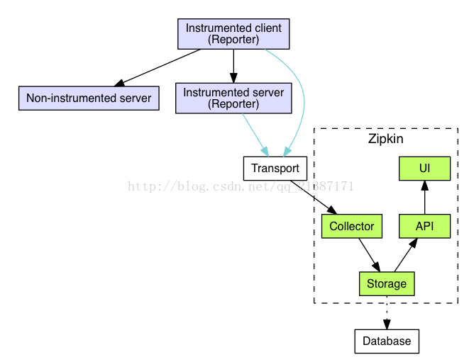

## 简述


<span style=background:#c9ccff>调用</span>包括<span style=background:#c9ccff>请求</span>、<span style=background:#c9ccff>响应</span>两步。

如[上图](http://daixiaoyu.com/distributed-tracing.html)所示，在分布式系统中，前端的一次<span style=background:#c9ccff>调用</span>往往会形成对后端的多个服务<span style=background:#c9ccff>调用</span>，并形成<u>调用链路</u>。

- 通过追踪<span style=background:#c9ccff>调用</span>，可获取<u>调用链路</u>，进而得到服务之间的依赖关系。
- 更进一步，在追踪的同时：
  - 记录各个<span style=background:#c9ccff>调用</span>的发出/接收时间，即可得到其在各个服务上的耗时，进而分析性能、改进响应速度。
  - 记录各个<span style=background:#c9ccff>调用</span>的成功/失败，即可定位故障。

### 数据结构

<u>调用链路</u>也叫做Trace，<u>调用链路</u>中的子调用也叫做Span，两者均用64位的ID进行标识，[换句话说](https://www.cnblogs.com/duanxz/p/7552857.html)：

- Span
  - Span表示基本的工作单元，如，发送HTTP请求。
  - Span中会记录ID、Trace的ID、摘要、时间戳、事件、IP等信息。
  - <u>Trace ID</u>为空的Span称为Root Span。
- Trace
  - Trace包含一组Span，形成树状结构。
  - Trace ID是全局唯一，仅在Trace创建时被赋予，之后当一个服务调用另一个服务时，<u>Trace ID</u>将保持不变。
- Annotation
  - 用来记录事件，或者说<span style=background:#c9ccff>请求</span>/<span style=background:#c9ccff>响应</span>的开始和结束。
  - 包括以下4种：
    - Client Sent，CS。
    - Server Received，SR。
    - Server Sent，SS。
    - Client Received，CR。


## Zipkin

[Zipkin](https://github.com/openzipkin/zipkin)是一个分布式<span style=background:#c2e2ff>链路追踪</span>系统，由**Twitter**基于**Google**的Dapper论文开发。

> 除了用于追踪RPC（HTTP）等调用过程，**Zipkin**可用于追踪多线程的调用。
> 分布式<span style=background:#c2e2ff>链路追踪</span>系统除了Dapper、Zipkin，还有Open Tracing。
>
> - Open Tracing是CNCF（Cloud Native Computing Foundation）为了实现平台无关、厂商无关的<span style=background:#c2e2ff>链路追踪</span>，发布了<span style=background:#c2e2ff>链路追踪</span>标准。

### 工作过程

简单来说，开发者需要将**Zipkin**的客户端嵌入到服务中，之后Client会在服务发送的HTTP请求中添加Trace ID、Span ID来对其进行标识，然后，Client定时向**Zipkin**的服务端上报数据；Server将这些数据保存下来，而**Zipkin UI**会绘制服务依赖图和与<span style=background:#c9ccff>请求</span>/<span style=background:#c9ccff>响应</span>相关的报表。

[具体来说](http://www.ityouknow.com/springcloud/2018/02/02/spring-cloud-sleuth-zipkin.html)：

1. 生产记录

   1. **Zipkin**可用于多线程、RPC、HTTP等调用过程。
   2. **Zipkin**的<u>Trace ID</u>采用`ThreadLocalRandom`类来生成的。

2. 收集数据

   1. 向**Zipkin**报告数据的方式有同步、异步两种：
      1. 同步：主要是通过HTTP。 
      2. 异步：主要是通过**Kafka**，当然也可以使用**Apache ActiveMQ**、**gRPC**和**RabbitMQ**。

3. 存储数据

   1. **Zipkin**提供了插拔式的数据存储，包括**In-Memory**、**MySQL**、**Cassandra**、**Elasticsearch**。

4. 展示数据

   1. 通过追踪<u>Trace ID</u>即可呈现整个调用链。

### 架构

如[下图](https://blog.csdn.net/qq_21387171/article/details/53787019)所示，跟踪器（Tracer）位于Client中，负责生成Span，并将Span发送给**Zipkin**的一起画应用程序中的报告器（Reporter）组件。

Reporter再将Span发送到收集器（Collector），Collector将数据发送给Storage进行存储，然后就可以通过**Zipkin UI**使用API来查询/展示数据。

> Storage就是上面提到的插拔式数据存储。



### 数据结构

#### Trace

Trace就是树结构的Span集合。

#### Span

Span的数据结构为：

```json
{
  "traceId": "bd7a977555f6b982", // Trace ID
  "name": "service-name", // Span Name，一般是服务的名称
  "id": "ebf33e1a81dc6f71", // Span ID
  "parentId": "bd7a977555f6b982", // 父Span的ID，可选
  "timestamp": 1458702548478000, // 创建时间，单位为微秒
  "duration": 354374, // 持续时间，单位为微妙
  "annotations": [
    {
      "endpoint": {
        "serviceName": "zipkin-query",
        "ipv4": "192.168.1.2",
        "port": 9411
      },
      "timestamp": 1458702548786000,
      "value": "cs"
    }
  ],
  "binaryAnnotations": [ // 二进制注释
    {
      "key": "lc",
      "value": "JDBCSpanStore",
      "endpoint": {
        "serviceName": "zipkin-query",
          "ipv4": "192.168.1.2",
          "port": 9411
        }
    }
  ]
}
```


## Sleuth

**Zipkin**提供了Java版本的埋点库（客户端）[Brave](https://github.com/openzipkin/brave)，而[Spring Cloud Seluth](https://github.com/spring-cloud/spring-cloud-sleuth)通过自动化配置对Brave进行了整合。

**Sleuth**通过对所有的`@RequestMapping`匹配到的endpoints进行监控；**Sleuth**还强化了RestTemplate：对RestTemplate增加了一层`Interceptor`，以此来监控那些通过RestTemplate发送的HTTP请求。

**Sleuth**在监听到HTTP请求后，会在<u>请求头</u>上添加<u>Trace ID</u>和<u>Span ID</u>。

> 也可以使用Beats，一个简单的数据传送器。Beats要么位于服务器上，要么位于容器上，用于监听日志文件的位置，然后将日志发送到**Logstash**中进行转换，或直接发送到**Elasticsearch**中。
> 
> 也可以通过写本地日志，使用**Logstash**等日志收集工具进行收集，最后持久化到**MySQL**、**Elasticsearch**中。

###  配置

```yml
spring:
  zipkin:
    base-url: http://localhost/ # 地址
    sender:
      type: web 				# RabbitMQ、Kafka、Web
  sleuth:
    sampler:
      probability: 1.0	 		# 采样比例，0~1.0，默认为0.1
```

### 实战

**Sleuth**、**Zipkin**的部署使用，见[文章](http://daixiaoyu.com/distributed-tracing.html)。


## 服务网格

相比于日志和指标，跟踪难以实现，但[服务网格的兴起使得集成跟踪功能几乎毫不费力](https://www.oreilly.com/library/view/distributed-systems-observability/9781492033431/ch04.html)。

服务网格的数据平面在代理级别实现跟踪和统计数据收集，这允许将单个服务视为黑盒，但仍然可以对整个网格进行统一和彻底的可观察性。

作为网格一部分的应用程序仍需要将标头转发到网格中的下一跳，但不需要额外的检测。

