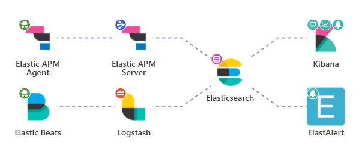

## ELK

开源社区最早流行的日志收集体系是ELK，即，**Elasticsearch**、**Logstash**和**Kibana**的组合：

1. **Elasticsearch**负责存储、实时搜索和分析（聚合统计）。
2. **Logstash**是一个服务器端数据处理管道，负责从多个源中收集数据，并对数据进行转换，然后发送给**Elasticsearch**。
3. **Kibana**负责对**Elasticsearch**中的数据可视化为图表。

ELK的野心很大，这也导致了[ELK对各个领域不够专注](https://blog.hufeifei.cn/2021/09/Distribution/grafana/)：

1. 全文检索受限于分词器，对于日志查询非常鸡肋，如：两个单词能搜索到目标日志，但三个单词就可能搜索不到了。
2. 索引阶段比较耗时，经常出现索引不过来抛出EsRject的现象。
3. **ELasticsearch**会将文档原文保存到`_source`字段中，对于不熟悉它的人来说，这意味着数据量翻番。
4. **Elasticsearch**的高性能依赖内存，官方建议为操作系统的文件缓存至少预留一半内存，而这对日志查询来说是小题大做。
5. **Elasticsearch**生产环境至少部署3个节点，以应对网络波动时出现的脑裂。
6. 基于JVM的**Logstash**极其笨重，经常因为GC无响应导致日志延时，其作为收集日志的Agent有点喧宾夺主。

> 对于**Logstash**存在的问题，Elastic专门用Go语言开发了轻量级的日志采集工具FileBeat，由FileBeat负责采集，Logstash负责解析处理。

