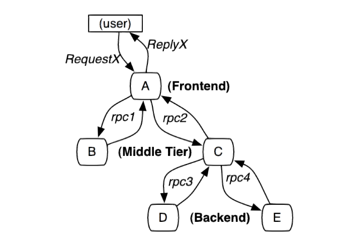
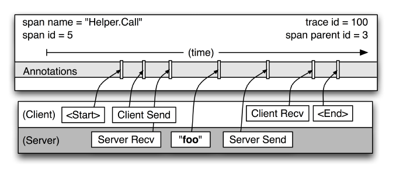

# Dapper，大规模分布式系统的跟踪系统

[原文](../reference/Dapper.pdf)，[译文](https://bigbully.github.io/Dapper-translation/)

**Dapper**主要用于探查性能不足，以及促进对全面大规模的工作负载下的系统行为的理解，还常用于发现系统问题。

## 概述

## 1 介绍

1. 低开销
2. 透明
3. 易扩展

### 1.1 文献的总结

## 2 Dapper的分布式跟踪

### 2.1 跟踪树和span

### 2.2 植入点

### 2.3 Annotation

### 2.4 采样率

### 2.5 跟踪的收集

#### 2.5.1 带外数据跟踪收集

### 2.6 安全和隐私考虑

## 3 Dapper部署状况

### 3.1 Dapper运行库

### 3.2 生产环境下的涵盖面

### 3.3 跟踪Annotation的使用

## 4 处理跟踪损耗

### 4.1 生成跟踪的损耗

### 4.2 跟踪收集的消耗

### 4.3 在生产环境下对负载的影响

### 4.4 可变采样

### 4.5 应对积极采样

### 4.6 在收集过程中额外的采样

## 5 通用的Dapper工具

### 5.1 Dapper Depot API

#### 5.1.1 DAPI在Google内部的使用

### 5.2 Dapper的用户接口

## 6 经验

### 6.1 在开发中使用Dapper

#### 6.1.1 与异常监控的集成

### 6.2 解决延迟的长尾效应

### 6.3 推断服务依赖

### 6.4 不同服务的网络使用率

### 6.5 分层和共享存储系统

### 6.6 Dapper的救火能力

## 7 其他收获

## 8 相关产品

## 9 总结
