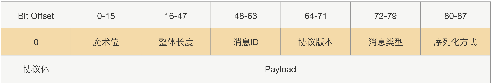
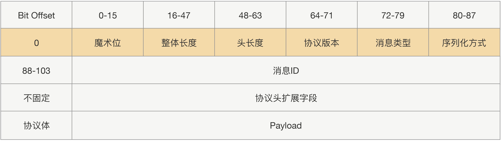
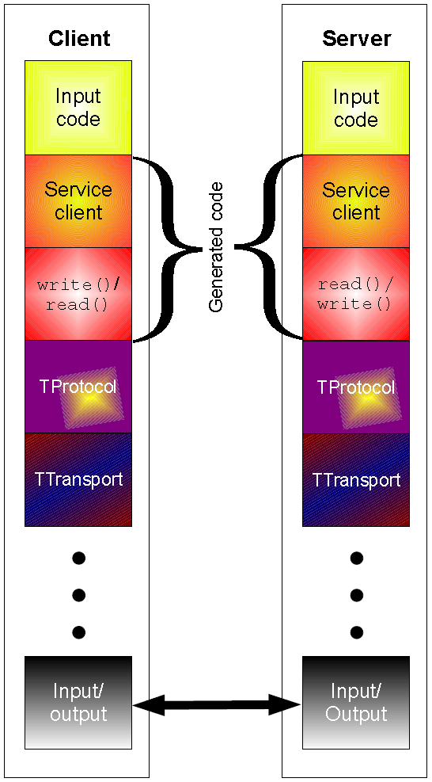

## RPC⭐

RPC，Remote Procedure Call，通过隐藏复杂的底层网络协议，让远程调用变得像本地调用。

既然是调用，调用方就需要传递方法名、参数类型、参数值，被调用方将结果返回。

RPC是一种IPC模型，Java的[**RMI**](https://www.liaoxuefeng.com/wiki/1252599548343744/1323711850348577)是其一种实现。

> REST，REpresentational State Transfer，是一种模型/软件架构设计风格，流行于网络应用的开发。

RPC是设计主要有`3`点：

1. 服务寻址

2. 数据流序列化 / 反序列化

   1. JSON
      1. JSON内存开销大；且没有类型，需要通过反射进行类型转换。
   2. **Hessian**
      1. 生成的字节数少；不支持Java中的基于链表的数据结构，Byte/Short反序列化是会变成Integer。
   3. **ProtoBuf**
      1. 二进制，高效，但不可读。可用ProtoStuff代替。

3. 网络传输

   1. 绝大部分RPC实现都使用TCP，而非HTTP，因为HTTP的请求头体积太大，并且无状态。

      1. 但HTTP应用广泛，健壮，使用方便。

   2. 传输协议分为定长协议、不定长协议。
   
      1. 定长效率高，但不够灵活。
   
      

另外：

1. 类要尽量简单，最好不要有依赖关系、继承关系。
2. 对象体积不要太大，不要传大集合。
3. 尽量选择语言原生对象。

## Thrift

**Apache Thrift**是一种轻量级、跨语言、跨平台的RPC框架。

**Thrift**使用一种自身的中间语言（Interface Definition Language，[IDL](https://blog.csdn.net/weixin_44240370/article/details/105930905)）和自身的编译生成器，来为各种主流语言生成RPC服务端/客户端模板代码。

> **Thrift**源于**Facebook**。

### 架构

如[上图](https://zh.wikipedia.org/wiki/Thrift)所示，**Thrift**的架构[分为多层](https://blog.csdn.net/baidu_22254181/article/details/82814489)，自下而上为传输层、协议层、处理层：

- Transport Layer
  - 传输层负责直接从网络中读写数据。
  - 传输层定义了具体的网络传输协议。
  - 传输层支持多种传输方式，如，TSocket 、TZlibTransport等。
- Protocol Layer
  - 协议层负责数据的序列化/反序列化。
  - 协议层定义了数据传输格式。
  - 协议层支持多种协议，如，TBinaryProtocol、TJSONProtocol等。
- Processor Layer
  - 处理层由具体的**IDL**生成，封装了具体的网络传输协议和序列化方式，并委托给开发者实现的`Handler`进行处理。

**Thrift**还提供众多服务器，支持不同的网络IO模型，如，TNonblockingServer、TSimpleServer、TThreadPoolServer等。

### 优点

- 轻量级。
- 跨语言。
- 学习成本低。
  - **IDL**的风格类似于**Protocol Buffers**，通俗易懂；服务接口的风格也像面向对象的类一样。
- 开发速度快、维护成本低。
  - RPC接口的创建仅需编写**IDL**文件，然后使用编译生成器即可自动生成Skeletons（服务端骨架）和Stubs（客户端桩），免去了定义和维护接口编码/解码、消息传输、网络IO模型等基础工作。
- 高效稳定。
  - 已经在**Cassandra**、**Hadoop**、**HBase**等项目中得到了验证。

> 正是因为有如此多的优点，所以百度、美团、小米等公司都在使用**Thrift**。
>
> **Hadoop**的部分组件也使用了**Thrift**和**ProtoBuf**。

