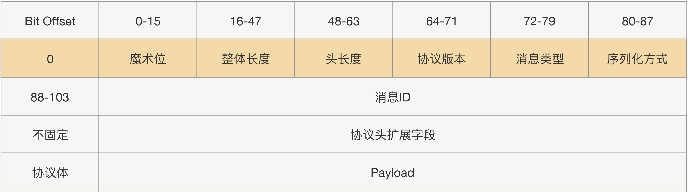

## RPC

RPC，Remote Procedure Call，通过隐藏复杂的底层网络协议，让远程调用变得像本地调用。

既然是调用，调用方就需要传递方法名、参数类型、参数值，被调用方将结果返回。

**RPC**是一种模型，Java的[**RMI**](https://www.liaoxuefeng.com/wiki/1252599548343744/1323711850348577)是其一种实现。

**RPC**是设计主要有3点，

1. 服务寻址

2. 数据流序列化 / 反序列化

   1. JSON
      1. JSON内存开销大；且没有类型，需要通过反射进行类型转换。
   2. Hessian
      1. 生成的字节数少；不支持Java中的基于链表的数据结构，Byte/Short反序列化是会变成Integer。
   3. Protobuf
      1. 二进制，高效，但不可读。可用Protostuff代替。

3. 网络传输

   1. 绝大部分**RPC**实现都使用TCP，而非HTTP，因为HTTP的请求头体积太大，并且无状态。

   2. 传输协议分为定长协议、不定长协议。定长效率高，但不够灵活。

      

另外需要注意，

1. 类要尽量简单，最好不要有依赖关系、继承关系。
2. 对象体积不要太大，不要穿大集合。
3. 尽量选择语言原生对象。

## Guava

**Guava**是一个由“**Google**对Java6的一系列扩展”组成[的项目](https://www.cnblogs.com/peida/archive/2013/06/08/3120820.html)。

| 包名                              | 功能                                                         |
| --------------------------------- | ------------------------------------------------------------ |
| com.google.common.annotations     | 普通注解类型。                                               |
| com.google.common.base            | 基本工具类库和接口。                                         |
| com.google.common.cache           | 缓存工具包，非常简单易用且功能强大的JVM内缓存。              |
| com.google.common.collect         | 带泛型的集合接口扩展和实现，以及工具类，这里你会发现很多好玩的集合。 |
| com.google.common.eventbus        | 发布订阅风格的事件总线。                                     |
| com.google.common.hash            | 哈希工具、Bloom filters。                                    |
| com.google.common.io              | IO工具包。                                                   |
| com.google.common.math            | 原始算术类型和超大数的运算工具包。                           |
| com.google.common.net             | 网络工具包。                                                 |
| com.google.common.primitives      | 八种原始类型和无符号类型的静态工具包。                       |
| com.google.common.reflect         | 反射工具包。                                                 |
| com.google.common.util.concurrent | 多线程工具包。   ListenableFuture：可监听的异步回调。   Service：控制事件的启动和关闭，为你管理复杂的状态逻辑。 |

