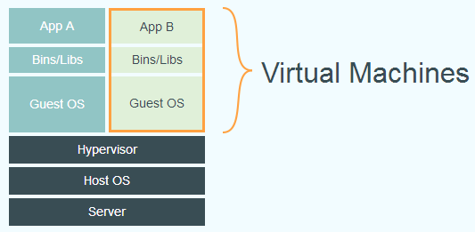
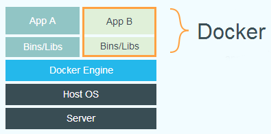

## 虚拟化[[1]](https://www.cyc2018.xyz/其它/编码实践/Docker.html)

虚拟化主要是为了充分利用硬件资源，以及实现应用的可移植性。

> “充分利用硬件资源”还包括“定义资源边界，合理分配资源”的含义。

### 虚拟机

**虚拟机**是一种虚拟化技术，会模拟硬件，并在硬件上安装**OS**。

不难看出，虚拟化对CPU、内存、磁盘等资源的占用很大。

### Docker

**Docker**也是一种虚拟化技术，但它采用隔离进程的方式实现，被隔离的进程独立于宿主**OS**和其它隔离的进程。

**Docker**使用了分层技术，提升了组件的复用率、可维护性和易扩展性。

### 虚拟机与Docker

与**虚拟机**相比，**Docker**的最大优点是轻，也正因此，**Docker**常用于微服务的部署、维护、组合。

与**虚拟机**相比，**Docker**的隔离性较弱，但也足够安全。

