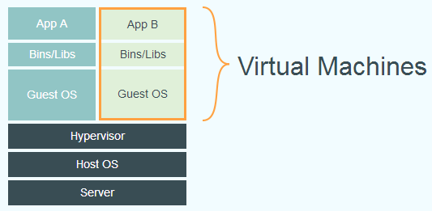
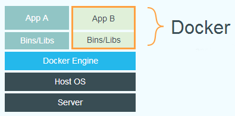

## 虚拟化[[1]](https://www.cyc2018.xyz/其它/编码实践/Docker.html)

虚拟化主要是为了充分利用硬件资源，以及实现应用的可移植性。

## 虚拟机

**虚拟机**是一种虚拟化技术，会模拟硬件，并在硬件上安装**OS**。

不难看出，虚拟化对CPU、内存、硬盘等资源的占用很大。

## Docker

**Docker**也是一种虚拟化技术，但它采用隔离进程的方式实现，被隔离的进程独立于宿主**OS**和其他隔离的进程。

**Docker**使用了分层技术，提升了组件的复用率、可维护性和易扩展性。

## 虚拟机与Docker

与**虚拟机**相比，**Docker**的最大优点是轻，也正因此，**Docker**常用于微服务的部署、维护、组合。

与**虚拟机**相比，**Docker**的隔离性较弱，但也足够安全。

> **Docker**利用了Linux中的诸多安全特性来保证不同容器之间的隔离，包括[使用Namespace隔离容器的运行环境](https://www.cnblogs.com/sammyliu/p/5878973.html)、[使用Control Groups限制容器使用的资源](https://www.cnblogs.com/sammyliu/p/5886833.html)，并通过签名机制来对镜像进行验证。

### Host OS与Guest OS[[2]](https://www.cnblogs.com/sammyliu/p/5877964.html)

假如现在有一台主机安装的是CentOS，CentOS之上运行着**Docker**，而**Docker**中又运行着一个Ubuntu容器，那么在这一场景中，Host OS是CentOS，Guest OS是Ubuntu。

容器的文件系统与Host OS的文件系统是隔离的，即，容器中的应用无法直接与Host OS的文件系统进行交互，除非将Host OS的文件系统挂载为卷。

所以，为了容器中应用能与文件系统交互，**Docker**提供了Guest OS，当然Guest OS只是并且也仅需提供Base OS的部分功能，而这——容器与Host共享OS内核——也正是容器和虚拟机的本质区别，。

> Guest OS也被称为Base Image。

