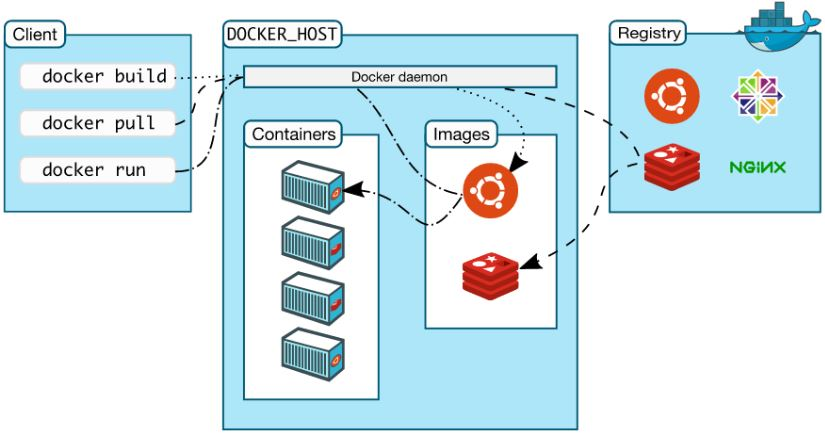

## 虚拟化[[1]](https://www.cyc2018.xyz/其它/编码实践/Docker.html)

虚拟化主要是为了充分利用硬件资源，以及实现应用的可移植性。

### 虚拟机

**虚拟机**是一种虚拟化技术，会模拟硬件，并在硬件上安装**OS**。

不难看出，虚拟化对CPU、内存、硬盘等资源的占用很大。

### Docker

**Docker**也是一种虚拟化技术，但它采用隔离进程的方式实现，被隔离的进程独立于宿主**OS**和其他隔离的进程。

**Docker**使用了分层技术，提升了组件的复用率、可维护性和易扩展性。

### 比较

与**虚拟机**相比，**Docker**的最大优点是轻，也正因此，**Docker**常用于微服务的部署、维护、组合。

与**虚拟机**相比，**Docker**的隔离性较弱，但也足够安全。

> **Docker**利用了Linux中的诸多安全特性来保证不同容器之间的隔离，包括[使用Namespace隔离容器的运行环境](https://www.cnblogs.com/sammyliu/p/5878973.html)、[使用CGroups限制容器使用的资源](https://www.cnblogs.com/sammyliu/p/5886833.html)，并通过签名机制来对镜像进行验证。

## Docker

## 体系

如[上图](https://www.cnblogs.com/sammyliu/p/5875470.html#blogTitle7)所示，**Docker**由3部分组成：

- Registry：镜像仓库，提供镜像的保存、下载、上传。
- Host：从Registry中下载镜像，并启动容器。
- Client：用户通过在Client输入命令来与Host交互。

### 镜像与容器

镜像和容器是**Docker**的两个基本概念，镜像是动态的容器的静态表示（specification）。

> 镜像可以看做OOP中的类，容器可以看做镜像的一个实例。

镜像包含着容器运行时所需的代码以及其它组件。镜像采用分层结构，每一层都是只读的。

> 一个镜像主要由`tar`文件和`json`文件组成。

### Host OS与Guest OS[[2]](https://www.cnblogs.com/sammyliu/p/5877964.html)

假如现在有一台主机安装的是CentOS，CentOS之上运行着**Docker**，而**Docker**中又运行着一个Ubuntu容器，那么在这一场景中，Host OS是CentOS，Guest OS是Ubuntu。

容器的文件系统与Host OS的文件系统是隔离的，即，容器中的应用无法直接与Host OS的文件系统进行交互，除非将Host OS的文件系统挂载为卷。

所以，为了容器中应用能与文件系统交互，**Docker**提供了Guest OS，当然Guest OS只是并且也仅需提供Base OS的部分功能，而这——容器与Host共享OS内核——也正是容器和虚拟机的本质区别，。

> Guest OS也被称为Base Image。

### 构建

构建镜像时，会一层一层地构建，前一层是后一层的基础。

构建容器时，会在镜像的基础上增加一个`writable layer`，来保存容器运行过程中的修改。

> `writable layer`，可写层，也称作`container layer`，容器层。

### 目录[[3]](https://zhuanlan.zhihu.com/p/362406703)

**Docker**相关的本地资源都存放在`/var/lib/docker/`中，其中的：

- `graph`：存放镜像信息。
- `container`：存放容器信息。
- `aufs`：存放具体的内容文件。

### Docker Compose[[4]](https://www.cnblogs.com/duanxz/archive/2012/09/03/2669047.html)[[4]](https://www.cnblogs.com/duanxz/archive/2013/03/25/2980155.html)

**Docker**用于管理单个服务，而**Docker Compose**用于管理多个服务，即，服务集群的部署和迁移。

具体来说，**Docker Compose**允许我们创建一个文件，并在其中配置一组**Docker**命令，然后执行该文件的方式来简化重复操作。（类似于脚本）

## Kubernetes

