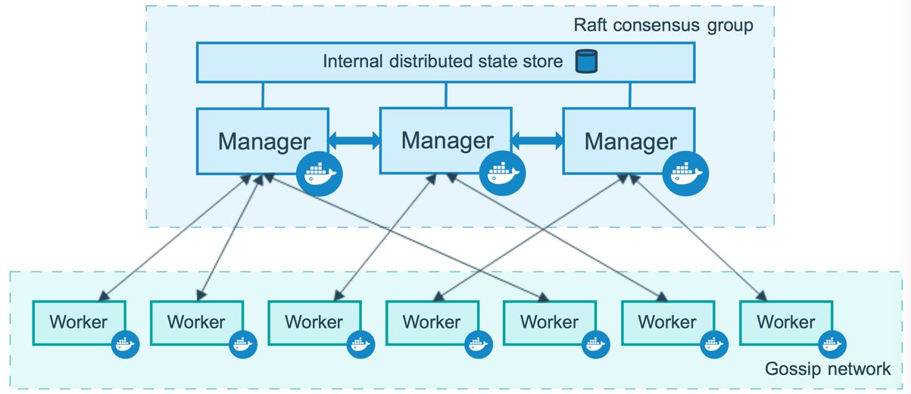

## 容器

镜像和容器是**Docker**的两个基本概念，镜像是动态的容器的静态表示（Specification）。 如果将镜像可以看做OOP中的类，那么容器可以看做镜像的一个实例。

容器的[实质是进程](https://yeasy.gitbook.io/docker_practice/basic_concept/container)，但不同于直接在Host中执行的进程，容器运行在独立的Namespace中，即，运行在包含独立的文件系统、网络、用户的隔离环境中。

> **Docker**利用了Linux中的诸多安全特性来保证不同容器之间的隔离，包括[使用Namespace隔离容器的运行环境](https://www.cnblogs.com/sammyliu/p/5878973.html)、[使用Control Groups限制容器使用的资源](https://www.cnblogs.com/sammyliu/p/5886833.html)，并通过签名机制来对镜像进行验证。

### Host OS与Guest OS

[假如](https://www.cnblogs.com/sammyliu/p/5877964.html)，现在有一台主机安装的是CentOS，CentOS之上运行着**Docker**，而**Docker**中又运行着一个Ubuntu容器，那么在这一场景中，Host OS是CentOS，Guest OS是Ubuntu。

容器的文件系统与Host OS的文件系统是隔离的，即，容器中的应用无法直接与Host OS的文件系统进行交互，除非将Host OS的文件系统挂载为卷。

所以，为了容器中应用能与文件系统交互，**Docker**提供了Guest OS，当然Guest OS只是并且也仅需提供Base OS的部分功能，而这——容器与Host共享OS内核——也正是容器和虚拟机的本质区别，。

> Guest OS也被称为Base Image。

## 镜像

镜像包含着容器运行时所需的代码以及其它组件（库、匿名卷、环境变量、用户等）。

镜像采用分层结构，每一层都是只读的。

一个镜像主要由`tar`文件和`json`文件组成。

## 体系

如[下图](https://www.cnblogs.com/sammyliu/p/5875470.html#blogTitle7)所示，**Docker**由3部分组成：

- Registry：镜像仓库，提供镜像的保存、下载、上传。
- Host：从Registry中下载镜像，并启动容器。
- Client：用户通过在Client输入命令来与Host交互。

## 构建

构建镜像时，会一层一层地构建，前一层是后一层的基础。

构建容器时，会在镜像的基础上增加一个`writable layer`，来保存容器运行过程中的修改。

`writable layer`，可写层，也称作`container layer`，容器。`writable layer`的生命周期与容器一致，即，其中的数据会随容器的停止而丢失，所以我们不应向`writable layer`中写入任何数据，而应使用数据卷或绑定宿主目录的方式。

## 目录[[1]](https://zhuanlan.zhihu.com/p/362406703)

**Docker**相关的本地资源都存放在`/var/lib/docker/`中，其中的：

- `graph`：存放镜像信息。
- `container`：存放容器信息。
- `aufs`：存放具体的内容文件。

## 网络模式[[2]](https://www.cnblogs.com/sammyliu/p/5894191.html)

**Docker**提供了4种单节点网络模式：`Bridge`、`Host`、`Container`、`None`和1种多节点网络模式。

## Docker Compose[[3]](https://www.cnblogs.com/duanxz/archive/2012/09/03/2669047.html)[[4]](https://www.cnblogs.com/duanxz/archive/2013/03/25/2980155.html)

**Docker**用于管理单个服务，而**Docker Compose**用于管理（也称编排，Orchestration）多个服务，即，服务集群的部署和迁移。

**Docker Compose**允许我们创建一个模板文件（`docker-compose.yml`），并在其中配置一组**Docker**命令，然后执行该文件的方式来简化重复操作。（类似于脚本）

### 服务和项目[[5]](https://yeasy.gitbook.io/docker_practice/compose/introduction)：

- Service：服务，指一个应用的容器，实际上可以包括若干运行相同镜像的容器实例。
- Project：项目是由一组关联的应用容器组成的一个完整业务单元，在 `docker-compose.yml` 文件中定义。

**Docker Compose** 的默认管理对象是Project，通过子命令对中的一组容器进行便捷的生命周期管理。

## Swarm Mode

**Docker**的**Swarm Mode**内置了<u>键值对</u>存储功能，提供了众多的新特性，如：具有容错能力的去中心化设计、内置服务发现、负载均衡、路由网格、动态伸缩、滚动更新、安全传输等，使得**Docker**原生的<u>Swarm集群</u>具备与Mesos、**Kubernetes**竞争的实力。

对集群来说，传统的配置文件分发方式，如：配置文件放入镜像中、设置环境变量、`volume`挂载等，都降低了镜像的通用性，所以**Docker Swarm**提供`docker config`子命令来管理集群中的配置信息。

### 节点

运行**Docker**的Host可以主动初始化一个<u>Swarm集群</u>，或者加入一个已存在的<u>Swarm集群</u>，而这个Host也就成为<u>Swarm集群</u>的一个节点。

如[下图](https://yeasy.gitbook.io/docker_practice/swarm_mode/overview)所示，节点分为Manager和Worker。

### 服务和任务

Task：任务是**Swarm Mode**的最小的调度单位，目前来说就是一个单一的容器。

Services：服务是指一组Task的集合，服务定义了Task的属性。

## etcd

`etcd`是一个分布式<u>键值对</u>数据库，源自[Fedora CoreOS](https://getfedora.org/coreos?stream=stable)，兼具一致性和高可用性，可用于管理配置信息和服务发现。

## CI/CD

**Continuous Integration**：持续集成是一种软件开发实践，每次集成都通过自动化的构建/编译、发布、测试来验证功能，从而尽早地发现集成错误。

**Continuous Deployment**：持续部署是通过自动化的构建、测试和部署循环来快速交付高质量的产品。

> 与**Jenkins**不同，基于**Docker**的CI/CD理论上支持所有的编程语言，因为其每一步都运行在**Docker**容器中。

