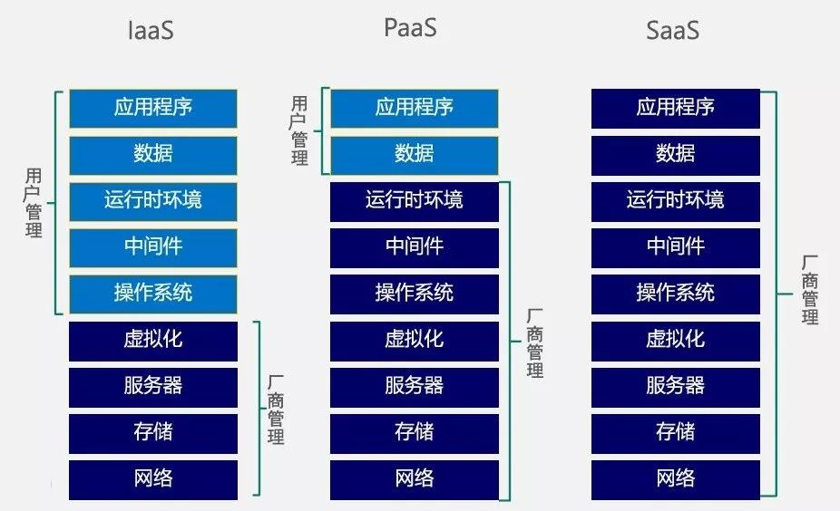

## 简介

**Kubernetes**[是一款](https://yeasy.gitbook.io/docker_practice/kubernetes)基于**Docker**的容器集群管理系统，包括容器的部署、调度、维护和伸缩。

> **Kubernetes**这个名字源于希腊语，意为“舵手”或“飞行员”，其简称为**k8s**，因为`k`和`s`之间有`8`个字符。
>
> **Kubernetes**由**Google**使用**Go**语言进行开发的。

## 节点

Node可以是虚拟机，也可以是物理机，Node上运行着各种服务，包括**Docker**、kubelet、代理服务等。

Node由云平台创建，而非**Kubernetes**。

### 状态

Node有`Pending`，`Running`，`Terminated` 三个种状态：

- 当**Kubernetes**发现了一个可用Node，就会将该Node标记为`Pending`。
- 之后某个时刻，**Kubernetes**会将其标记为`Running`。
  - `Running`包括`NodeReachable`、`NodeReady`。
- Node的运行结束后，**Kubernetes**会将其标记为`Terminated`。
  - 一个`Terminated`的Node不再接受和调度任何请求，并且已经在其上运行的**Container Pod**也会删除。

## 容器组

**Container Pod**，容器组，简称**Pod**，是一组工作于同一物理工作节点的容器，这组容器拥有相同的网络命名空间、IP以及存储配额（volume）。

**Pod**是容器管理的最小单位。

### 状态

**Pod**有4种状态：

- `pending`：**Pod**已经被Node接受，但有若干容器还没有运行起来。
- `running`：**Pod**已经被调度到Node，并且所有容器都已经启动，且至少有一个容器处于运行状态或者重启状态。
- `succeeded`：所有容器都正常退出。
- `failed`：所有容器都意外中断。

## 节点角色

如[下图](https://yeasy.gitbook.io/docker_practice/kubernetes/design)所示，Node分为Master和Worker两种。

### 主节点

Master上运行有：

- apiserver：对外提供RESTful的**Kubernetes API**，供Client和其它组件调用。
- scheduler：负责调度资源，即，将**Pod**分配到Node上。
- controller-manager：负责管理控制器。[控制器包括4种](https://kubernetes.io/zh/docs/concepts/overview/components/#kube-controller-manager)：
  - Node Controller：负责在Node出现故障时进行通知和响应
  - Job controller：监测代表一次性任务的Job对象，然后创建**Pods**来运行这些任务直至完成
  - Endpoints Controller：填充端点(Endpoints)对象，即，加入Service与**Pod**。
  - Service Account & Token Controllers：为新的命名空间创建默认帐户和 API 访问令牌.

> Master使用**etcd**存储信息、传递消息。

### 工作节点

- kubelet：是Worker执行操作的Agent，负责管理容器、上报**Pod**运行状态等。
- kube-proxy：是一个简单的网络访问Proxy，同时也是一个Load Balancer，负责将请求分配给Worker上的**Pod**。

#### 代理

Agent和Proxy都译为“代理”，用于处理请求，[但](https://blog.csdn.net/antony1776/article/details/107835249)：

- Agent偏向Client，会置于Client中，类似于企业里的会计。
- Proxy偏向Server，置于Client和Server之间，相对独立，类似于会计事务所。

## OpenStack

**OpenStack**为云计算而生，用于管理服务器上的硬件资源。

**OpenStack**是一种IaaS，Infrastructure as a Service。

> 如[下图](https://zhuanlan.zhihu.com/p/35598437)所示，除了IaaS，还有PaaS、SaaS、DaaS等。

### 对比[[1]](https://www.zhihu.com/question/26895729/answer/298988959)

**Kubernetes**面向应用层，变革的是业务架构。

**OpenStack**面向资源层，变革的是资源供给。

> 对于多租户需求来说，容器的隔离性不够强，需要加一层虚拟机来弥补，而**OpenStack**是很好的方案。

## 服务网格

[Service Mesh](https://jimmysong.io/istio-handbook/concepts/what-is-service-mesh.html)，服务网格，是云原生环境的基础设施层中，负责服务间通信的组件，包括服务发现、负载均衡、故障恢复、超时/重试、指标收集/监控、链路追踪，甚至A/B测试、金丝雀发布、限流、访问控制和端到端认证等工作。

- **Service Mesh**没有带来新功能，它要解决的问题已经有其它组件解决了。
- 但与其它工具不同的是，**Service Mesh**针对的是基于**Kubernetes**的云原生环境（异构应用），不像的**Hystrix**、**Finagle**等组件，只针对特定环境、特定开发语言。

**Service Mesh**通常通过一组轻量级网络代理来实现，这些代理与应用程序代码一起部署，而应用程序不需要感知代理的存在。

**Istio**和**Linkerd**是目前比较流行的服务网格实现，均可直接在**Kubernetes**中集成。

