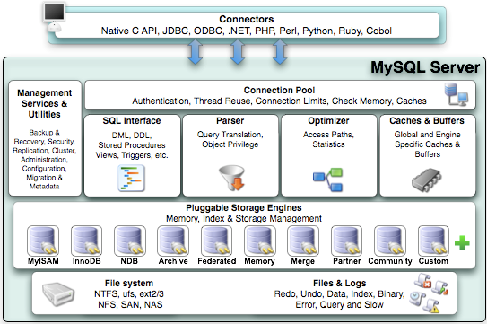
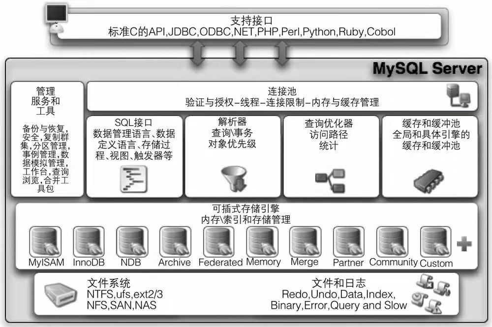

<span style=background:#ffee7c>mysql的单机峰值多少？</span>sysbench是一款开源的多线程性能测试工具，可以执行CPU、内存、线程、IO、数据库等方面的性能测试。

<span style=background:#ffee7c>《[高性能MySQL](https://read.douban.com/reader/ebook/35648568/)》（书籍，146页）</span>

<span style=background:#ffee7c>[Mysql为何使用可重复读为默认隔离级别?](https://juejin.cn/post/6974318442228744205)</span>

[InnoDB底层数据结构](https://juejin.cn/post/6844904190477598733)

阿里ApsaraDB[技术月报](http://mysql.taobao.org/monthly/)。

MySQL与编码，[导读](https://blog.hufeifei.cn/2018/05/26/DB/MySQL性能优化[实践篇]-复合索引实例/#where-c1-x-and-c2-x-and-c4-gt-x-and-c3-x)。


## 基本组成

SQL，Structured Query Language，有3部分：

- **DDL**，Data Defind Language：定义数据，即，添加表、删除表、修改表结构。
- **DML**，Data Manipulation Language：添加删除更新数据。
- **DQL**，Data Query Language：查询数据。

> 可以说，DQL是最常用的SQL，故单独成立一[篇](./1.1 DQL)。


## 键

### 主键

**主键**不能带有业务信息，可以为自增型或GUID。

自增主键的类型如果为`INT`，可以存储`21亿`（`2^31`)条数据，

如果是`BIGINT`，则可以存储`922亿亿`（`2^63`)条数据。

> `int(M)`: M indicates the maximum display width for integer types.

### 联合主键

除非有必要，才使用联合主键。**联合主键**会提升表之间的复杂度。

**联合主键**会生成相应的<span style=background:#c2e2ff>联合索引</span>。

### 外键

**外键**约束可以保证无效的数据无法插入，但是会降低性能，往往是通过应用程序来实现约束。


## 唯一

想要某一列的值在插入时唯一，有以下2种方式：

1. 唯一索引，不允许作为**外键**。

   ```sql
   ALTER TABLE table_name ADD UNIQUE INDEX idx_column(column_name)
   ```

2. 唯一约束，允许作为**外键**。

   ```sql
   ALTER TABLE table_name ADD CONSTRAINT unique_column UNIQUE (column_name)
   ```

在**MySQL**中，唯一约束实际上是用唯一索引实现的，会创建一个唯一索引，但两者在使用上区别不大。

两种方式都允许为`NULL`，另外**MySQL**中`NULL`不允许和`NULL`作比较，`NULL == NULL`和`NULL != NULL`均为`false`。


## 字段

`varchar`类型的字段，如果长度为`256`，则应该改为`255`，因为`256`会多用一个`Byte`来存储长度。

一条<u>记录</u>的`varchar`长度不要超过`65532`，如果是`UTF-8`，则不能超过`65532/3`。


## 插入

`timestamp`类型的字段仅能存储`1970-01-01 00:00:01.000000`到`2038-01-19 03:14:07.999999`范围内的时间，并且受时区影响，可见`timestamp`类型修改为`datatime`类型。


## 一些实用SQL[[2]](https://www.liaoxuefeng.com/wiki/1177760294764384/1246617682185952)

##### 插入或替换

`REPLACE`不同于`UPDATE`，它实际上是先`DELETE`再`INSERT`，并且要求表有**主键**或者唯一的<span style=background:#c2e2ff>联合索引</span>。

```sql
REPLACE INTO students (id, class_id, name, gender, score) VALUES (1, 1, '小明', 'F', 99);
```

##### 插入或更新

```sql
INSERT INTO students (id, class_id, name, gender, score) VALUES (1, 1, '小明', 'F', 99) ON DUPLICATE KEY UPDATE name='小明', gender='F', score=99;
```

##### 插入或忽略

```sql
INSERT IGNORE INTO students (id, class_id, name, gender, score) VALUES (1, 1, '小明', 'F', 99);
```

##### 从查询结果中插入

```sql
INSERT INTO statistics (class_id, average) SELECT class_id, AVG(score) FROM students GROUP BY class_id;
```

##### 强制使用指定索引

```sql
SELECT * FROM students FORCE INDEX (idx_class_id) WHERE class_id = 1 ORDER BY id DESC;
```

##### 查看表结构

```sql
SHOW CREATE TABLE table_name;
```


## MySQL

如下图所示，**MySQL**的[逻辑架构](https://blog.csdn.net/hguisu/article/details/7106342)主要分为：

1. **Connectors**
   1. 各类连接器。**MySQL**的非企业版本只支持一个线程一个连接。
2. **Management Services & Utilities**
   1. 管理服务和工具。
3. **Connection Pool**
   1. 连接池。
4. **SQL Interface**
5. **Parser**
   1. 解析器。
6. **Optimizer**
   1. 查询优化器。
7. **Cache & Buffers**
   1. 读缓存和写缓冲。
8. **Pluggable Storage Engines**
   1. 插件式存储引擎。
   2. **MySQL**有两个主要的存储引擎：⭐
      1. **MyISAM**
         1. 该引擎基于IBM的文件系统ISAM（Index Sequential Access Method，索引顺序访问方法，可以连续地或任意地记录任何访问）。
         2. 其缓存为**Key Cache**，只保存索引，不保存数据（**OS** Cache会保存数据）。
      2. **InnoDB**
         1. 该引擎支持<span style=background:#c2e2ff>事务</span>、<span style=background:#c2e2ff>外键</span>、<span style=background:#c2e2ff>行锁</span>，采用了<span style=background:#c2e2ff>聚族索引</span>、<span style=background:#c2e2ff>预读取</span>的设计。
         2. 其缓存为**Buffer Pool**，保存索引和数据。





