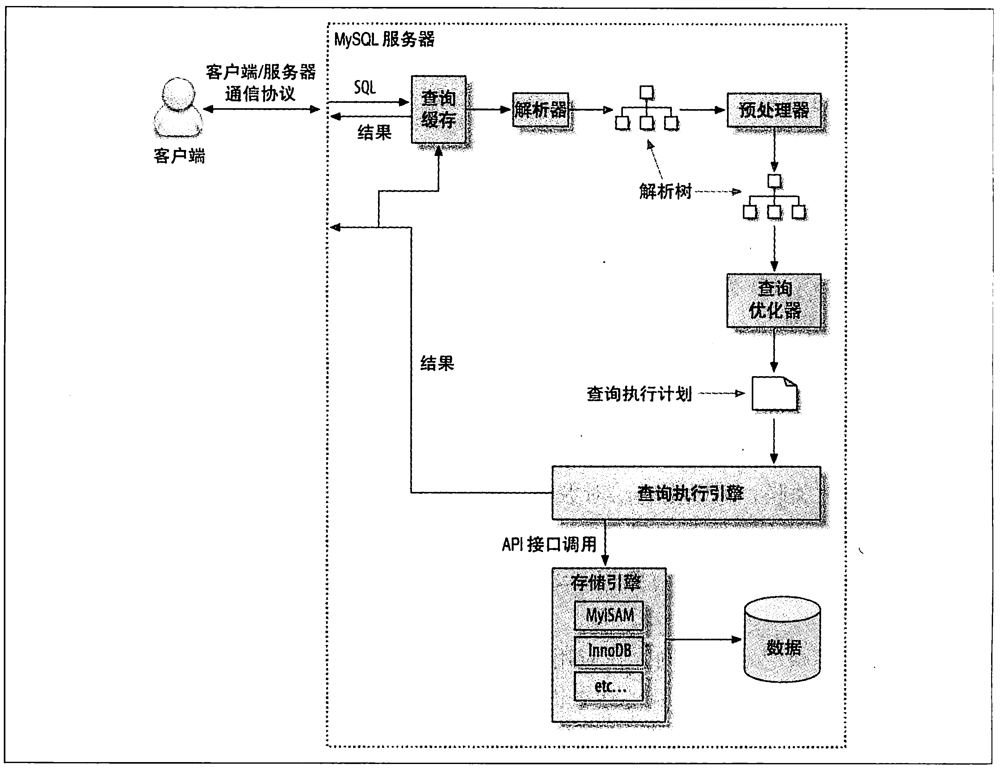
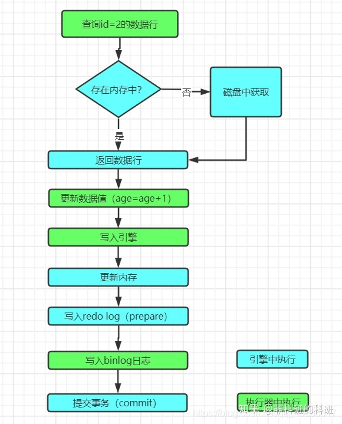

## 简述

可以说，DQL是最常用的SQL，故单独成立一篇。

> DQL的可以以`\g`或`\G`结尾：
>
> - `\g`作用等同于`;`。
> - `\G`表示要按列打印，而非按行打印。


## 执行过程

### 查询

查询（`SELECT`）过程为：

1. 客户端向服务器发送SQL。
1. 服务端进行用户身份的验证和权限的校验。
2. 服务器检查缓存，如果命中，则直接返回结果；否则继续执行。
3. 服务器对SQL进行解析、预处理、优化，然后生成执行计划。
4. 服务器根据执行计划，调用存储引擎。
4. 服务器将结果返回给客户端。

> **MySQL**会基于成本模型来优化执行计划，包括选择合适的索引、合适的关联顺序。



### 更新

更新（`UPDATE`）[过程为](https://zhuanlan.zhihu.com/p/270632940)：

1. 先将数据查出。
2. 然后进行“row format”，转换到服务层。
3. 服务层修改数据。
4. 将数据写回。




## 关键字和保留字

关键字和保留字[大全](https://dev.mysql.com/doc/refman/5.7/en/keywords.html)。

关键字的[执行顺序](https://www.jianshu.com/p/30fcf2a79286)：

1. `FROM <left_table>`
2. `ON <join_condition>`
3. `<join_type> JOIN <right_table>`
4. `WHERE <where_condition>`
5. `GROUP BY <group_by_list>`（**MySQL**从此之后可以使用`SELECT`中定义的别名）
6. `HAVING <having_condition>`（**Oracle**、**Hive**从此之后可以使用`SELECT`中定义的别名）
7. `SELECT`
8. `DISTINCT <select_list>`
9. `UNION`
10. `ORDER BY <order_by_condition>`
11. `LIMIT <offset>,<rows>`

> `WHERE`用于`GROUP BY`<span style=background:#f8d2ff>前</span>的数据过滤，故<span style=background:#f8d2ff>不能</span>使用聚合函数产生的结果。
>
> `HAVING`用于`GROUP BY`<span style=background:#ffb8b8>后</span>的数据过滤，故<span style=background:#ffb8b8>能</span>使用聚合函数产生的结果。


## 关联

[关于是否禁止使用JOIN的讨论](https://www.v2ex.com/t/678312)<span style=background:#ffee7c>todo</span>

[MySQL分组查找最早(大)或最晚(小)记录](https://blog.csdn.net/weixin_42265242/article/details/82715631)<span style=background:#ffee7c>todo</span>


## 过滤

### 类型转换

`WHERE`要留意字段类型的<span style=background:#c2e2ff>隐式转换</span>，因为**MySQL**在进行[字符串和数字的比较时](https://www.cnblogs.com/micrari/p/6358652.html)，会将字符串转换为数字。

- 对于以数字开头的字符串，**MySQL**会截取前面的数字部分。
- 对于不以数字开头的字符串，**MySQL**会将其转换为`0`。

### 通配符

`LIKE`往往与通配符搭配使用，以完成模糊搜索。

SQL中有以下[通配符](https://www.runoob.com/sql/sql-wildcards.html)：

| 通配符                            | 描述                                |
| :-------------------------------- | :---------------------------------- |
| `%`                               | 替代`0`个或`多`个字符               |
| `_`                               | 替代`单`个字符                      |
| `[*charlist*]`                    | 字符列中的`任何` `单一`字符         |
| `[^*charlist*]`、` [!*charlist*]` | **不在**字符列中的`任何` `单一`字符 |

### 转义

如果想需要转义特殊字符，可使用`ESCAPE`。

```sql
SELECT * FROM t WHERE x LIKE '%\_%' ESCAPE '\';
```

**SQL Server**支持使用`[]`包围需要转义的字符。

```sql
SELECT * FROM t WHERE x LIKE '%[\]_%';
```

**Hive**支持使用`\`进行转义，或者使用`RLIKE`替代`LIKE`。

> “**Hive**支持使用`\`”没找到相关文档，但是亲测有效。

```sql
SELECT * FROM t WHERE x LIKE '%\_%';
```


## 集合运算

| 运算符      | 说明                                                   | 去重           | 排序               |
| ----------- | ------------------------------------------------------ | -------------- | ------------------ |
| `UNION`     | 对查询结果做<span style=background:#c2e2ff>并集</span> | 自动去掉重复行 | ❌                  |
| `UNION ALL` | 对查询结果做<span style=background:#c2e2ff>并集</span> | 不会去掉重复行 | ❌                  |
| `INTERSECT` | 对查询结果做<span style=background:#c2e2ff>交集</span> | ❌              | 根据第一列进行排序 |
| `MINUS`     | 对查询结果做<span style=background:#c2e2ff>减集</span> | ❌              | 根据第一列进行排序 |


## 排序

我们可以根据业务需要借助索引来排序。

但如果不能借助索引排序时，**MySQL**会进行文件排序，即，在内存中开辟一块缓存，大小为`sort_buffer_size`：

1. 如果要排序的数据量小于`sort_buffer_size`，则在内存中完成排序。
2. 如果要排序的数据量超出`sort_buffer_size`，则利用磁盘文件辅助排序。

> 文件排序一般使用归并排序算法。

### 数据重复问题

[MySQL ORDER BY LIMIT分页数据重复问题](https://www.jianshu.com/p/544c319fd838)

1. `LIMIT`经常会搭配`ORDER BY`使用，但如果排序字段包含重复数值，**MySQL**不会处理重复值之间的顺序，即，无序的，返回顺序依赖具体的执行计划。
2. 这就会造成如果某页正好在这些重复值中截断，会导致所谓的分页数值重复问题。

解决方法很简单：

1. 为排序字段添加<span style=background:#c2e2ff>索引</span>。
2. 将一个绝对有序，也就是没有重复值的字段加入到排序列中，往往会选择主键，这样排序结果就会变为绝对有序。

> If you combine LIMIT row_count with ORDER BY, MySQL stops sorting as soon as it has found the first row_count rows of the sorted result, rather than sorting the entire result.
>
> <span style=background:#ffee7c>这个“entire result”指的究竟是只是行，还是包含列？</span>


## 分页

`LIMIT <offset>,<rows>`的另一种写法是`LIMIT <rows> OFFSET <offset>`

对`LIMIT`来说，`OFFSET`越大，查询速度越慢。

这是因为`LIMIT`实际上是将`offset+rows`条数据全部查出，然后将前`offset`条数据全部丢弃。⭐


## 引号

### 单引号

文本值需要使用`'`进行包围。

数值类型不要使用`'`。

如果字符串本身也包括`'`，则使用两个`'`来进行表示，或者对`'`进行转义。

> [如下所示](https://www.jb51.net/article/26488.htm)，如果主键为字符串类型，但在查询时使用数值类型作为查询条件，那么不会走索引，而是会全表扫描，降低速度。
>
> ```sql
> SELECT * FROM `foo` WHERE `key`=1293322797;
> ```

### 反引号

<code>\`</code>是**MySQL**为了区分的保留字/关键字与普通字符而引入的符号，主要用于表名、字段名。

当然，使用<code>\`</code>来包围普通字符没有坏处，但比较保险。

### 双引号

`"`的用法和`'`类似，主流数据库都支持`'`和`"`的互换。


## WITH

`WITH AS`短语[也叫做](https://www.jianshu.com/p/bd5342046491)子查询部分（subquery factoring），用于定义SQL片段。

定义后的SQL片段可被整个SQL使用，以减少重复代码。

### 示例

```sql
WITH alias1 AS (SELECT * FORM employee)
alias2 AS (SELECT * FROM department)
```


## 条件判断

### CASE

`CASE`语句[等同于](https://www.cnblogs.com/martinzhang/p/3220595.html)Java中的`switch`语句

```sql
CASE <单值表达式>
     WHEN <表达式值> THEN <SQL语句或者返回值>
     WHEN <表达式值> THEN <SQL语句或者返回值>
     ...
     WHEN <表达式值> THEN <SQL语句或者返回值>
     ELSE <SQL语句或者返回值>
 END
```

### IF

`IF()`的用法与`CASE`语句相似，但：

- `CASE`是SQL标准定义的，`IF()`是数据库系统的扩展。
- `CASE`可以用于SQL语句、存储过程、触发器，`IF()`只能用于存储过程、触发器。
  - 但在存储过程和触发器中，用`IF()`替代`CASE`的麻烦、难以实现、代价高。

> `IF()`可嵌套到其它聚合函数中。


## 函数

### TRUNCATE

`TRUNCATE(number, decimals)`[用于截取数字](https://www.cnblogs.com/miracle-luna/p/12041781.html)：

- `number`为要截取的数字。
- `decimals`为指定的小数位数。
  - 当`decimals`大于`0`时，对`number`的小数位数进行指定位数的截取。
  - 当`decimals`等于`0`时，去除`number`的小数部分，只保留整数部分。
  - 当`decimals`小于`0`时，去除`number`的小数部分，并将其整数部分指定位数进行补零。

> `TRUNCATE()`仅会截取，舍入请用`FLOOR()`、`CEIL()`、`ROUND()`等函数。

> **Oracle**、**Hive**中对应的函数名为`TRUNC()`，它除了支持截取数字，[还支持截取日期](https://www.cnblogs.com/wenBlog/p/10848208.html)。
