## InnoDB Buffer Pool[[1]](https://mp.weixin.qq.com/s/uyu0lKz2_N5BYgITKz71CQ)

磁盘的读写速度远不如内存，数据库如果每次读写都直接操作磁盘，其速度只能比🐢还慢，所以数据库都会在内存中设置<u>缓存</u>、<u>缓冲</u>以减少磁盘IO。

**MySQL**的默认存储引擎为**InnoDB**，而**InnoDB**的<u>缓存</u>、<u>缓冲</u>为**Buffer Pool**。

> **Buffer Pool**会缓存索引、行/记录、自适应哈希索引、锁和其它内部数据结构。

一个**Buffer Pool**一次只能允许一个线程来操作（操作过程会加锁），但是可以设置多个**Buffer Pool**来提升并发量。

1. innodb_buffer_pool_size，**Buffer Pool**的大小，默认为`128MB`。

2. `innodb_buffer_pool_instance`，**Buffer Pool**的个数。

3. `innodb_buffer_pool_chunk_size`，默认大小为`128MB`。
   1. **Buffer Pool**以块（Chunk）为单位。
   2. **Buffer Pool**支持动态扩容，扩容时不会直接申请一大块连续的空间，而是以**Chunk**为单位，申请多个**Chunk**。
   3. 另外**Buffer Pool**不是越大越好，一般为`50%~60%`，剩下的空间供系统、其它程序使用。

**Buffer Pool**有3个重要概念：Free List、Flush List、LRU List。

在介绍这3个重要概念之前，我们先介绍1个基本概念——数据页。

## 数据页

在数据库中，我们都是以“表+行”的逻辑单位来操作数据，但**MySQL**实际上是以页（Page）为单位来操作数据，每Page大小默认`16KB`。

> 日志文件是个例外，不基于Page。

无论磁盘中的数据，还是**Buffer Pool**中的数据，均以Page为单位进行组织。

**InnoDB**还会为**Buffer Pool**中的每个Page额外开辟一些空间，用于保存数据Page<u>所属表空间</u>、<u>页号</u>等部分元数据，所占空间约为Page的`15%`（`800B`）。

所以**InnoDB**在启动时，会在内存中申请一块比innodb_buffer_pool_size略大的连续空间，多申请的空间就是用于存储这些元数据。

### Hash Table

Hash Table用于记录<u>已使用</u>的Page。

- 键：表空间号+数据页号。
- 值：数据页地址。

多个**Buffer Pool**会共用一个**Hash Table**，即，多个**Buffer Pool**中的数据不会有重复。

## Free List

Free List用于记录<u>空闲</u>的Page，是一个双向链表。

确切的说，Free List由空闲Page的部分元数据组成。

Free List还有一个基础节点，用于引用该双向链表的头节点、尾节点、节点个数。

> JVM也使用空闲列表法来记录未使用的内存空间。

## Flush List

**Buffer Pool**不仅扮演着**读缓存**的角色，还扮演着**写缓冲**的角色。

> **HBase**则采用**读缓存**和**写缓冲**分离的设计。

**InnoDB**的**增删改查**操作都是先在**Buffer Pool**中进行的，操作之后内存中的部分Page就与磁盘中相应的Page就不一致了，内存中的这部分Page也称作**脏页**。

**InnoDB**通过Flush List来记录这些**脏页**，确切的说，Flush List由**脏页**的部分元数据组成。

当**脏页**被后台线程刷写到磁盘中后，**InnoDB**就会释放该**脏页**所占空间，即，将该Page从Flush List移除，同时添加到Free List中。

## LRU List

内存空间终归是有限的，当其空间不足时，我们往往会将**最近最少使用**（Least Recently Used，LRU）的数据淘汰掉。

**Buffer Pool**也不例外，它采用LRU List，一个双向链表来实现LRU，链表节点由Page的部分元数据组成，具体使用过程为：

1. 新加载的Page的会按照加载顺序插入到LRU List的头部。
2. 当空间不足时，**InnoDB**就会将LRU List尾部的Page刷入磁盘，腾出空间。

## 预读取机制

**MySQL**的**预读取**过程大致为：

1. 查询一个Page时，往往也需要查询与该Page<u>相邻</u>的Page，所以为了减少读取次数，**InnoDB**会将Page及其<u>相邻</u>的Page一并加载到**Buffer Pool**中。
2. **预读取**机制似乎只是**InnoDB**中的概念，**MyISAM**以文件预读的方式预热数据。

**预读取**有2种类型：

1. `innodb_read_ahead_threshold`，线性预读，默认值为`56`。如果顺序访问了某一个区里的多个Page，且Page数量达到该阈值，就会进行预读取，把下一个相邻区中的所有数据都加载到**Buffer Pool**中。
2. `innodb_random_read_ahead`，随机预读，会带来不必要的麻烦，**MySQL 5.5**已基本废弃该功能。

### 与冷热数据

不难看出，**预读取**机制虽然能减少总体的读取次数，但是这些<u>相邻页</u>的使用率远低于其对应的Page，会造成：

1. **Buffer Pool**空间的浪费。
2. 其它使用率高的Page会被挤兑到LRU List的后端，进而被淘汰。

诚然，数据使用频率不一致的问题，也就是<u>冷热数据</u>现象，是数据存储领域的自然现象，**预读取**机制只是加剧了这一问题。

**Buffer Pool**采用<u>冷热分离</u>的方式来解决这一个问题。

## LRU List的冷热分离

**InnoDB**将LRU List分为**冷数据区**、**热数据区**。

Page加载到**Buffer Pool**中后会被放入**冷数据区**的头部，如果一段时间延迟后，该Page被再次访问，才会被移动到**热数据区**的头部。

这个过程涉及两个参数：

1. `innodb_old_blocks_pct`，**热数据区**的占比，默认为`37%`。

2. `innodb_old_blocks_time`，时间延迟长短，默认为`1000毫秒`。
   1. 刚加载到**Buffer Pool**中的数据在短时间内被重复访问的概率较高，但超出一定时间后概率就会降低，因此时间延迟的设置能有效区分<u>冷热数据</u>。
   2. 全表扫描等操作会加载大量数据到**Buffer Pool**中，时间延迟的设置能有效防止<u>热数据</u>被挤出**Buffer Pool**，即，防止**Buffer Pool**被污染。

那么**热数据区**中的Page被访问后，是否应该移动到表头？

1. 答案是否。

2. 因为**热数据区**的Page本身就会被频繁访问，如果每次都移动到表头，只会徒增开销、降低性能。

3. 所以**Buffer Pool**的LRU List的**热数据区**中：
   1. Page如果在**数据区**的前`25%`，被访问时不会被移动。
   2. Page如果在**热数据区**的后`75%`，被访问时才会被移入到**热数据区**的头部。

   

## 脏页的刷盘[[2]](https://blog.csdn.net/qq_42604176/article/details/116460433)

**InnoDB**通过buf_LRU_get_free_block()获取**Buffer Pool**中的空闲空间。
1. buf_LRU_get_free_block()会访问Free List，从中获取空闲空间，如果获取失败，则会尝试淘汰LRU List中的Page。
2. buf_LRU_get_free_block()会循环执行上述过程，直到获取到足够的空闲空间，所以在高负载情况下会加剧Free List与LRU List的**mutex**的竞争。

**InnoDB**设置了独立线程来负责**Buffer Pool**中**脏页**的刷盘，以避免用户线程同步刷脏，提升用户线程的响应速度。

并且**InnoDB**将Free List/Flush List与LRU List的刷脏分开，以避免两者相互影响、降低性能。两者的刷盘分别由不同的线程负责：

1. `page_cleaner_thread`，负责将Flush List中引用的**脏页**进行刷盘，并将刷盘后的空闲空间放入Free List，LRU List中对应的**脏页**也会被移除。
   1. 以单线程方式执行。
   2. 每次刷写**脏页**的时间间隔`sleep time`是自适应的，会根据当前的**LSN**（Log Sequence Number）、Flush List的`oldest_modification`、当前的同步刷脏点进行调整。
   3. 每次刷写**脏页**的数量也是自适应的，会根据系统中**脏页**的比例、Redo Log的产生速度、其它几个参数进行调整。
   4. 如果`page_cleaner_thread`刷盘不及时，就会调用buf_LRU_get_free_block()来获取空间，进而出现上面<u>1.2</u>中的竞争问题，降低性能。
   5. 如果`page_cleaner_thread`刷盘过快，会占用大量IO，也有可能降低性能。

2. `lru_manager_thread`负责将LRU List中引用的**脏页**的刷盘。
   1. 以多线程方式执行。
   2. 每次刷写**脏页**的时间间隔是自适应的，会根据Free List的长度与`max_free_len=innodb_LRU_scan_depth*innodb_buf_pool_instances`的大小关系进行调整。
   3. 每次刷写**脏页**的数量是固定的，由`innodb_LRU_scan_depth`变量决定。

其它刷盘时机请阅读《[5.3 日志](http://leanlee.top/notes/07、MySQL/5.3 日志)》中的《[脏页的刷盘时机](http://leanlee.top/notes/07、MySQL/5.3 日志#脏页的刷盘时机)》。

## 图解

1. **InnoDB**读写过程：

   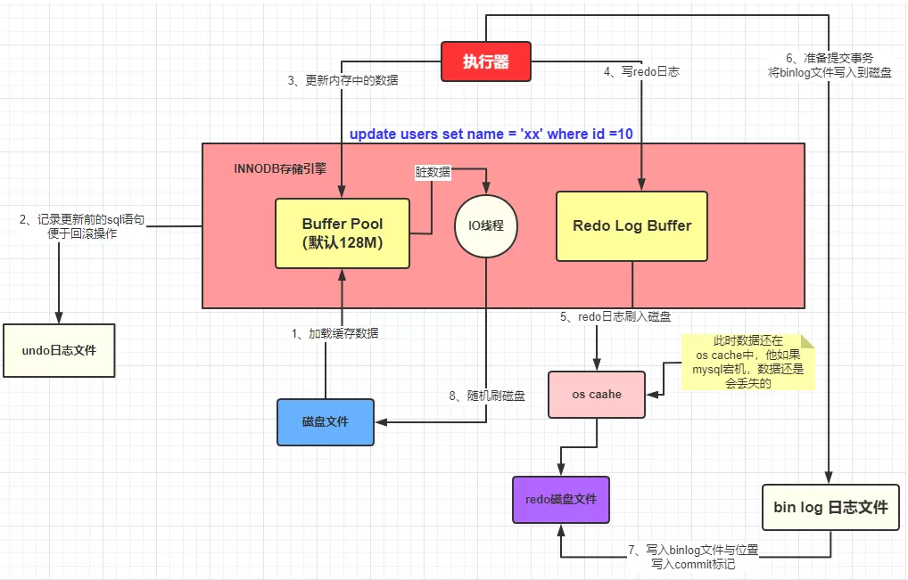

2. **Buffer Pool**由**Chunk**组成：

   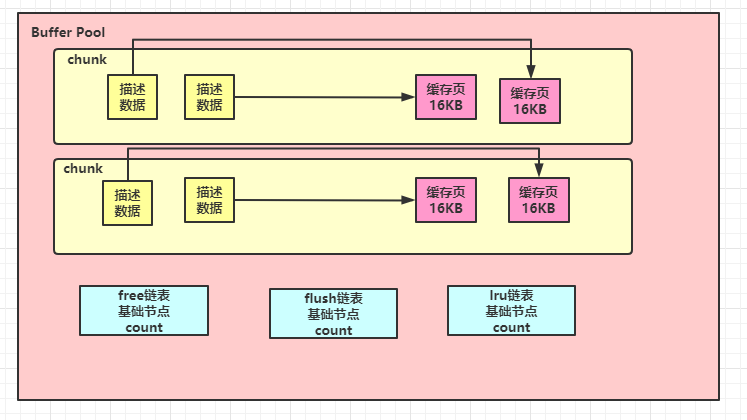

3. 多个**Buffer Pool**与他们的**Chunk**：

   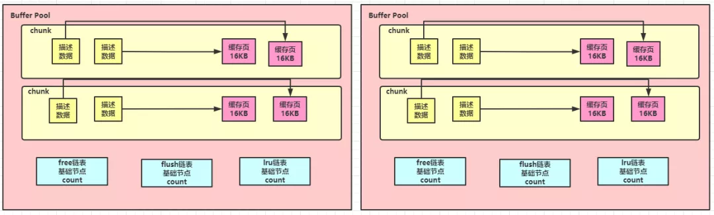

4. Page：

   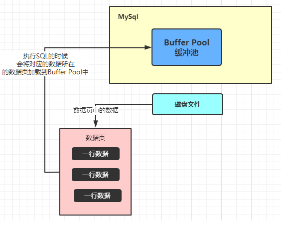

5. **Buffer Pool**中的Page：

   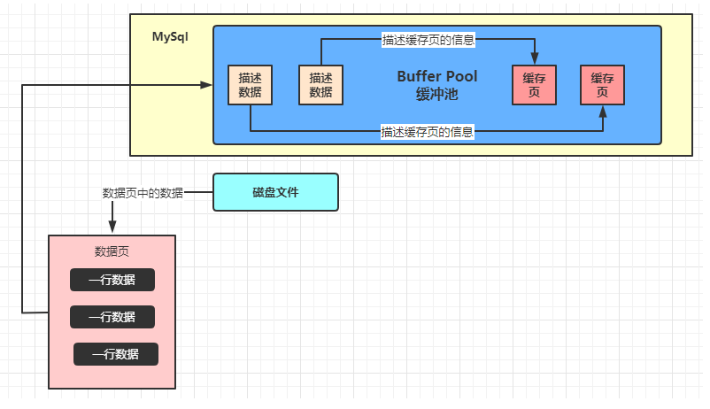

6. Free List：

   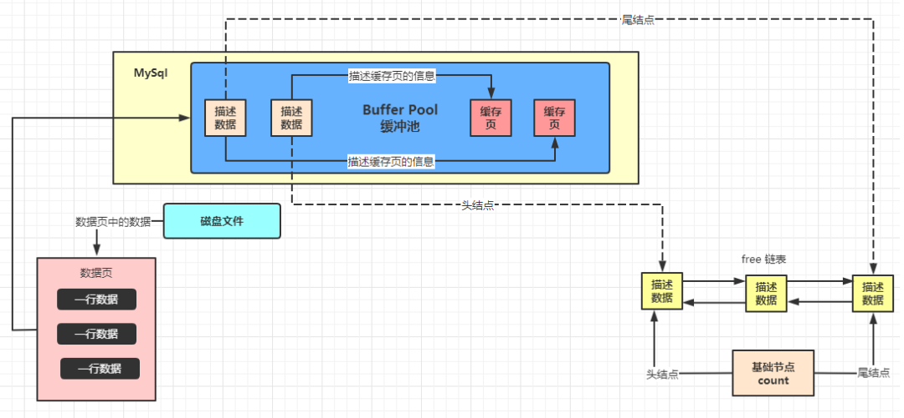

7. Flush List：

   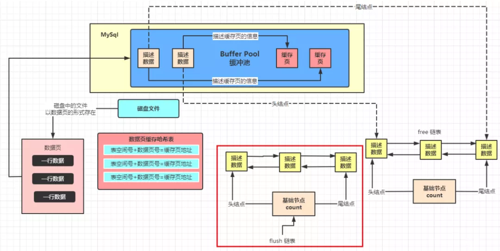

8. 数据库不停地增删改查：

   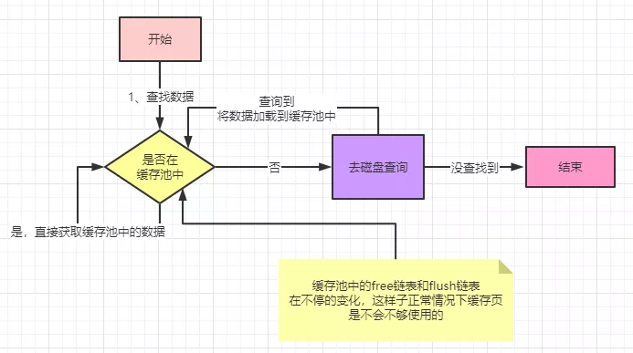

9. LRU List的工作过程：

   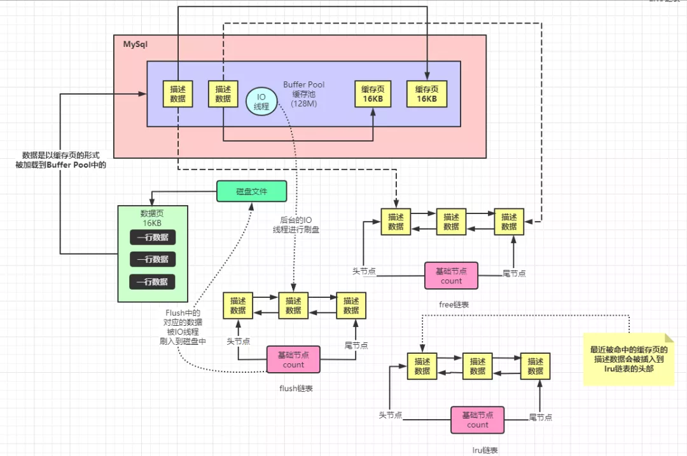

10. 预读取与LRU List：

    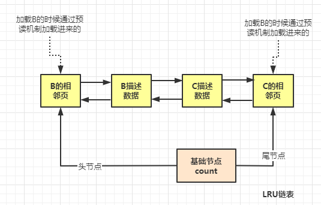

11. LRU List的<u>冷热分离</u>：

    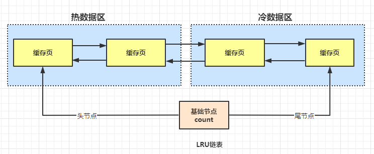

12. 后台线程将<u>冷数据区</u>的尾节点对应的Page刷入磁盘：

    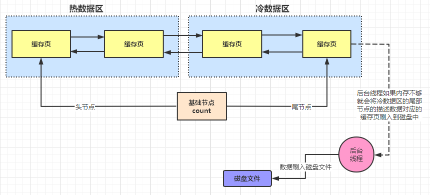

13. 无

## InnoDB Doublewrite Buffer

双写缓冲，**Doublewrite Buffer**，用于避免Page没写完整这种数据损坏。

**Buffer Pool**在写入磁盘前，会先将数据写入到磁盘上的**Doublewrite Buffer**文件中，然后再写入到数据文件中。

每个Page的末尾都有校验值（Checksum），用于判断Page是否损坏。

## 全局缓存

除了存储引擎层面的缓存，**MySQL**还提供全局层面/服务器层的查询缓存（**Query Cache**）（只针对`SELECT`）。

简单来说，**Query Cache**是一个散列表，开启后，**MySQL**会根据SQL、使用的数据库、使用的协议的版本等信息生成Hash值作为键，然后查看**Query Cache**中是否存在值。

1. 如果存在，则直接返回查询结果。
2. 如果不存在，则进行解析、优化和执行，然后将查询结果放入**Query Cache**并返回。
   1. 当然，如果查询无果，或者SQL中含有非确定函数（如，`rand()`、`now()`、`current_date()`）、UDF（User Defined Function）、系统表等内容，则不会放入**Query Cache**，而是直接返回查询结果。

当表发生一丁点变化时，与该表相关的缓存都会失效。当**Query Cache**空间不足时，会淘汰某些缓存。

**Query Cache**能加速读取，尤其是那些读多写少（`10`读`1`写）或包含负责计算（聚合）的SQL，但**Query Cache**也有一定的限制：

- **Query Cache**开启后，会成为服务器层的资源竞争单点，可能会导致服务器僵死。
- **Query Cache**的读写都有开销，如果命中率低，缓存的开销可能反而高于收益。
- **Query Cache**不支持分区表。

不是每条查询都能从**Query Cache**受益或受害，所以，是否开启缓存，要从全局出发，综合考虑。

> **Query Cache**太过鸡肋，**MySQL 8.0**[舍弃了它](https://blog.csdn.net/wtopps/article/details/127733437)，并推荐使用客户端缓存。