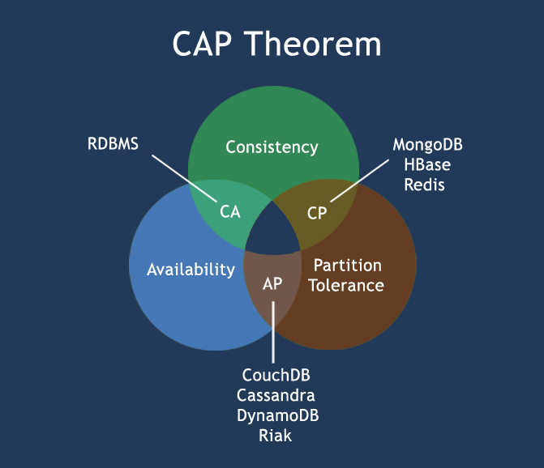
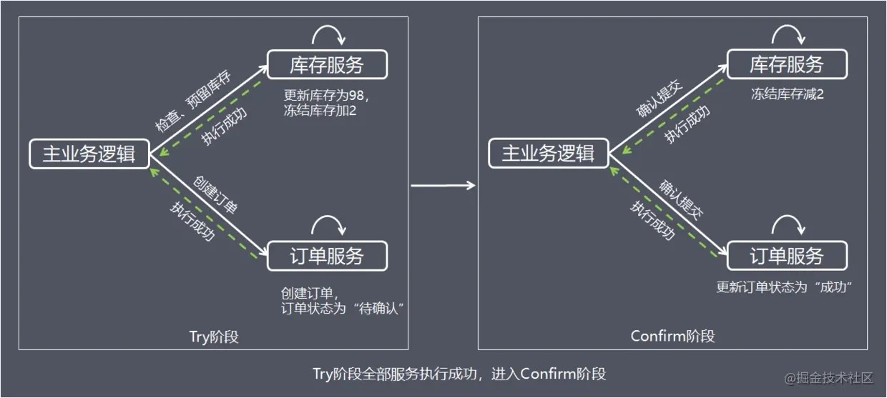
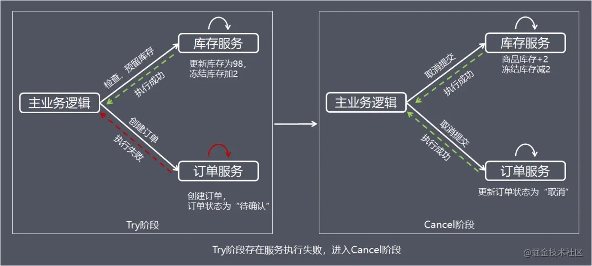
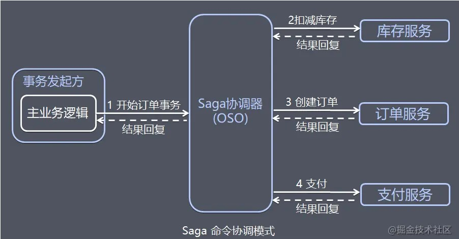
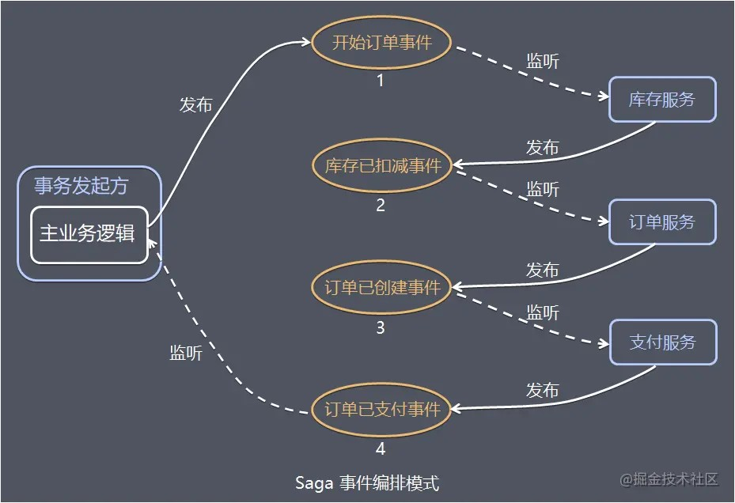

## 分布式

随着业务量的增长，应用程序会由单机架构演化成分布式架构，包括数据源以及事务。

### CAP

分布式系统[在设计时](https://www.jianshu.com/p/e0e7e8494d96)，需要考虑`3`个方面：

1. ##### Consistency
   
   1. 一致性。
   2. 各节点在同一时间具有相同的数据。
   3. 具体来说包括：`锁`、`超时`、`有限重试`。
2. ##### Availability
   
   1. 可用性，
   2. 请求执行成功与否，节点都会返回响应。
   3. 具体来说：`多节点`、`负载均衡`、`自由扩展`。
3. ##### Partition Tolerance
   
   1. 容灾。
   2. 容许部分节点的宕机（整个系统仍能运行）。
   3. 具体来说：`持久化`、`选举`/`切换`。

**CAP**中的这三个方面是无法同时满足的：

1. CA，单节点、非分布式，扩展性差。
2. CP，通用性差。
3. AP，略。

### BASE

**BASE**是对**CAP**要求的放宽：

1. **B**asically **A**vailability
   1. 基本可用。
2. **S**oft state
   1. 软状态（无连接）、中间状态
   2. 与Hard-State（面向连接）相对立。
3. **E**ventually consistency
   1. 最终一致。

## 分布式事务解决方案

[分布式事务的解决方案有多种](https://juejin.cn/post/6844903734753886216)：

1. 基于原子提交的，如，**2PC**、**3PC**。
2. 基于代码的，如，**TCC**、**Saga**。
3. 基于消息队列的，如，本地消息表、**RocketMQ**事务模式。

> XA不是网络协议，而是一套由X/Open组织提出的分布式事务处理规范，是一套实现了**2PC**的工业标准，主要定义了事务管理器和局部资源管理器之间的接口（C API）。
>
> MySQL、Oracle、PostgreSQL等主流数据库都支持XA。
>
> - **MySQL**采用插件式架构，各个存储引擎完全独立，故而在其内部需要使用XA。
>
> XA（2PC）性能堪忧，实际很少有人用。

分布式事务中，**Atomicity**、**Isolation**都能够轻松保证，但受网络波动、故障的影响，各节点间**Consistency**存在挑战。

## 两阶段提交

两阶段提交，Two Phase Commit，2PC。

**2PC**中有两类角色：

1. 事务的发起者，也被称为协调者，因为负责协调。
2. 事务的执行者，也被称为参与者，真正执行事务的节点。

**2PC**将事务提交分为`2`阶段：

1. ##### 准备阶段。
   
   1. 协调者向所有参与者发送事务，然后等待反馈，等待过程支持超时。
   2. 参与者收到事务后，执行事务，包括写Redo Log和Undo Log，但不正式提交事务；
   3. 参与者执行完后，向协调者反馈事务执行结果（成功/失败），然后等待协调者的下一步指示，等待过程不支持超时，会一直阻塞。
2. ##### 正式提交阶段。

   1. 如果协调者收到所有参与者的事务执行成功的反馈，则通知所有参与者<u>正式提交</u>事务；
      1. 然后参与者提交事务，释放资源，并向协调者反馈结果；
      2. 协调者再次收到所有参与者的反馈，事务<u>执行</u>完成。
   2. 如果有参与者反馈事务执行失败，或反馈超时，则协调者通知所有参与者<u>回滚</u>事务；
      1. 然后参与者回滚事务，释放资源，并向协调者反馈结果；
      2. 协调者会一直等待，直到收到所有参与者的反馈，才会完成事务<u>中断</u>。

可以看出，**2PC**比较简单，一致性强，但实际很少使用，因为：

1. 阻塞时间长，并发量低。
2. 协调者为单点，存在风险。
3. 协调者、参与者可能会因为网络等问题而一直等待，进而会破坏**Consistency**。

## 三阶段提交

三阶段提交，Three Phase Commit，3PC。

**3PC**的`3`个阶段为：

1. ##### Can Commit

   1. 协调者向所有参与者发送事务，然后等待反馈，等待过程支持超时。
   2. 参与者收到事务后，不执行事务，但会向协调者反馈能否执行事务，然后等待协调者的下一步指示，等待过程支持超时。

2. ##### Pre Commit

   1. 如果协调者收到所有参与者的能执行事务的反馈，则通知所有参与者执行事务。
      1. 参与者收到通知后，执行事务，包括写Redo Log和Undo Log，但不正式提交事务；
      2. 参与者执行完后，向协调者反馈事务执行结果（成功/失败），然后等待协调者的下一步指示，等待过程支持超时。
   2. 否则，即，部分参与者反馈无法执行事务，或反馈超时，则协调者通知所有参与者回滚事务；
      1. 然后参与者回滚事务，释放资源，并向协调者反馈结果；
      2. 协调者再次收到所有参与者的反馈，事务<u>中断</u>完成。
   3. 又或者参与者等待下一步指示时超时，参与者会自行中断事务，进行回滚。

3. ##### Do Commit

   1. 如果协调者收到所有参与者的事务执行成功的反馈，则通知所有参与者<u>正式提交</u>事务；
      1. 然后参与者提交事务，释放资源，并向协调者反馈结果；
      2. 协调者再次收到所有参与者的反馈，事务<u>执行</u>完成。
   2. 否则，即，部分参与者反馈事务执行失败，或反馈超时，则协调者通知所有参与者<u>回滚</u>事务；
      1. 然后参与者回滚事务，释放资源，并向协调者反馈结果；
      2. 协调者再次收到所有参与者的反馈，事务<u>中断</u>完成。
   3. 如果参与者收不到下一步指示，即，等待超时，参与者仍会提交事务。

**3PC**是对**2PC**的改进：

1. 并将准备阶段拆分为**Can Commit**和**Pre Commit**，增强健壮性。
2. 在“参与者反馈完结果后等待下一步指示”过程中加入了超时，以及在参与者在“正式提交阶段/**Do Commit**阶段”等待超时后仍会提交事务，一定程度上缓解了单点问题。

但数据不一致的问题仍然存在。

## TCC

**TCC**，**T**ry **C**ommit **C**ancel。

**TCC**分为`2`个阶段：

1. ##### Try

   1. 检查并预留资源。
   2. 如，检查库存并冻结部分库存，同时创建订单。

2. ##### Confirm/Cancel

   1. Try成功，则Confirm，即，执行资源确认。
      1. 如，将冻结的库存扣除，同时修改订单的状态为“下单成功”（这种状态就是一种Soft State）：
   2. Try失败，包括资源不足，或等待超时，则Cancel，即，取消资源的预留。
      1. 如，恢复冻结的库存，同时修改订单的状态为“取消”：

**TCC**比基于**XA**的分布式事务更好：

1. 粒度细，资源占用时间短，从而并发高。
2. 实现了最终一致性，缓解了数据不一致性的问题。
3. 各项服务可分布式部署，解决了单点问题。

但**TCC**业务耦合度高，导致开发、维护成本高。

## Saga

与**TCC**一样，**Saga**模式也是将事务分解为一系列幂等的有序子事务，每个子事务都有对应的补偿动作。

与**TCC**不同的是，**Saga**的所有动作都是直接提交，没有“预留”，因此隔离性较差，往往需在业务代码中加锁来处理资源竞争（存疑）；并且，**Saga**的有`2`种子事务的补偿动作（恢复策略）：

1. Forward Recovery，向前恢复，即，重试当前子事务。
2. Backward Recovery，向后恢复，即，回滚之前已经执行成功的所有子事务。

**Saga**有`2`种实现方式：

1. ##### Order Orchestrator

   1. 命令协调器。

   2. 由单独的协调器专门协调事务，并以“命令/回复”的方式与执行子事务的参与者通信。

   3. 以购物为例，如下图所示：

      

2. ##### Event Choreography

   1. 事件编排。

   2. 通过发布不同的事件发起不同的子事务，通过监听事件来执行子事务。

   3. 以购物为例，如下图所示：

      

两种实现方式相比：

1. **Order Orchestrator**
   1. 要更容易实现回滚操作。
   2. **Order Orchestrator**的开发、维护会比较复杂，且存在单点风险。
2. **Event Choreography**
   1. 参与者之间的依赖关系复杂、分散，不便维护，且存在循环依赖的风险，但没有单点风险。

## 本地消息表

> 该模式最早由eBay提出。

通过消息队列，而非通过编码来协调事务：

1. 事务发起者通过消息队列通知事务参与者执行事务。
2. 参与者也会通过消息队列向发起者反馈事务执行结果。

消息发送过程中会在本地数据库建立表来保证可靠性：

1. 发起者会在本地建立”<u>消息发送记录表</u>“，对已发送，但反馈超时的消息，会进行有限重试。
2. 参与者会在本地建立”<u>消息接收记录表</u>“，对消息进行过滤，防止重复消费，同时可用于重试反馈。

消息队列带来了解耦、异步的好处，但因其引入的本地消息表会占用数据库资源，并受限于数据库的并发性能。

## RocketMQ

基于消息队列的分布式事务引入本地消息表，是为了

1. 将消息持久化。
2. 提供超时重试。

而**RocketMQ**可以免去本地消息表，因为它不仅支持消息持久化，并提供超时重试：

1. 免去消息记录表能减轻本地数据库的压力。
2. **RocketMQ**提供带超时检查的二次确认。
   1. 事务发起者发起事务并发送消息，然后在本地执行事务，根据本地事务的执行结果向**RocketMQ**中发送确认消息（Commit/Rollback）；如果迟迟没有发送第二次确认，**RocketMQ**会等待超时，进行消息回查。
   2. 这简化了编程，但增加了消息量，从而增加网络开销。

> 与**RocketMQ**相比，**Kafka**仅支持持久化，需要我们额外编写服务实现超时重试。

